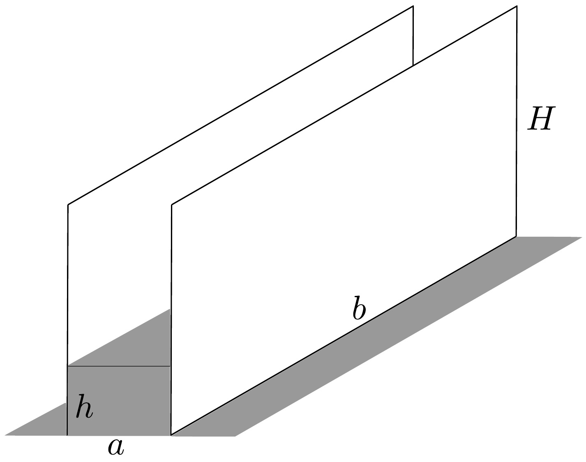
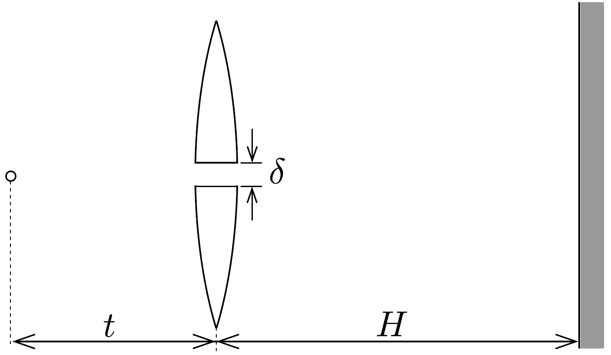

## Feladat 4

Egy $2 r$ átmérójú, $n_{0}$ törésmutatójú anyagból készült, vékony, bikonvex lencse görbületi sugarai $R_{1}$ és $R_{2}$. A lencse egyik oldalán $n_{1}$, a másik oldalán $n_{2}$ törésmutatójú anyag van. Csak paraxiális fénysugarakat vizsgáljunk.

- a) Igazoljuk, hogy
\[
\frac{f_{1}}{t_{1}}+\frac{f_{2}}{t_{2}}=1,
\]
ahol $f_{1}$ és $f_{2}$ a két oldalon mérhetó fókusztávolság, $t_{1}$ az egyik, $t_{2}$ a másik oldalon mért tárgy-, illetve képtávolság.
- b) A lencsét síkjára merőlegesen két részre vágjukszét és a részeket kis $\delta$ távolságra eltávolítjuk. Mindkét oldalon levegő van. A lencse egyik oldalán $t$ távolságban pontszerú, monokromatikus fényforrást helyezünk el a 29. ábrán látható módon, $(t>f)$. A lencsétől $H$ távolságban levő ernyő́n hány interferenciacsík keletkezik?

