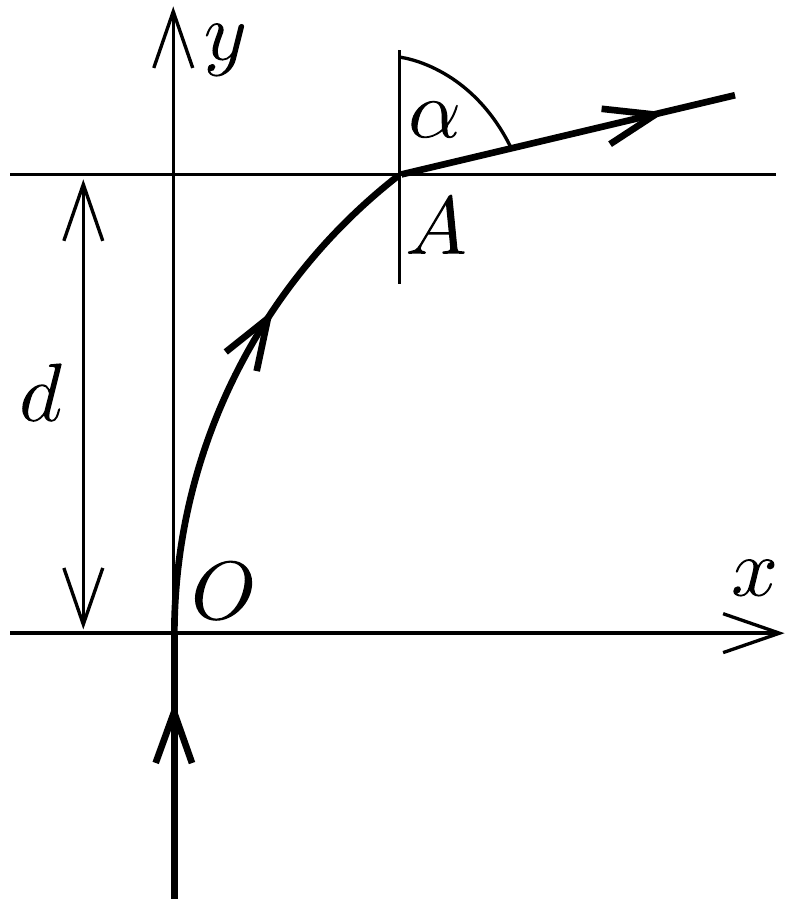

## Feladat 2

Adott egy $d$ vastagságú lemez, amelynek a törésmutatója az $x$ tengely irányában a következő képlet szerint változik (lásd a 33. ábrát):
\[
n(x)=\frac{n_{0}}{1-x / r} .
\]
Az $O$ pontban a lemezre merőlegesen egy fénysugarat ejtünk be a levegőből, és ez a lemezt egy bizonyos $A$ pontban, $\alpha$ kilépési szöggel hagyja el.

33. ábra.

Mekkora az $n_{A}$ törésmutató az $A$ pontban? Hol van az $A$ pont? Milyen vastag a lemez? Számadatok: $n_{0}=1,2, r=13 \mathrm{~cm}, \alpha=30^{\circ}$.
