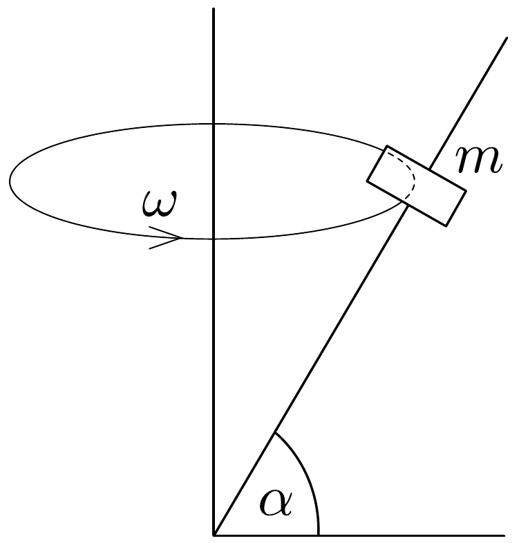

## Feladat 1

Egy rúd állandó $\omega$ szögsebességgel forog egy függőleges tengelyhez rögzítve. A rúd a függőleges tengellyel $\left(90^{\circ}-\alpha\right)$ szöget zár be (38. ábra). A rúdon egy $m$ tömegú test csúszhat, a súrlódási együttható $\mu$. Mi a feltétele annak, hogy forgás közben a test a rúd ugyanazon a helyén maradjon?

