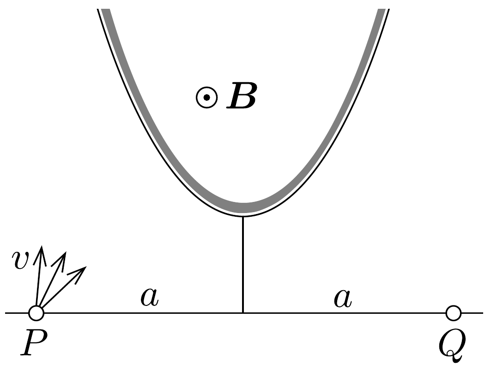

## Feladat 3

A 39. ábrán látható $P$ pontból egyenló tömegú, egyenló $v$ sebességú ionok indulnak el különbözó irányokban. Ezeket egy $P Q=2 a$ távolságban levó $Q$ pontban kell összegyújteni adott $B$ indukciójú homogén mágneses térrel, amely merőleges a rajz síkjára. A pályák legyenek a középvonalra szimmetrikusak. Milyen legyen a mágneses tér határvonala?

