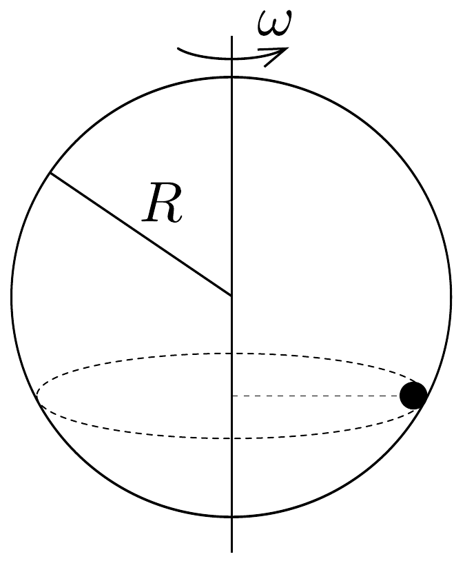

## Feladat 1

Egy $R=0,5 \mathrm{~m}$ sugarú üres gömb állandó $\omega=5 \mathrm{~s}^{-1}$ szögsebességgel forog függőleges átmérője körül. A 46. ábra szerint $R / 2$ magasságban egy behelyzett tárgy együtt forog a gömbbel.

a) Legalább mekkorának kell lennie a súrlódási együtthatónak, hogy ez az állapot megvalósulhasson?
b) Legalább mekkora súrlódási együtthatóra van akkor szükség, ha a szögsebesség $\omega=8 \mathrm{~s}^{-1}$ ?
c) Vizsgáljuk meg az előbbiekben megállapított súrlódási együtthatók esetében az állapotok stabilitási viszonyait, ha (i) kicsit megváltozik a tárgy helyzete; (ii) kicsit megváltozik a gömb szögsebessége!
