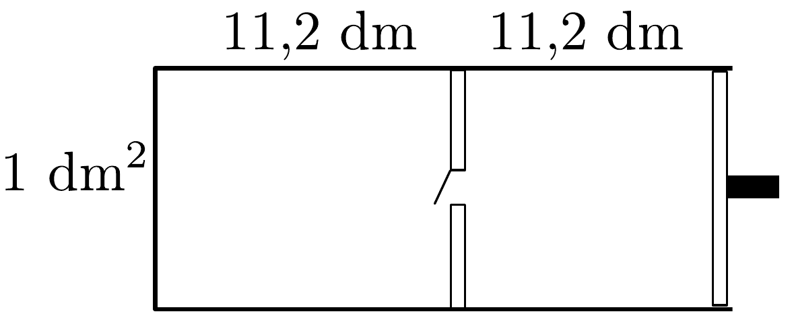

## Feladat 2

A 47. ábrán látható $1 \mathrm{dm}^{2}$ alapterületú henger külső fala, dugattyúja és belső elválasztó fala hőszigeteló anyagból készült. Az elválasztó falon

lévő szelep kinyílik, ha a nyomás a jobb oldalon nagyobb, mint a bal oldalon. Kezdetben 12 g hélium van a bal oldali és 2 g hélium van a jobb oldali részben. A henger hossza mindkét részben 11,2 dm, a hómérséklet pedig 0 °C. A külső légnyomás $10^{5} \mathrm{~Pa}$. A dugattyút elkezdjük lassan beljebb tolni az elválasztó fal felé.

Amikor a szelep kinyílik, megállítjuk a dugattyút, majd az egyensúly kialakulása után folytatjuk a lassú mozgatást addig, ameddig az elválasztó falat el nem érjük. Mennyi munkát végeztünk a folyamat során?
