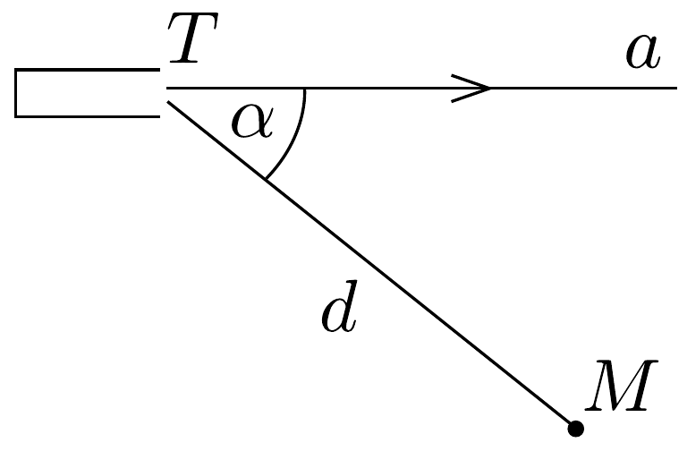

## Feladat 3

Egy elektronágyú $U=1000 \mathrm{~V}$ feszültséggel gyorsított elektronokat bocsát ki az 54, ábrán látható $a$ egyenes irányában. Az ágyútól $d=5 \mathrm{~cm}$ távolságban, $\alpha=60^{\circ}$-os irányban levő $M$ céltárgyat akarjuk eltalálni. Ennek érdekében $B$ indukciójú homogén mágneses teret alkalmazunk.

Mekkora legyen ennek az erőssége, ha
a) a mágneses indukció merőleges az $a$ egyenes és az $M$ pont által meghatározott síkra;

b) a mágneses indukció párhuzamos a $T M$ iránnyal?

Az elektron töltése $Q=1,6 \cdot 10^{-19} \mathrm{C}$, tömege $m=9,1 \cdot 10^{-31} \mathrm{~kg}$.
