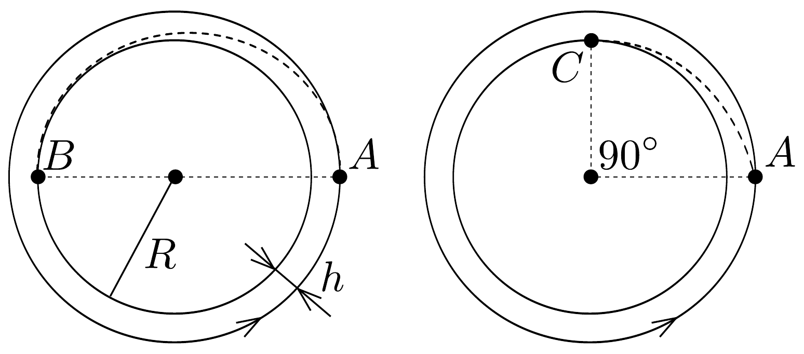

## Feladat 1

Egy $m=12 \mathrm{t}$ tömegú ürhajó $h=100 \mathrm{~km}$ magasságban körpályán kering a Hold körül. Abból a célból, hogy elérje a Holdat, a hajtómúvet rövid időre bekapcsolják az $A$ pontban. A rakétából kiáramló gázok sebessége a rakétához képest $u=10000 \mathrm{~m} / \mathrm{s}$. A Hold sugara $R=1700 \mathrm{~km}$, felszínén a szabadesés gyorsulása $g=1,7 \mathrm{~m} / \mathrm{s}^{2}$. Az úrhajó a megközelítést kétféleképp hajthatja végre (58. ábra):
- a) A Holdat az $A$ ponttal ellentétes $B$ pontban éri el;
- b) Az $A$ pontban a Hold középpontja felé adott impulzussal elérik azt, hogy az úrhajó a $B$-ben érintőlegesen éri el a Hold felszínét.

Mennyi üzemanyagot fogyaszt a két esetben az ürhajó?
