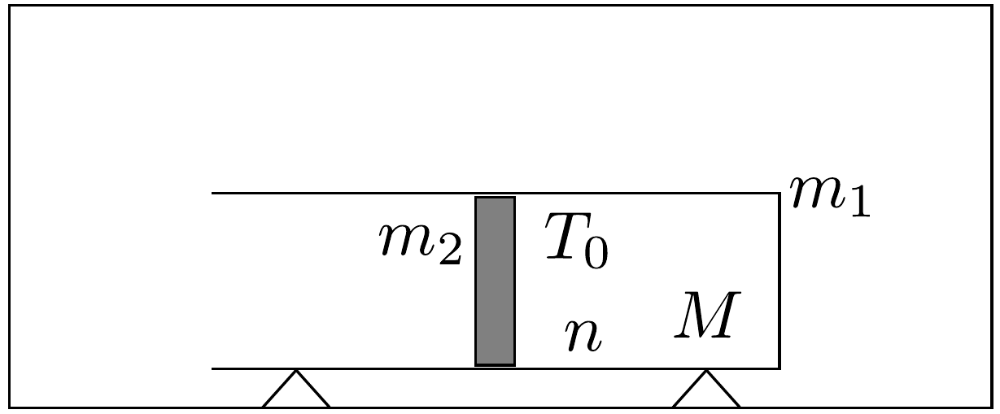

## Feladat 1

A 63. ábrán látható, légüres térben vízszintesen nyugvó, $m_{1}=$ $=0,6 \mathrm{~kg}$ tömegǘ henger térfogatának felénél egy $m_{2}=0,3 \mathrm{~kg}$ tömegü dugattyú van rögzítve. Az elzárt részben $T_{0}=273$ K hőmérsékletű, $n=25 \mathrm{~mol}$, $M=4 \mathrm{~g} / \mathrm{mol}$ moláris tömegú héliumgáz található. A dugattyú rögzítését megszüntetjük, majd a dugattyú kivágódása után a gáz szabadon kiáramlik. Mekkora a henger végsebessége?

63. ábra.

A súrlódás, a henger és a dugattyú hốfelvétele, valamint a folyamat első részében a gáz súlypontjának elmozdulása elhanyagolható.
