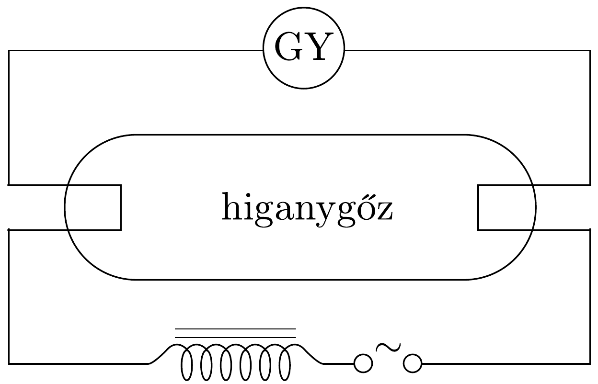
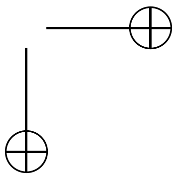

## Feladat 1

Egy fénycsövet 50 Hz-es váltakozó áramú hálózatra kapcsolunk a 68. ábrán látható módon. Múködés közben a következő adatokat mérjük:

\begin{tabular}[t]{|l|l|}
\hline hálózati feszültség & $U=228,5 \mathrm{~V}$ \\
\hline áramerősség & $I=0,60 \mathrm{~A}$ \\
\hline fénycsó végei közötti feszültség & $U^{\prime}=84 \mathrm{~V}$ \\
\hline fojtótekercs ellenállása & $R_{\mathrm{t}}=26,3 \Omega$ \\
\hline
\end{tabular}

68. ábra.

Számításainkban magát a fénycsövet tiszta ohmikus ellenállásúnak tekinthetjük. higanygőz
- a) Mekkora a fojtótekercs $L$ önindukciós együtthatója?
- b) Mekkora a $\varphi$ fáziseltolódás a feszültség és az áram között?
- c) Mekkora az áramkör által felvett teljesítmény?
- d) Azon kívül, hogy a fojtótekercs korlátozza az áramot, más fontos szerepe is van. Mi ez?

Megjegyzés. A 68 ábrán a GY fénycsőgyújtó-szerkezet egy olyan kapcsoló, amely a hálózati feszültség bekapcsolásakor zárja, majd nyitja az áramkört, és ezután nyitva is marad, ha a fénycsố már világít.
- $e$ ) Rajzoljuk meg a múködő állapotban levő fénycső fényintenzitását mint az idó függvényét kvantítatív időskálával!
- $f)$ Miért kell csupán egyszer begyújtani a fénycsövet, noha a váltakozó áram szabályos időközönként átmegy a nulla értéken?

g) A gyárban adott útmutató szerint egy kb. $4,7 \mu \mathrm{~F}$-os kondenzátort lehet sorbakapcsolni a fojtótekerccsel. Hogyan hat ez a fénycső múködésére, és miért jó ez?
h) Vizsgáljuk meg az adott fénycső két felét az adott spektroszkóppal. (A fénycső egyik felén van csak lumineszkáló bevonat.) Magyarázzuk meg a két spektrum közti különbséget!
