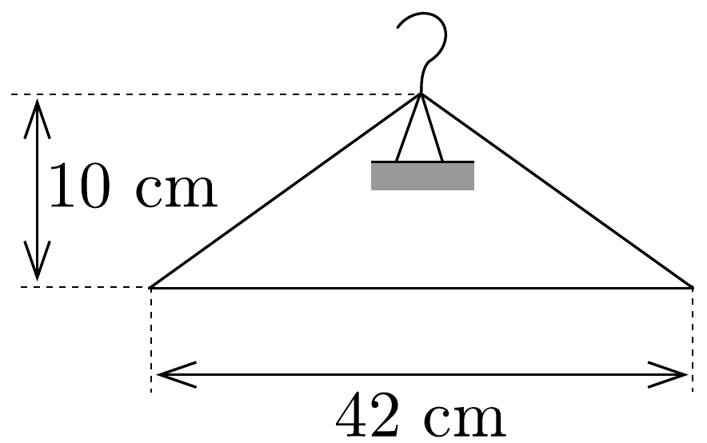
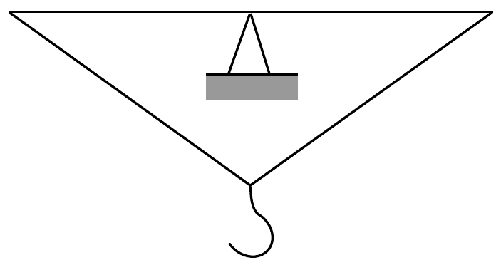
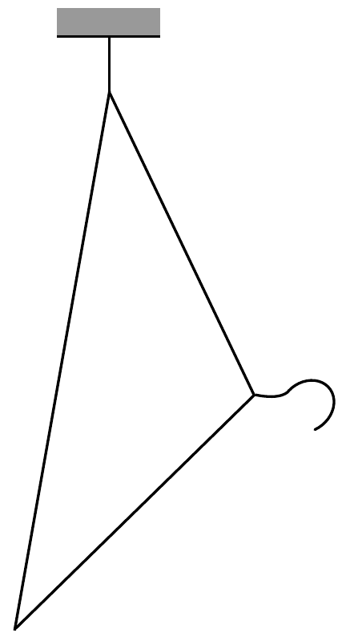

## Feladat 2

Egy drótból készült ruhafogas kis amplitúdójú lengéseket végez a 69. ábra síkjában, a lerajzolt egyensúlyi helyzetek körül. Az $a$ ) és a $b$ ) helyzetben a fogas hosszú oldala vízszintes. A másik két oldal egyenlő hosszú. A lengésidő

69. ábra.
mindhárom esetben azonos. Hol van a tömegközéppont és mekkora a lengésidő? (Az ábrán megadott adatokon kívül további információ nincs.)
