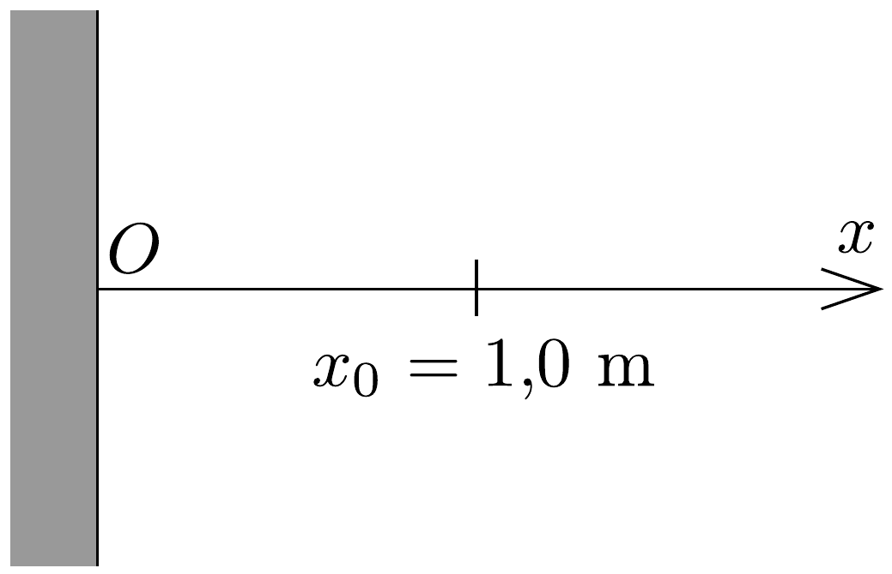
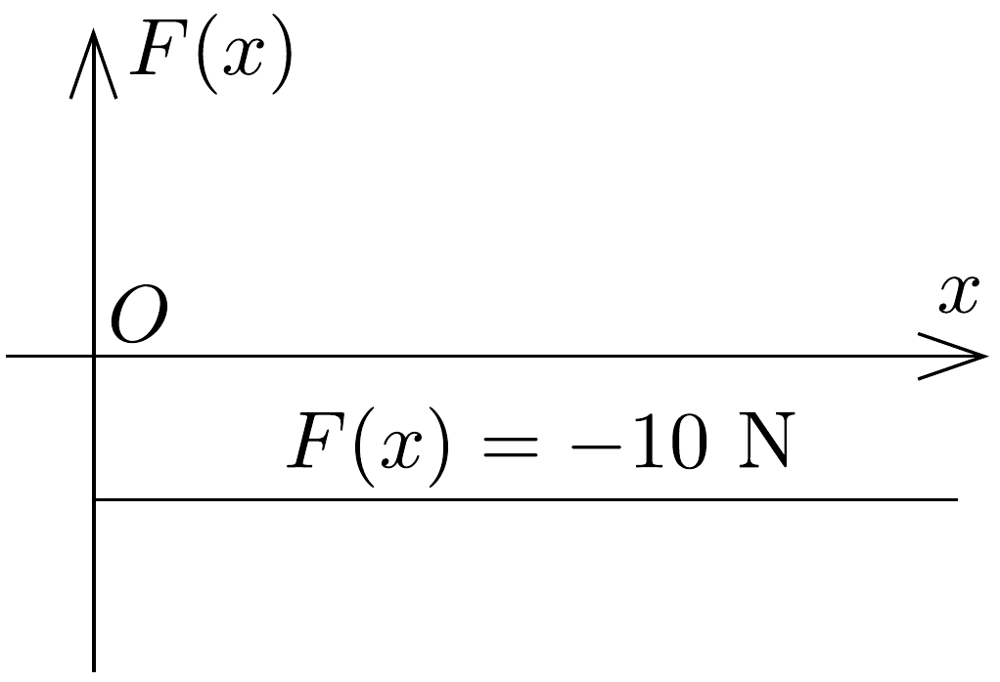

## Feladat 1

Egy részecske egydimenziós mozgást végez a 72. ábra felsó részén látható $O x$ pozitív féltengely mentén. A részecskére ható $F(x)$ erốt a 72. ábra alsó része mutatja. Az $O$ origóban egy tökéletesen visszaverő fal van. Ugyanakkor a részecskére mindenhol hat egy súrlódási eró is, amelynek nagysága $F_{\mathrm{s}}=1,00 \mathrm{~N}$. A részecske az $x=x_{0}$ pontból indul $E_{0}=10,0 \mathrm{~J}$ kinetikus energiával.

72. ábra.
a) Határozzuk meg, milyen hosszú utat tesz meg a részecske a végleges megállásig!
b) Ábrázoljuk grafikusan a részecske $U(x)$ helyzeti energiáját az $F(x)$ erőtérben!
c) Ábrázoljuk kvalitatívan a részecske sebességét az $x$ koordináta függvényében!
