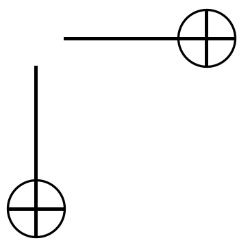
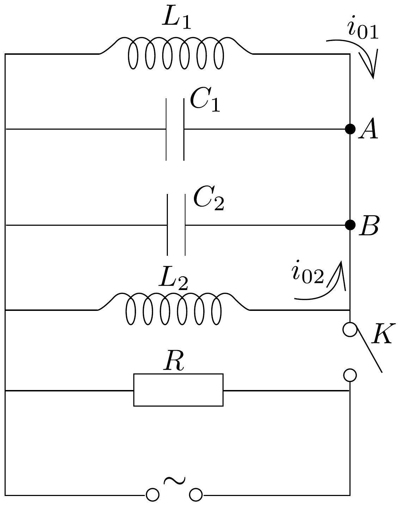

## Feladat 2

A 73. ábra szerinti áramkörben $L_{1}=10 \mathrm{mH}, L_{2}=20 \mathrm{mH}$, $C_{1}=10 \mathrm{nF}, C_{2}=5 \mathrm{nF}$ és $R=100 \mathrm{k} \Omega$. A $K$ kapcsoló hosszabb ideje zárva van. Az áramforrás $f$ változtatható frekvenciájú szinuszos áramot ad, de az áramforrás áramerősségének amplitúdója állandó.
a) Jelöljük $f_{\mathrm{m}}$-mel a $P_{\mathrm{m}}$ maximális hatásos teljesítményhez tartozó frekvenciát és $f_{+}$-szal, ill. $f_{-}$-szal az $1 / 2 P_{\mathrm{m}}$-hez tartozó frekvenciákat! Határozzuk meg $f_{\mathrm{m}}$ és $\Delta f=f_{+}-f_{-}$arányát!

73. ábra.

A $K$ kapcsolót kinyitjuk. A kapcsoló nyitása utáni $t_{0}$ pillanatban az $L_{1}$-en és $L_{2}$-n átfolyó áramerósségek $i_{01}=0,1 \mathrm{~A}, i_{02}=0,2 \mathrm{~A}$ és a feszültség $u_{0}=40 \mathrm{~V}$.
- b) Számítsuk ki az $L_{1} C_{1} C_{2} L_{2}$ áramkör sajátrezgésének frekvenciáját!
- c) Határozzuk meg az $A B$ vezetőben az áramerősséget!
- d) Számítsuk ki az $L_{1}$ tekercsben az áramerősség rezgésének amplitúdóját!
