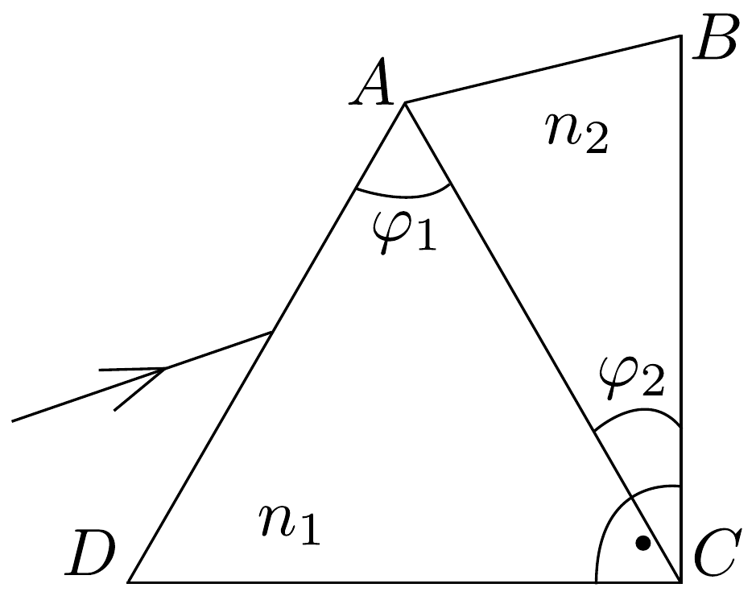

## Feladat 3

Két prizmát, amelyek törőszőge $\varphi_{1}=60^{\circ}, \varphi_{2}=30^{\circ}$, a 74. ábrának megfelelő módon összeragasztottunk. A $C$ csúcsnál lévő szög $90^{\circ}$. A törésmutató-

74. ábra.
kat a következő képletek adják meg:
\[
n_{1}=a_{1}+\frac{b_{1}}{\lambda^{2}}, \quad n_{2}=a_{2}+\frac{b_{2}}{\lambda^{2}},
\]
ahol $a_{1}=1,1, b_{1}=10^{5} \mathrm{~nm}^{2}, a_{2}=1,3, b_{2}=5 \cdot 10^{4} \mathrm{~nm}^{2}$.
a) Határozzuk meg azt a $\lambda_{0}$ hullámhosszat, amelyre bármely irányból érkező fénysugár törés nélkül halad át az $A C$ felületen! Határozzuk meg az ehhez az esethez tartozó $n_{1}$ és $n_{2}$ törésmutatókat is!
b) Rajzoljuk meg, hogy hogyan halad át a prizmarendszeren az ábra szerint beérkező, három különböző fénysugár, amelyek hullámhossza $\lambda_{\text {vörös }}, \lambda_{0}$, és $\lambda_{\text {kék }}$ ! Legyen a fénysugarak beesési szöge azonos!
c) Határozzuk meg, hogy a $\lambda_{0}$ hullámhosszú sugárzásra mekkora a prizmarendszer legkisebb eltérítési szöge!
d) Határozzuk meg, hogy milyen hullámhosszú sugárzás esetén lehetséges, hogy a $D C$ alappal párhuzamosan belépő fénysugár $D C$-vel párhuzamos marad a prizmarendszer elhagyása után is!
