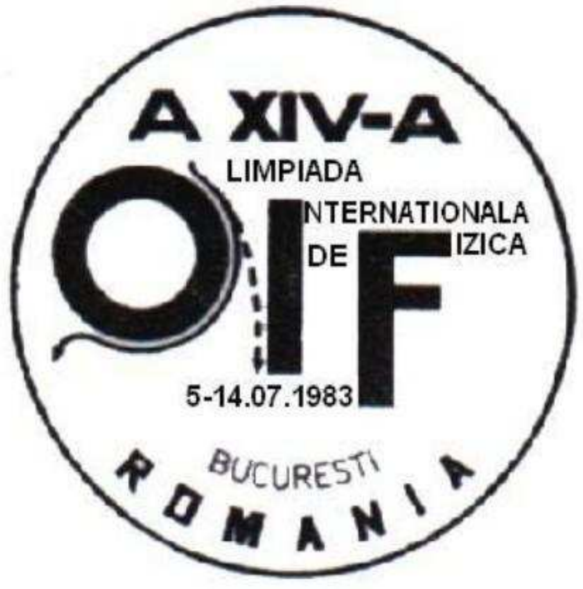

## Feladat 5

${ }^{7}$ Magyarázzuk meg kvalitatívan, hogy az Olimpia emblémáján (75. ábra) látható vízszintes tengelyú hengerre öntött folyadéksugár miért nem hagyja el a hengert a szaggatott vonal irányában, miért folyik a folytonos vonallal jelölt görbe mentén!

75. ábra.

Ez a tény az úgynevezett Coanda-hatással van kapcsolatban, amelyet 1936-ban Henry Coanda román mérnök szabadalmaztatott ${ }^{8}$.

\footnotetext{
${ }^{7}$ A feladat helyes megoldásáért nem járt pont, csak különdíj.
${ }^{8}$ Doug McLean: Understanding Aerodynamics: Arguing from the Real Physics (2012) c. könyv
