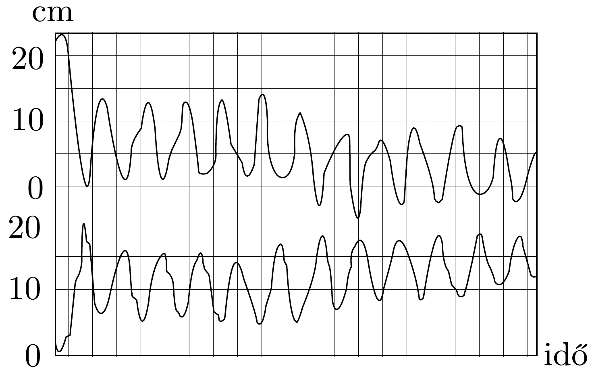
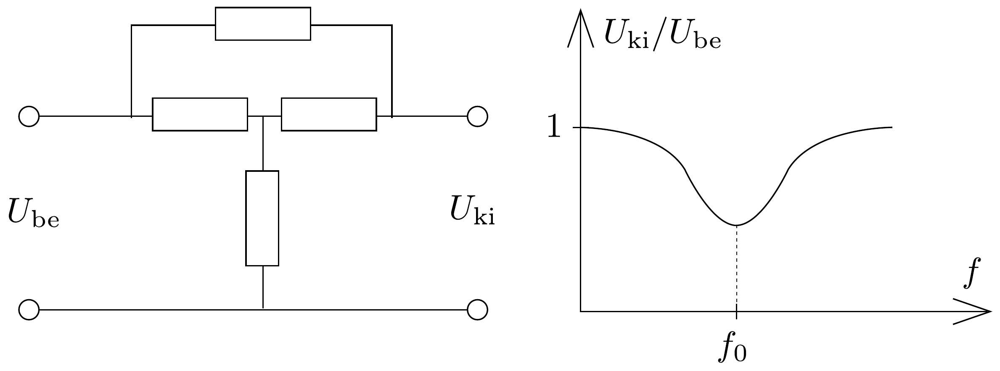

## Feladat 3

Egy elektromos szúróáramkör négy alkotóelemből áll, amint azt a 84. ábrán láthatjuk. A feszültségforrás belső ellenállása elhanyagolható, és a terhelés ellenállását végtelennek vehetjük. A szűrőáramkörnek olyannak kell lennie, hogy az $U_{\mathrm{ki}} / U_{\mathrm{be}}$ hányados az ábrának megfelelően függjön a frekvenciától, ahol $U_{\mathrm{be}}$ a feszültségforrás feszültsége és $U_{\mathrm{ki}}$ a kimenó feszültség. Az $f_{0}$ frekvenciánál az $U_{\mathrm{be}}$ és az $U_{\mathrm{ki}}$ közötti fáziskülönbség nulla.

A szúrőáramkör megépítéséhez a következő alkotóelemek állnak rendelkezésre:

83. ábra.

84. ábra.
- - két darab $10 \mathrm{k} \Omega$-os ellenállás;
- - két darab 10 nF-os kondenzátor;
- - két darab 160 mH-s tekercs, melyek nem tartalmaznak vasat és az ellenállásuk elhanyagolható.

A felsorolt alkotóelemek közül négy felhasználásával lehetséges olyan szüróáramkört készíteni, amely kielégíti az ábrákon látható feltételeket. Határozzuk meg a lehető legtöbb kombináció esetén az $f_{0}$ frekvenciát és az $U_{\mathrm{ki}} / U_{\mathrm{be}}$ hányadost ennél a frekvenciánál!
