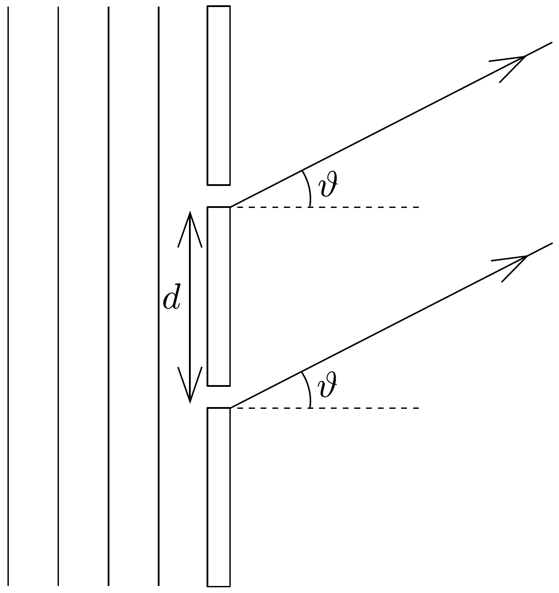

## Feladat 1

Egy $\lambda$ hullámhosszúságú és $f$ frekvenciájú monokromatikus, sík fényhullám esik merőlegesen a 95. ábrán látható, két azonos méretú, keskeny résre. A rések egymástól mért távolsága $d$. Az egyes réseket elhagyó hullámokat $\vartheta$ irányban mérve ( $x$ távolságban, $t$ időpillanatban) a következő összefüggés adja meg:
\[
y=a \cos \left[2 \pi\left(f t-\frac{x}{\lambda}\right)\right],
\]
ahol az $a$ amplitúdó mindkét hullám esetén ugyanakkora. (Tegyük fel, hogy $x$ sokkal nagyobb, mint $d$.)

a) Mutassuk meg, hogy az a két hullám, amelyeket a résekre merőleges irányhoz képest $\vartheta$ szögben észlelünk, olyan $A$ eredő amplitúdóval rendelkezik, amit két $a$ nagyságú vektor összeadásával kaphatunk meg, és a hozzájuk tartozó irányokat a fényhullám fázisa határozza meg!

Igazoljuk geometriailag vektorábra alapján, hogy
\[
A=2 a \cos \beta,
\]
ahol
\[
\beta=\frac{d \sin \vartheta}{\lambda} \pi!
\]
b) Cseréljük ki a kettős rést egy optikai ráccsal, amelyben $N$ számú azonos, egyenletesen elhelyezett rés van, és a szomszédos rések $d$ távolságra helyezkednek el egymástól. Használjuk az amplitúdók „vektorösszeadási” módszerét annak igazolására, hogy a vektoramplitúdók (melyek mindegyikének nagysága $a$ ) egy szabályos sokszög egy részét képezik. A sokszög csúcspontjai egy $R$ sugarú körön helyezkednek el, ahol
\[
R=\frac{a}{2 \sin \beta} .
\]

Mutassuk meg, hogy az eredő amplitúdó
\[
a \frac{\sin (N \beta)}{\sin \beta},
\]
és adjuk meg az eredő fáziskülönbséget a rács széléről kiinduló fény fázisához képest!
$c$ ) Vázoljuk fel azonos grafikonon a $\sin (N \beta)$ és az $1 / \sin \beta$ értékeit $\beta$ függvényében! Egy másik grafikonon mutassuk meg, hogyan változik az eredő hullám intenzitása $\beta$ függvényében!
d) Határozzuk meg a fóintenzitás-maximumok nagyságát!
e) Mutassuk meg, hogy a főmaximumok száma nem haladhatja meg a $2 d / \lambda+1$ értéket!
f) Mutassuk meg, hogy a $\lambda$ és a $\lambda+\Delta \lambda$ hullámhosszúságú két hullám $(\Delta \lambda \ll \lambda)$ olyan fómaximumokat ad, amelyeknek szögeltérése:
\[
\Delta \vartheta=\frac{n \cdot \Delta \lambda}{d \cos \vartheta}, \quad \text { ahol } \quad n=0, \pm 1, \pm 2, \ldots
\]
Számítsuk ki ezt a szögeltérést a nátrium D vonalaira, amelyekre $\lambda=589,0 \mathrm{~nm}$, $\lambda+\Delta \lambda=589,6 \mathrm{~nm}, n=2$ és $d=1,2 \cdot 10^{-6} \mathrm{~m}$.

Megjegyzés:
\[
\cos A+\cos B=2 \cos \left(\frac{A+B}{2}\right) \cos \left(\frac{A-B}{2}\right) .
\]
