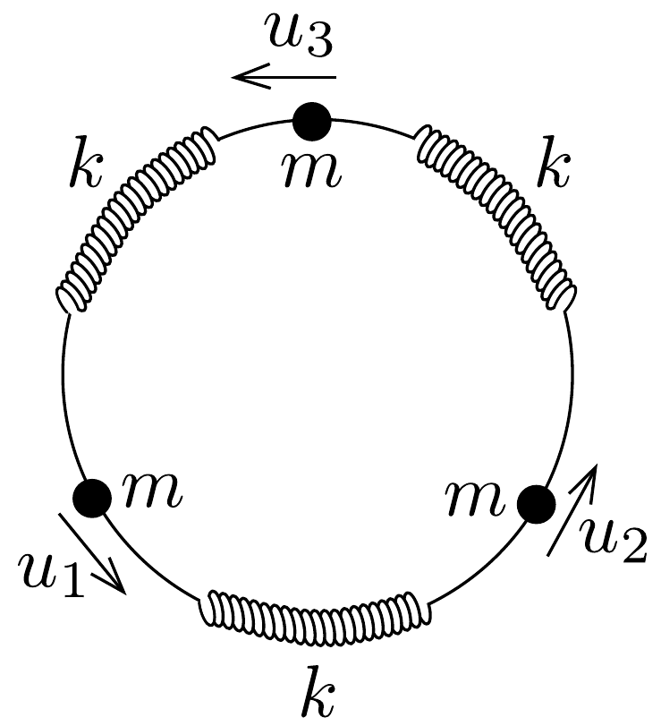

## Feladat 3

Három, egyaránt $m$ tömegú részecske egyensúlyban van, melyeket elhanyagolható tömegú rugók kötnek össze. A rugók követik a Hooke-törvényt $k$ rugóállandóval. A részecskék a 97. ábrán látható módon csak egy kör mentén mozoghatnak.

Az egyes részecskéket az egyensúlyi helyzetükből kicsit kimozdítjuk $u_{1}, u_{2}$, illetve $u_{3}$ távolsággal.

a) Írjuk fel ebben az esetben mindegyik részecske mozgásegyenletét!
b) Mutassuk meg, hogy az egyenletrendszernek az alábbi egyszerú harmonikus megoldásai vannak:
\[
u_{n}=a_{n} \cos (\omega t), \quad(n=1,2,3),
\]
$-\omega^{2} u_{n}$ gyorsulásértékekkel, ahol $a_{n}$ állandó amplitúdók, az $\omega$ körfrekvencia pedig az alábbi két értéket veheti fel: $\omega_{0} \sqrt{3}$, illetve 0 , ahol $\omega_{0}^{2}=k / m$, és az első érték kétszer lép fel.
$c)$ A rugók és részecskék egymást váltogató rendszerét terjesszük ki $N$ számú részecskére. (Mindegyik $m$ tömegú és rugókkal kapcsolódik a szomszédos részecskékhez. Kezdetben a rugók feszítetlenek, és a rendszer nyugalomban van.)

Írjuk fel az $n$-edik részecske $(n=1,2, \ldots, N)$ mozgásegyenletét a szomszédos részecskék elmozdulásainak segítségével, ha a részecskéket kimozdítjuk egyensúlyi helyzetükből!

Igazoljuk, hogy a harmonikus rezgést leíró megoldások
\[
u_{n}(t)=a_{s} \sin \left(\frac{2 n s \pi}{N}+\Phi\right) \cos \omega_{s} t
\]
alakúak, ahol $s=1,2, \ldots, N ; n=1,2, \ldots, N$ és $\Phi$ egy tetszőleges fázis, továbbá
\[
\omega_{s}=2 \omega_{0} \sin (s \pi / N),
\]
ahol $a_{s}(s=1,2, \ldots, N) n$-től független, állandó amplitúdók.
Állapítsuk meg a lehetséges frekvenciák tartományát egy olyan lánc esetén, amely végtelen számú tömeget tartalmaz!
- d) Határozzuk meg az $\frac{u_{n}}{u_{n+1}}$ arányt nagy $N$-ekre két esetben:
- (i) alacsony frekvenciás megoldásokra,
- (ii) $\omega=\omega_{\text {max }}$ esetén, ahol $\omega_{\text {max }}$ a maximális frekvenciájú megoldás,

Vázoljunk fel az $(i)$, illetve a $(i i)$ esetben tipikus megoldásgörbéket, amelyek a részecskéknek adott $t$ időpontbeli elmozdulását ábrázolják a részecskék láncmenti sorszámának a függvényében!
- $e$ ) Becsüljük meg, milyen lényeges változást hozna létre a körfrekvencia eloszlásában az, ha az egyik tömeget kicserélnénk egy $m^{\prime} \ll m$ nagyságú tömegre!

A fenti eredmény alapján írjuk le kvalitatívan egy olyan kétatomos molekulalánc frekvenciaspektrumát, amely felváltva tartalmaz $m$ és $m^{\prime}$ tömegü részecskéket!

Megjegyzés:
\[
\begin{gathered}
\sin (A+B)=\sin A \cos B+\cos A \sin B \\
\sin A+\sin B=2 \sin \left(\frac{A+B}{2}\right) \cos \left(\frac{A-B}{2}\right) \\
2 \sin ^{2} A=1-\cos 2 A
\end{gathered}
\]
