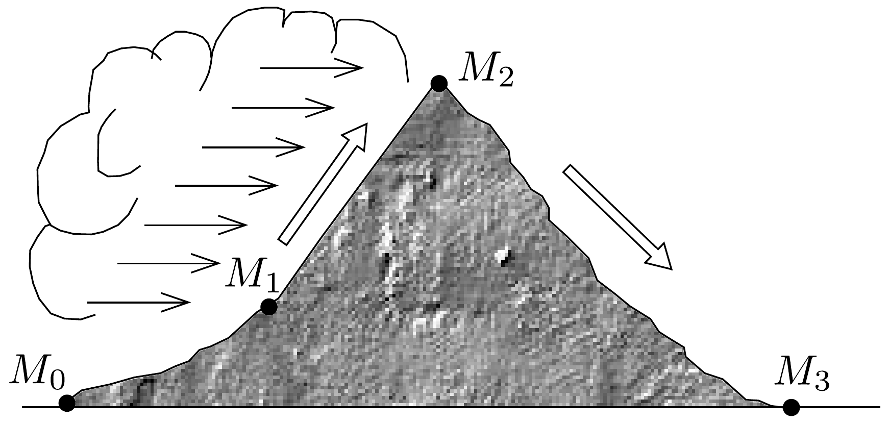

## Feladat 1

Nedves levegő adiabatikusan áramlik át a 111. ábrán látható hegyláncon. Az $M_{0}$ és $M_{3}$ meteorológiai állomásokon 100 kPa légnyomást mérnek, míg az $M_{2}$ állomáson a nyomás 70 kPa. A levegő hőmérséklete $M_{0}$-nál $20^{\circ} \mathrm{C}$. Miközben a levegő emelkedik, 84,5 kPa-nál felhőképződés indul meg. A hegyen felfelé emelkedő nedves levegő mennyiségét úgy írhatjuk le, hogy megadjuk: minden négyzetméter földfelület fölött 2000 kg nedves levegő található. A nedves levegő 1500 másodperc alatt éri el a hegygerincet (az $M_{2}$ állomást). Az emelkedés alatt minden kilogram levegőből 2,45 g mennyiségú víz válik ki esó formájában.

- a) Határozzuk meg a felhőképződés magasságához tartozó $T_{1}$ hőmérsékletet!
- b) Mekkora a felhőképződés kezdetének $h_{1}$ magassága az $M_{0}$ állomáshoz képest? (Tételezzük fel, hogy a légkör sürúsége a magassággal lineárisan csökken!)
- c) Mekkora $T_{2}$ hőmérsékletet mérnek a hegygerincen?
- d) Számítsuk ki, hogy mennyi (milyen magas vízoszlopnak megfelelő) eső esik 3 óra alatt, feltéve hogy az eső egyenletesen esik az $M_{1}$ és $M_{2}$ pontok között!
- e) Mennyi a hegylánc mögötti $M_{3}$ állomáson mérhető $T_{3}$ hőmérséklet? Diszkutáljuk, hogy mennyiben más a légkör állapota az $M_{3}$ állomásnál az $M_{0}$-beli állapothoz képest!

Útmutatás és adatok: A légkör ideális gáznak tekinthető. Hanyagoljuk el a vízgőz befolyását a fajhőre és a levegő súrúségére, továbbá ne vegyük figyelembe a párolgáshő hőmérsékletfüggését. A hőmérsékleteket 1 K-es pontossággal, a felhőképződés helyét 10 m-es pontossággal, a lehulló eső mennyiségét pedig 0,1 mm-es pontossággal határozzuk meg!

A légkör fajhője a vizsgált hőmérséklet-tartományban $c_{p}=1005 \mathrm{~J} /(\mathrm{kg} \cdot \mathrm{K})$. Az $M_{0}$ állomáson a légkör súrúsége $p_{0}$ és $T_{0}$ értékeknél $\varrho_{0}=1,189 \mathrm{~kg} / \mathrm{m}^{3}$. A víz párolgáshője a felhőben $L=2500 \mathrm{~kJ} / \mathrm{kg}$, továbbá $\kappa=c_{p} / c_{v}=1,4, g=9,81 \mathrm{~m} / \mathrm{s}^{2}$.

