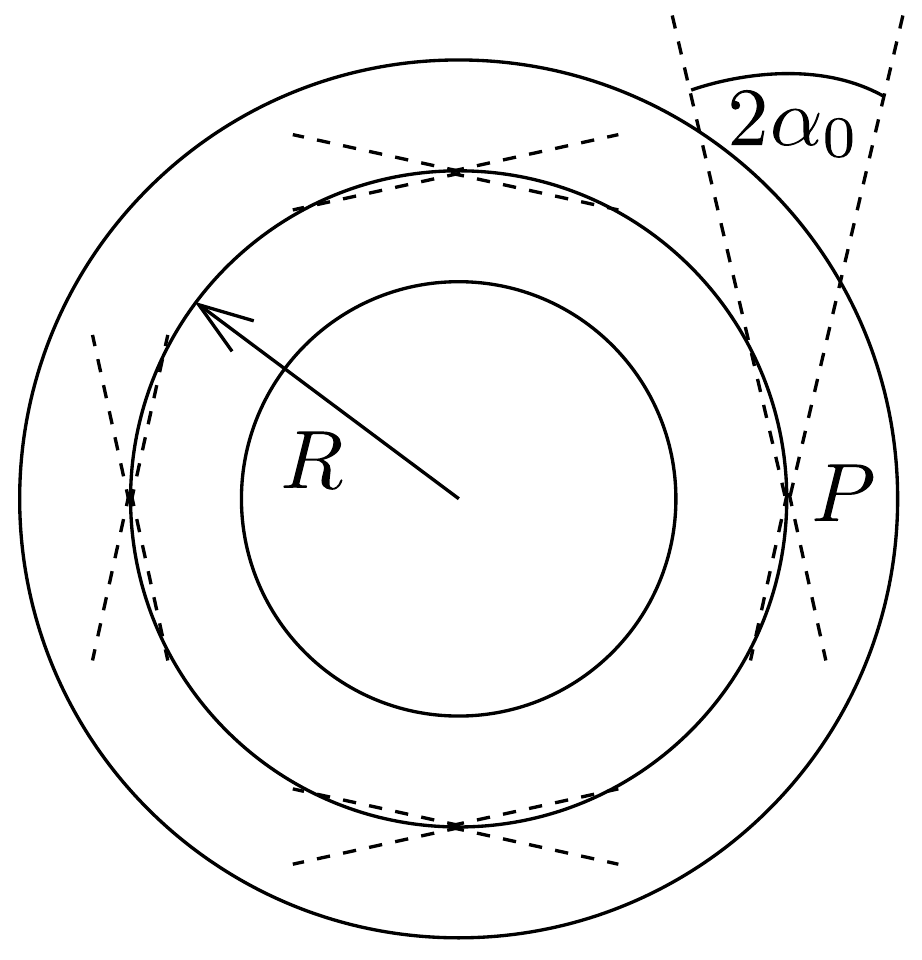

## Feladat 2

Egy pontszerú $P$ elektronforrás elektronnyalábot bocsájt ki, amely egy toroid tekercs $B$ mágneses mezőjébe jut, az erővonalakkal megegyező irányban (112. ábra). A nyaláb széttartásának szöge $2 \alpha_{0}$, amelyről feltehető, hogy kicsiny $\left(\alpha_{0} \ll 1\right)$. Az elektronok $V_{0}$ gyorsítófeszültség alkalmazása után a toroid középkörének $R$ sugaránál jutnak be a tekercs belsejébe. $\boldsymbol{B}$ nagyságát állandónak tekinthetjük és az egyes elektronok közötti elektrosztatikus kölcsönhatást elhanyagolhatjuk.

a) Annak érdekében, hogy az elektronnyalábot a toroid belsejében tartsuk, bizonyos $\boldsymbol{B}_{1}$ homogén mágneses eltérítő mező́t kell alkalmaznunk. Számítsuk ki azt a $B_{1}$ értéket, amely ahhoz szükséges, hogy egy elektron $R$ sugarú körpályán mozogjon a toroidban!
b) A toroid terében négy, egymáshoz képest $\pi / 2$-vel eltolt helyzetú fókuszpontot akarunk létrehozni az elektronnyalábban. Határozzuk meg, mekkora $B$ érték szükséges ehhez!

Megjegyzés: Az elektron pályájának vizsgálata során tekintsünk el a mágneses mező görbültségétől!
c) Ha a $\boldsymbol{B}_{1}$ eltérítő mezőt kikapcsoljuk, akkor az elektronnyaláb nem képes megmaradni a toroidban, hanem az ábra síkjára merőleges irányú szisztematikus mozgással (drift) elhagyja azt.
(i) Mutassuk meg, hogy az elektronok sugárirányban csak véges mértékben térnek el a bebocsátási helyhez tartozó sugártól!
(ii) Határozzuk meg a driftsebesség irányát!

Megjegyzés: Az elektronnyaláb széttartásának szögét elhanyagolhatjuk. Használjuk fel az energia- és a perdületmegmaradás törvényét!

Adatok: $e / m=1,76 \cdot 10^{11} \mathrm{C} / \mathrm{kg}, V_{0}=3 \mathrm{kV}, R=50 \mathrm{~mm}$.
