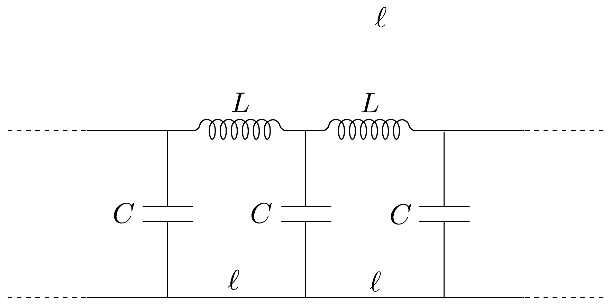

## Feladat 3

Ha a 113. ábrán látható, végtelen $L C$-láncban szinuszos hullámok terjednek, két egymást követő kondenzátor váltófeszültségének fázisa $\varphi$-vel különbözik egymástól.
a) Határozzuk meg, hogyan függ $\varphi$ az $\omega$ körfrekvenciától, $L$-től és $C$-től!

- b) Határozzuk meg a hullámok terjedési sebességét, ha az egyes cellák hossza $\ell!$
- c) Állapítsuk meg, milyen feltételek esetén igaz, hogy a hullámok terjedési sebessége csak kis mértékben függ $\omega$-tól, és határozzuk meg ebben az esetben a sebességet!
- d) Javasoljunk olyan egyszerú mechanikai modellt, amely analóg a fenti áramkörrel, és vezessünk le olyan egyenleteket, amelyek igazolják a modell érvényességét!

Megjegyzés:
\[
\sin \alpha+\sin \beta=2 \sin \left(\frac{\alpha+\beta}{2}\right) \cos \left(\frac{\alpha-\beta}{2}\right) .
\]
