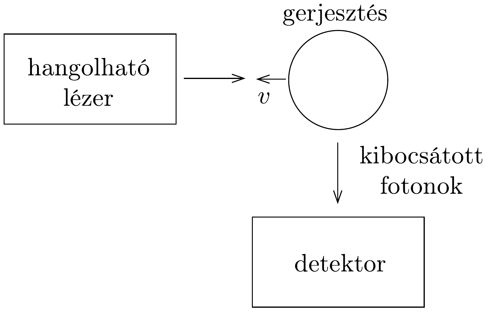
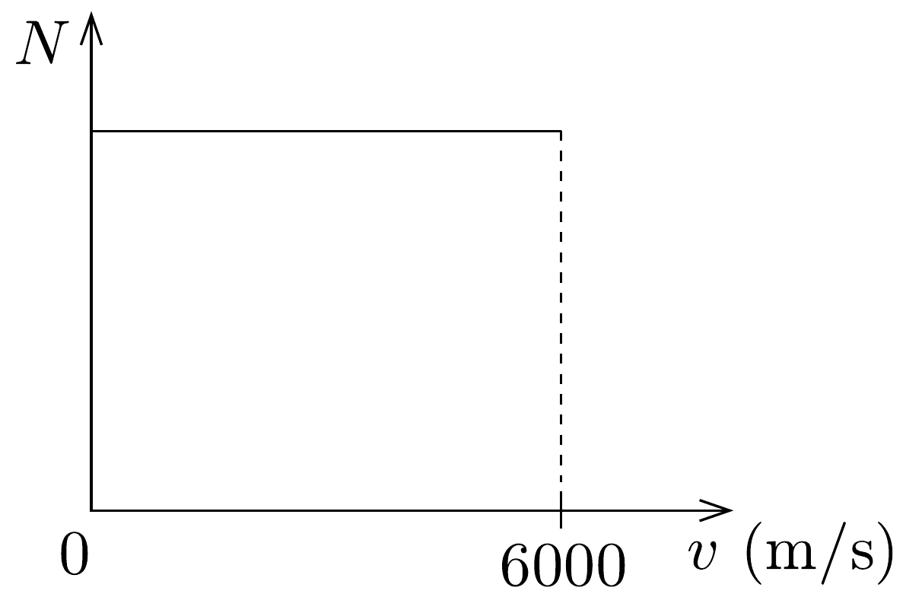

## Feladat 1

Részecskék sebességének spektroszkópiai vizsgálata Doppler-eltolódás segítségével

Az atomok fotonkibocsátása, illetve fotonelnyelése megfordítható folyamat. Erre példa a gerjesztés, majd az azt követő visszatérés az alapállapotba. Így lehetőség nyílik arra, hogy a fotonok elnyelődését a későbbi spontán fotonkibocsátás észlelése révén vizsgáljuk (fluoreszcencia). Modern vizsgálatokban ezt a jelenséget használják fel az atomi részecskék észlelésére és azonosítására, továbbá az atomi részecskenyalábok sebességeloszlásának meghatározására.

A 118. ábrán látható idealizált kísérleti elrendezésben egyszeresen töltött ionok $v$ sebességgel mozognak egy lézersugárral szemben. A lézer $\lambda$ hullámhossza változtatható. A nyugalomban levő részecskék $(v=0) \lambda_{1}=600 \mathrm{~nm}$ hullámhosszal gerjeszthetők. A mozgó részecskék gerjesztéséhez ettől eltérő hullámhossz szükséges a Doppler-effektusnak megfelelően.

Az ionok sebességeloszlása egyenletes a $v_{1}=0$ és $v_{2}=6000 \mathrm{~m} / \mathrm{s}$ értékek között. A 119. ábra a részecskeszámot ábrázolja a részecskesebesség függvényében.
1.1.A. Milyen hullámhosszhatárok között kell a lézert megváltoztatni ahhoz, hogy minden ion gerjesztődjön? Vázoljuk föl az újrakibocsátott fotonok számának eloszlását a lézer hullámhosszának függvényében! Ebben a részfeladatban a klasszikus Doppler-eltolódás képletével számoljunk.
1.1.B. Az előző feladat pontos tárgyalásához a Doppler-eltolódás relativisztikus kifejezése szükséges:
\[
v^{\prime}=v \sqrt{\frac{1+v / c}{1-v / c}} .
\]

Adjuk meg, hogy a klasszikus formula használata milyen nagyságrendú hibához vezet!
1.2. Tegyük fel, hogy az ionok gerjesztésük előtt $U$ nagyságú gyorsító elektrosztatikus potenciálkülönbségen haladnak keresztül. Mi a matematikai kapcsolat a sebességeloszlás szélessége és a gyorsítófeszültség nagysága között? Kiszélesíti, vagy elkeskenyíti a feszültség a sebességeloszlást?
1.3. Egy $e / m=4 \cdot 10^{6} \mathrm{C} / \mathrm{kg}$ fajlagos töltésú ionnak két állapota van, az ezeknek megfelelő hullámhosszak $\lambda_{1}=600 \mathrm{~nm}, \bar{\lambda}_{1}=\lambda_{1}+10^{-3} \mathrm{~nm}$. Mutassuk meg, hogy az összes ion gerjesztésekor a lézer kétféle ionállapotnak megfelelő hullámhossztartománya átfedésben van, ha nem alkalmazunk gyorsítófeszültséget. Megválasztható-e a gyorsítófeszültség értéke oly módon, hogy ne legyen átfedés a tartományok között? Ha igen, számítsuk ki az ehhez szükséges minimális feszültség értékét!
