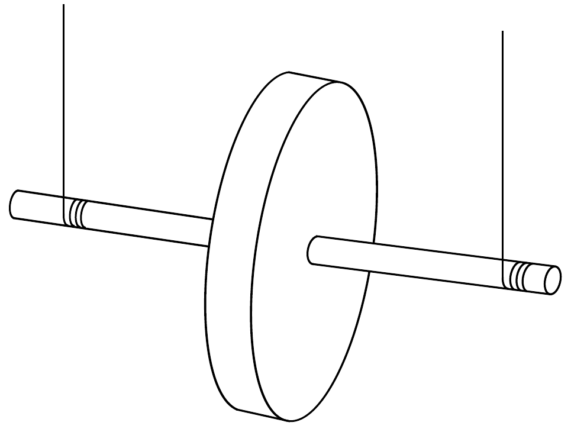
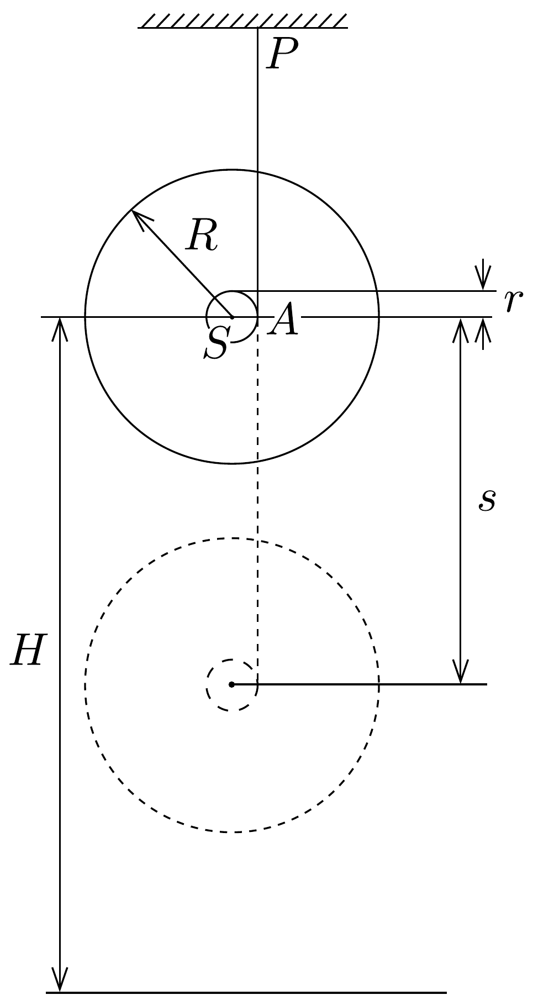

## Feladat 2

Maxwell-korong

Egy $M=0,40 \mathrm{~kg}$ tömegǘ, $R=0,060 \mathrm{~m}$ sugarú, $d=0,010 \mathrm{~m}$ vastag, egyenletes tömegeloszlású hengeres korongot két egyenlő hosszúságú fonálra függesztünk fel. A fonalak egy $r=0,0030 \mathrm{~m}$ sugarú, a korong középpontján átmenő tengelyhez csatlakoznak (a fonalak tömege és vastagsága, valamint a tengely tömege elhanyagolható). A fonalakat a tengelyre felcsévélve a korongot (a tömegközéppontját) $H=1,0 \mathrm{~m}$ magasságba emeljük, majd elengedjük, hogy letekeredjen
(120. ábra). Tegyük fel, hogy az $A$ pillanatnyi forgástengely a letekeredés során a $P$ felfüggesztési pont alatt helyezkedik el, vagyis a fonalak mindig függőlegesek maradnak, azaz a fonalak nagyon hosszúak (121. ábra).

2.1. Mekkora $\omega$ szögsebességgel rendelkezik a forgó korong az $S$ tömegközéppont $s$ nagyságú süllyedése után?
2.2. Mekkora a korong $E_{\mathrm{t}}$ haladási (transzlációs) mozgási energiája $s=0,50 \mathrm{~m}$ süllyedés után? Határozzuk meg számszerúen, hogy ez az energia hogyan aránylik a feladatban szerepet játszó többi energiákhoz ebben a pillanatban!
2.3. Határozzuk meg az egyes fonalakban fellépő feszítőerőt a korong leereszkedése közben!
2.4. A korong a pályájának legalsó pontját elérve újra emelkedni kezd. Számítsuk ki a korong $\omega^{\prime}$ szögsebességét a $\varphi$ elfordulási szög függvényében a 122. ábrán látható átfordulási fázisban! Adjuk meg a korong tömegközéppontjának elmozdulás- és sebességösszetevőit a $\varphi$ elfordulási szög függvényében!
2.5. A fonál legfeljebb $K_{0}=10 \mathrm{~N}$ feszítőerőt bír ki. Mekkora lehet maximálisan a fonalak $s_{\text {max }}$ lecsavarodási hossza, hogy ne következzék be szakadás az átfordulási fázisban?
