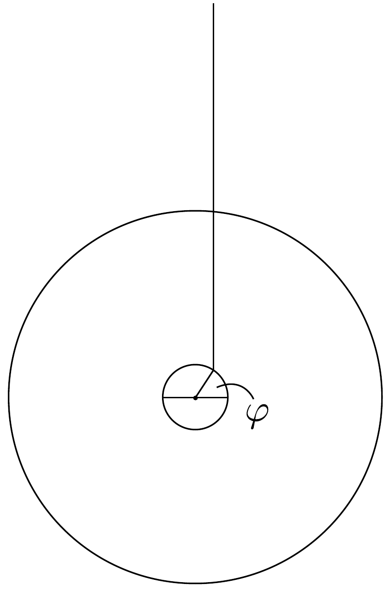

## Feladat 3

Rekombinációs folyamatok gázkisülésben
Elegendően magas hőmérsékletú gázkisülési cső különböző fajtájú ionokat tartalmaz. Vannak közöttük olyan, ismeretlen $Z$ rendszámú atomok, amelyek egy ki-

vételével valamennyi elektronjukat elvesztették. Ezeket a továbbiakban $A^{(Z-1)+}$ módon jelöljük.

Adatok:
- - $\varepsilon_{0}=8,854 \cdot 10^{-12} \mathrm{As} /(\mathrm{Vm})$,
- - elemi töltés: $e=1,602 \cdot 10^{-19} \mathrm{C}$,
- - $q^{2}=e^{2} /\left(4 \pi \varepsilon_{0}\right)=2,307 \cdot 10^{-28} \mathrm{Jm}$,
- $-\hbar=h /(2 \pi)=1,054 \cdot 10^{-34} \mathrm{Js}$,
- - elektron tömege: $m_{\mathrm{e}}=9,108 \cdot 10^{-31} \mathrm{~kg}$,
- - Bohr-sugár: $r_{\mathrm{B}}=\hbar^{2} /\left(m_{\mathrm{e}} q^{2}\right)=5,292 \cdot 10^{-11} \mathrm{~m}$,
- - Rydberg-energia: $E_{\mathrm{R}}=q^{2} /\left(2 r_{\mathrm{B}}\right)=2,180 \cdot 10^{-18} \mathrm{~J}$,
- - proton nyugalmi energiája: $m_{\mathrm{p}} c^{2}=1,503 \cdot 10^{-10} \mathrm{~J}$.

3.1. Tételezzük fel, hogy az $A^{(Z-1)+}$ ion egyetlen megmaradt elektronja alapállapotban van. Ebben az állapotban az elektron magtól mért távolságnégyzetének átlagát $r_{0}^{2}$-tel jelöljük és a $(\Delta x)^{2},(\Delta y)^{2},(\Delta z)^{2}$ helybizonytalanságok összegeként értelmezzük. Hasonló módon az elektron impulzusnégyzetének átlagát $p_{0}^{2}$-tel jelöljük és a $\left(\Delta p_{x}\right)^{2},\left(\Delta p_{y}\right)^{2},\left(\Delta p_{z}\right)^{2}$ impulzusbizonytalanságok összegeként definiáljuk.

Milyen egyenlőtlenséget elégít ki a $\left(p_{0}^{2}\right) \cdot\left(r_{0}^{2}\right)$ szorzat?
3.2. Egy $A^{(Z-1)+}$ ion befoghat egy elektront, majd kibocsát egy fotont. Írjuk fel azokat az egyenleteket, amelyekből a foton frekvenciája meghatározható, de ne oldjuk meg ezeket!
3.3. Határozzuk meg az $A^{(Z-1)+}$ ion energiáját annak a ténynek a felhasználásával, hogy alapállapotban az energia minimális. A számolás során használjuk a következő közelítéseket:
(i) A potenciális energia képletében $(1 / r)$ átlagértékét helyettesítsük $\left(1 / r_{0}\right)$ lal, ahol $r_{0}$ a 3.1 pontban szereplő mennyiség.
(ii) A mozgási energia kifejezésében az impulzus négyzetének átlagát helyettesítsük a 3.1. feladatbeli $p_{0}^{2}$-tel, majd használjuk fel a 3.1. feladat megoldásának $\left(p_{0}^{2}\right)\left(r_{0}^{2}\right)=\hbar^{2}$ alakú, egyszerűsített változatát.
3.4. A fentihez hasonló módon határozzuk meg az $A^{(Z-2)+}$ ion energiáját. Ez az ion további elektron felvételével alakul ki, és feltételezhetjük róla, hogy alapállapotban van. Jelöljük a két elektronnak a magtól való átlagos távolságát (a 3.3. részfeladatban szereplő $r_{0}$ megfelelőjét) $r_{1}$-gyel és $r_{2}$-vel. Az egymástól mért átlagos távolságukat egyszerűen közelítsük $\left(r_{1}+r_{2}\right)$-vel. Tegyük fel továbbá, hogy mindkét elektron impulzusnégyzetének átlagértéke kielégíti a határozatlansági relációt $\left(p_{1}^{2}\right)\left(r_{1}^{2}\right)=\hbar^{2}$ és $\left(p_{2}^{2}\right)\left(r_{2}^{2}\right)=\hbar^{2}$ alakban.

Útmutatás: Felhasználható az a tény, hogy az alapállapotban $r_{1}=r_{2}$.
3.5. Szorítkozzunk a továbbiakban arra a speciális folyamatra, amelyben egy nyugalomban levő és alapállapotú $A^{(Z-1)+}$ ion befog egy szintén nyugalomban levő elektront.

Határozzuk meg azt a $Z$ rendszámot, amelynél az elektronbefogást (rekombinációt) követő foton körfrekvenciája $\omega_{0}=2,507 \cdot 10^{17} \mathrm{~s}^{-1}$. Melyik elem ionjáról van szó?
