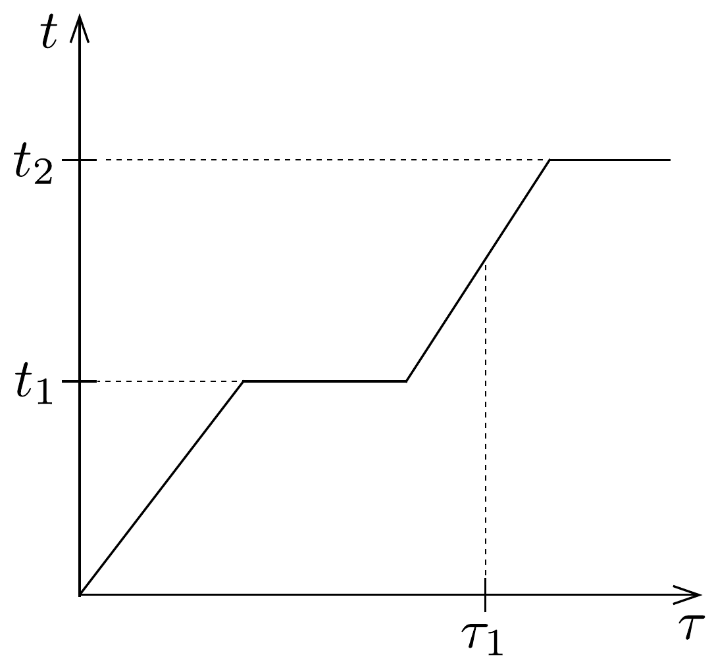

## Feladat 1

Tekintsünk két folyadékot, A-t és B-t, amelyek nem oldódnak egymásban. E folyadékok telített gőzeinek nyomása $p_{i},(i=\mathrm{A}$ vagy B) jó közelítéssel a következő formula szerint számolható:
\[
\ln \frac{p_{i}}{p_{0}}=\frac{a_{i}}{T}+b_{i},
\]
ahol $p_{0}$ a normál légköri nyomást jelöli, $T$ a gőz abszolút hőmérséklete, továbbá $a_{i}$ és $b_{i}$ a folyadékokra jellemző állandók.

A $p_{i} / p_{0}$ arány értékeit az A és a B folyadékokra, 40 °C és 90 °C hőmérsékleten az alábbi táblázat tartalmazza (az értékek hibái elhanyagolhatóak):

\begin{tabular}[t]{|l|l|l|}
\hline \multirow[b]{2}{*}{$t\left({ }^{\circ} \mathrm{C}\right)$} & \multicolumn{2}{|c|}{$p_{i} / p_{0}$} \\
\hline & $i=\mathrm{A}$ & $i=\mathrm{B}$ \\
\hline 40 & 0,284 & 0,07278 \\
\hline 90 & 1,476 & 0,6918 \\
\hline
\end{tabular}
- a) Határozzuk meg az A és B folyadékok forráspontját $p_{0}$ nyomáson!

\begin{tabular}[t]{|l|}
\hline $p_{0}$ \\
\hline C \\
\hline B \\
\hline A \\
\hline
\end{tabular}

125. ábra.

Az A és B folyadékokat egy edénybe öntöttük, amelyben a 125. ábra szerinti rétegek alakultak ki. Azért, hogy a szabad párolgást a B folyadék felszínéről megakadályozzuk, a B folyadék felületét egy nem párolgó C folyadékkal fedtük be, amely nem oldódik sem az A, sem a B folyadékban, és azok sem oldódnak benne. Az A és B folyadékok molekuláinak tömegaránya (gáz állapotban):
\[
\gamma=\frac{\mu_{\mathrm{A}}}{\mu_{\mathrm{B}}}=8 .
\]

Az A és B folyadékok tömege kezdetben egyforma, $m=100 \mathrm{~g}$. A rétegek vastagsága és a folyadékok súrúsége olyan, hogy feltehetjük: az edényben a nyomás gyakorlatilag mindenhol megegyezik a külső légnyomással. Ezek után lassan, folyamatosan és egyenletesen melegíteni kezdjük a folyadékrendszert. Azt találjuk, hogy a folyadék $t$ hőmérséklete a $\tau$ idő függvényében a 126. ábrán vázolt módon változik.

b) Határozzuk meg az ábra vízszintes szakaszainak megfelelő $t_{1}$, és $t_{2}$ hőmérsékleteket! Számítsuk ki az A és a B folyadék tömegét az ábrán látható valamely $\tau_{1}$ időpillanatban! A $t_{1}$ és $t_{2}$ hőmérsékletet kerekítsük egész (Celsius) fokra, a folyadék tömegét pedig tizedgramm pontossággal adjuk meg!

Megjegyzés: Feltesszük, hogy a vizsgált folyadékok gőzei jó közelítéssel
(i) eleget tesznek a Dalton-törvénynek, azaz a gázok keverékeinek nyomása egyenlő a gázkeveréket alkotó gázok parciális nyomásainak összegével,
(ii) egészen a telített gőznek megfelelő nyomásig ideális gáznak tekinthetők.
