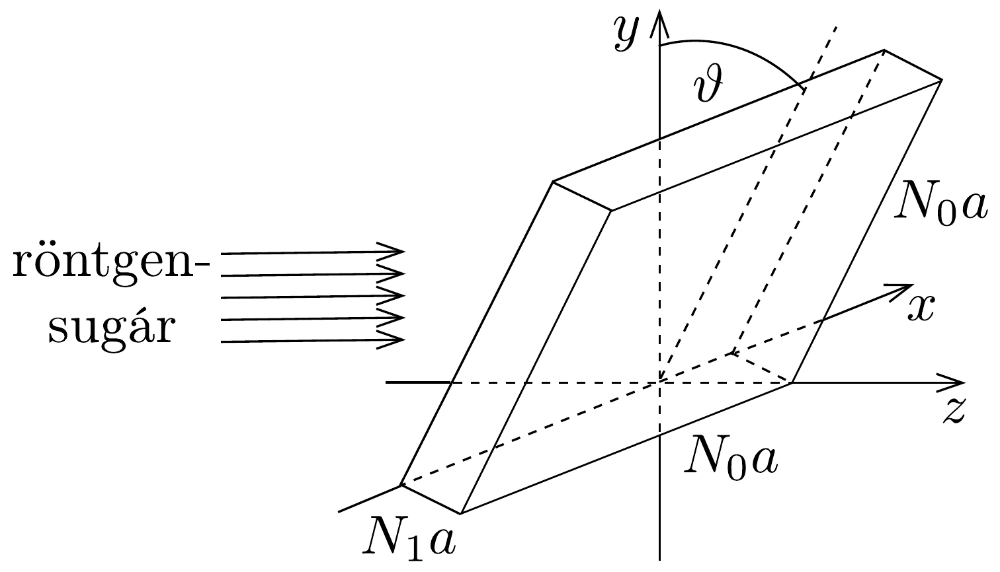
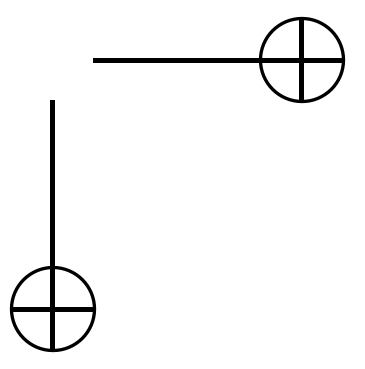
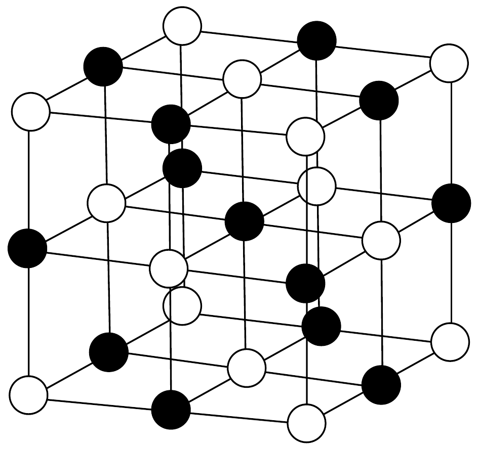
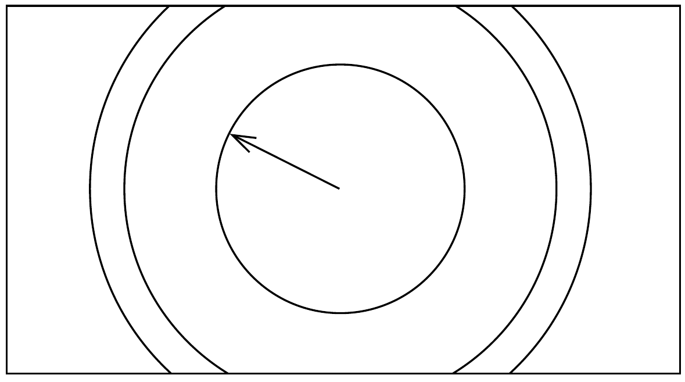

## Feladat 1

Röntgensugarak elhajlása kristályrácson

Röntgensugarak elhajlását fogjuk vizsgálni egyszerú köbös kristályrácson. Először egy monokromatikus síkhullám elhajlását tanulmányozzuk. A hullám merőlegesen esik egy kétdimenziós rácsra, amely $N_{1} \times N_{2}$ résből áll, ezek távolsága $d_{1}$ és $d_{2}$. Az elhajlási képet a rácstól $L$ távolságra lévó ernyőn észleljük. Az ernyő párhuzamos a ráccsal, továbbá $L$ sokkal nagyobb, mint $N_{1} d_{1}$ és $N_{2} d_{2}$.
a) Határozzuk meg az ernyőn látható főmaximumok helyzetét és szélességét! (A szélességen a kérdéses maximumhellyel szomszédos két minimumhely közti távolságot értjük.)

Tekintsünk ezek után egy a rácsállandójú, köbös kristályt, melynek mérete $N_{0} a \times N_{0} a \times N_{1} a$, ahol $N_{1} \ll N_{0}$. A kristályt a 127. ábrán látható módon $z$ irányú, párhuzamos röntgensugár-nyaláb útjába helyezzük úgy, hogy a kristály kicsiny $\vartheta$ szöget zárjon be az $y$ iránnyal. Az elhajlási képet most is a kristálytól messze elhelyezett ernyőn észleljük.

b) Számítsuk ki a maximumok helyzetét és szélességét a $\vartheta$ szög függvényében! Írjuk le, milyen speciális következménye van annak, hogy $N_{1} \ll N_{0}$ !

Az elhajlási kép az ún. Bragg-elmélet segítségével is levezethető. Ennek lényege az a feltételezés, hogy a röntgensugarak a kristályrács atomsíkjain tükröződnek. Az elhajlási kép ezeknek a tükröződő sugaraknak egymással történő interferenciájából jön létre.
c) Mutassuk meg, hogy a fenti ún. Bragg-reflexió ugyanott adja a maximumok helyét, mint azok a feltételek, melyeket a $b$ ) részben meghatároztunk!

Bizonyos méréseknél az ún. pormódszert alkalmazzák. A röntgensugár nagyon sok, parányi kristályon szóródik. (Természetesen ezeknek a kristályoknak a mé-

rete sokkal nagyobb, mint az $a$ rácsállandó.) Egy kísérletben 0,15 nm hullámhosszú röntgensugarakat szóratunk kálium-kloridon (KCl), amely köbös kristályrácsú (lásd a 128. ábrát). A fotolemezen koncentrikusan sötét körök jelennek meg. A kristály és a fotolemez közötti távolság 0,10 m, a legkisebb kör sugara 0,053 m (lásd a 129. ábrát). $\mathrm{A} \mathrm{K}^{+}$és a $\mathrm{Cl}^{-}$ionok lényegében ugyanakkora méretúek, így azonos szórócentrumoknak tekinthetők.

- d) Számítsuk ki két szomszédos káliumion távolságát a kristályrácsban!
