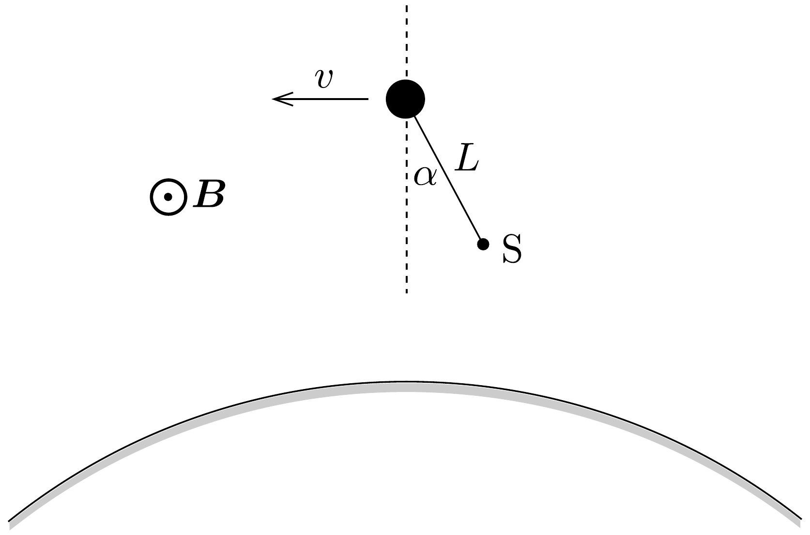

## Feladat 2

Elektromos kísérletek a Föld magnetoszférájában
1991 májusában állították Föld körüli pályára az Atlantis úrrepülőgépet. Tegyük fel, hogy a pályája kör alakú, amely a Föld egyenlítői síkjában fekszik. Egy meghatározott időpontban az úrrepülőgép kibocsát egy szondát, és ez egy $L$ hosszúságú, elektromosan vezetó rúddal kapcsolódik az Atlantishoz. Tételezzük fel, hogy a rúd merev, elhanyagolható tömegú, továbbá elektromosan szigetelő burkolat veszi körül. Mindenféle súrlódást elhanyagolunk.

Legyen $\alpha$ a rúd és az Atlantist a Föld középpontjával összekötő egyenes által bezárt szög (lásd a 130. ábrát)! Az S szonda szintén az Egyenlítő síkjában helyezkedik el. Tegyük fel, hogy a szonda tömege sokkal kisebb, mint az Atlantisé, továbbá $L$ sokkal kisebb, mint a pálya sugara.

a) Határozzuk meg, hogy milyen $\alpha$ érték(ek)nél marad a Földhöz képest változatlan az Atlantis és a szonda elhelyezkedése, vagyis milyen $\alpha$ érték(ek)nél marad $\alpha$ időben állandó? Vizsgáljuk meg minden esetben az egyensúly stabilitását!

Tegyük fel, hogy egy adott időpillanatban a rudat kis szöggel kitérítjük stabil egyensúlyi helyzetéből. A szonda ingaszerúen lengésbe jön.
b) Fejezzük ki a szonda lengésidejét a rendszer földkörüli keringési idejének segítségével!

A 130. ábrán a Föld mágneses tere merőleges a rajz síkjára és a papír síkjából kifelé mutat. A rúd pályamenti sebessége miatt a végpontjai között feszültség alakul ki benne. A környezet (a magnetoszféra) ritka ionizált gáz, nagyon jó elektromos vezetőképességgel. Az ionizált gázzal való elektromos érintkezést az Atlantison levő A és a szondán levő S elektródák biztosítják. A mozgás következtében $I$ erósségú áram folyik a rúdon keresztül.
c) Milyen irányú áram folyik a rúdban? (Legyen $\alpha=0$.)

Adatok:
- a keringési idő: $T=5,4 \cdot 10^{3} \mathrm{~s}$,
- a rúd hossza: $L=2,0 \cdot 10^{4} \mathrm{~m}$,
- a Föld mágneses indukciója a szonda környezetében: $B=5,0 \cdot 10^{-5} \mathrm{~T}$,
- az Atlantis tömege: $m=1,0 \cdot 10^{5} \mathrm{~kg}$.

Ezek után az úrrepülőgépben levő áramforrást is bekötjük az áramkörbe, és ily módon 0,1 A erősségú eredő egyenáram folyik az eddigivel ellentétes irányban.
d) Mennyi idő szükséges ahhoz, hogy a fenti áram hatására a pályasugár fokozatosan 10 m-rel megváltozzék? (Tegyük fel, hogy $\alpha$ mindvégig nulla marad! Hanyagoljuk el a magnetoszférában folyó áramok valamennyi hatását!) Csökken vagy pedig növekszik a pályasugár?
