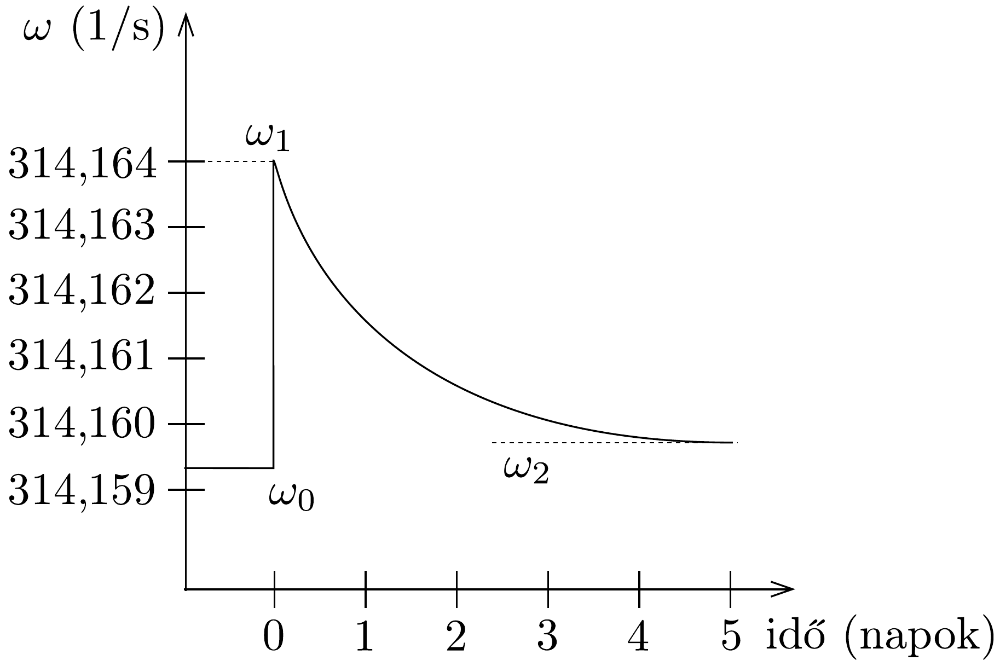

## Feladat 3

Forgó neutroncsillag
A „milliszekundomos pulzár” olyan kozmikus sugárforrás, amely nagyon rövid impulzusokat bocsát ki néhány milliszekundumos periódusidővel. Ez a sugárzás a rádióhullámok tartományába esik; megfelelő vevőkészülékkel az egyes impulzusokat külön-külön észlelhetjük, és ily módon a periódusidőt nagy pontossággal meghatározhatjuk.

Ezek a rádióimpulzusok egy különleges csillag, az ún. neutroncsillag felszínéről származnak. Ezek a csillagok nagyon tömörek: tömegük a Nap tömegének nagyságrendjébe esik, sugaruk azonban csak néhányszor tíz kilométer. Nagyon gyorsan forognak. A gyors forgás következtében a neutroncsillag kismértékben belapul. Tegyük fel, hogy a felületének a forgástengelyre illeszkedő síkmetszete olyan ellipszis, melynek tengelyei csaknem egyenlő hosszúságúak.

Legyen $r_{\mathrm{p}}$ a pólus felé mutató sugár, $r_{\mathrm{e}}$ pedig az egyenlítői sugár és definiáljuk a „lapultságot” a következő módon:
\[
\varepsilon=\frac{r_{\mathrm{e}}-r_{\mathrm{p}}}{r_{\mathrm{e}}} .
\]
Legyen a neutroncsillag tömege $2,0 \cdot 10^{30} \mathrm{~kg}$, átlagos sugara $1,0 \cdot 10^{4} \mathrm{~m}$, forgási periódusideje $2,0 \cdot 10^{-2} \mathrm{~s}$.
a) Számítsuk ki a neutroncsillag lapultságát! (A gravitációs állandó 6,67 ⋅ $10^{-11} \mathrm{~N} \cdot \mathrm{~m}^{2} \cdot \mathrm{~kg}^{-2}$.)

Hosszú idő (néhány év) alatt az energiaveszteség következtében a csillag forgása lelassul, és ez a lapultság csökkenésével jár együtt. A csillag felszínén azonban szilárd kéreg található, és ez a csillag folyékony belső részén úszik. A szilárd kéreg megakadályozza az egyensúlyi alak folytonos kialakulását. Ehelyett „csillagrengések" játszódnak le, amelyek gyors változásokat okozva módosítják a kéreg alakját az egyensúlyi forma irányába. Ilyen csillagrengések alatt és után a megfigyelhető szögsebesség a 131. ábrán látható módon változik.
b) A 131. ábra adatai alapján számítsuk ki a folyékony belső rész sugarát! Tekintsük a köpeny és a belső rész súrúségét azonosnak. (Hanyagoljuk el a belső rész alakváltozását.)
