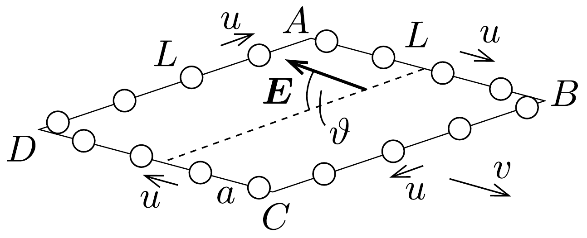

## Feladat 2

Egy négyzet alakú hurkon, amelynek minden oldala $L$ hosszúságú, nagy számú, elhanyagolható méretú, egyenként $q$ töltésú golyó mozog nagyon gyorsan, $u$ sebességgel, miközben a köztük lévó távolság minden esetben $a$ a hurokhoz rögzített koordináta-rendszerből nézve. A golyók úgy vannak a hurokra

felfúzve, mint a gyöngyök egy nyakláncra (lásd a 137. ábrát), továbbá $L \gg a$. A hurkot alkotó, elektromosan nem vezető huzal olyan homogén töltéssúrúséggel rendelkezik, amely tökéletesen semlegesíti a golyók teljes töltését.

Tekintsük azt az esetet, amikor a hurok az $A B$ oldallal párhuzamosan $v$ sebességgel mozog egy olyan tartományban, ahol a hurok sebességére merőleges $E$ térerősségú, homogén elektromos mező van. A hurkot mindvégig egy olyan síkban mozgatjuk, amely $\vartheta$ szöget zár be az $E$ térerősség irányával.

A relativisztikus effektusokat figyelembe véve, számítsuk ki az alábbi mennyiségeket egy olyan megfigyelő vonatkoztatási rendszeréhez képest, aki a hurkot a fenti $v$ sebességgel mozgónak látja:
- a) a golyók közötti $a_{A B}, a_{B C}, a_{C D}$ és $a_{D A}$ távolságokat a hurok minden egyes oldalára;
- b) az eredő töltés értékét (hurok és golyók) a hurok minden egyes oldalára;
\[
Q_{A B}, \quad Q_{B C}, \quad Q_{C D} \text { és } Q_{D A} .
\]
- $c$ ) az elektromos hatásokból létrejövő $M$ forgatónyomatékot, amely a hurkot a golyókkal együtt forgatni igyekszik;
- d) a $W$ energiát, amely a huroknak, illetve a golyóknak az elektromos mezővel való elektrosztatikus kölcsönhatásából származik.

Minden egyes választ a feladat adataival (jelölésével) adjuk meg.
Útmutatás: Egy test elektromos töltése független attól a vonatkoztatási rendszertől, amelyben megmérjük értékét. A feladatban a sugárzási hatásokat elhanyagolhatjuk.

A speciális relativitáselmélet néhány formulája:
- 1. Tekintsük a $K^{\prime}$ vonatkoztatási rendszert, amely $v$ sebességgel mozog egy másik $K$ vonatkoztatási rendszerhez képest. A rendszerek tengelyei párhuzamosak. $v$ iránya az $x$ tengely pozitív irányával egyezik meg. Ha egy részecske a $K^{\prime}$-ben mérve $u^{\prime}$ sebességgel mozog az $x^{\prime}$ irányban, akkor a részecske $K$-ban mért sebessége:
\[
u=\frac{u^{\prime}+v}{1+u^{\prime} v / c^{2}},
\]
továbbá mozgásának iránya $x$-tengely menti (ez a relativisztikus sebességösszeadás).
- 2. Ha egy test hossza nyugalomban $L_{0}$, akkor amint egy megfigyelőhöz képest $v$ sebességgel mozog $L_{0}$ irányában, ez a megfigyelő a következő $L$ hosszat méri:
\[
L=L_{0} \sqrt{1-v^{2} / c^{2}} .
\]
