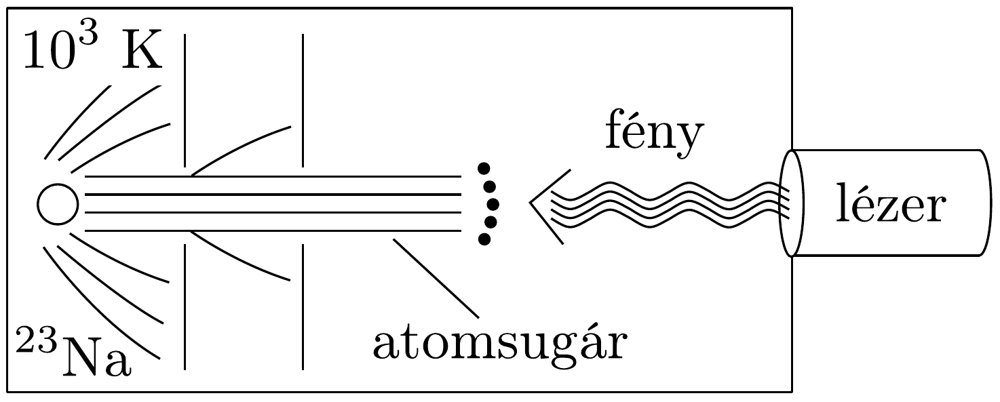
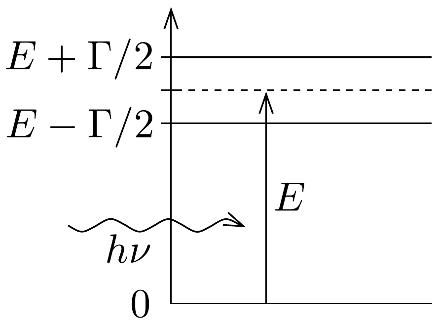
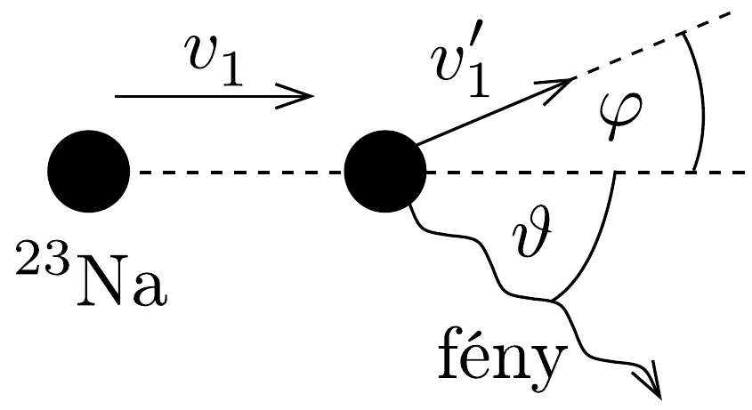

## Feladat 3

Atomok hütése lézerrel
Különálló atomok tulajdonságainak nagy pontosságú vizsgálatához az atomokat csaknem nyugalomban kell tartani bizonyos ideig a tér egy kis tartományában. Ennek elérésére a közelmúltban új módszert dolgoztak ki, amit lézeres hútésnek hívnak. A feladat ezzel kapcsolatos.

Egy vákuumkamrában egy erősen kollimált (párhuzamosított), ${ }^{23} \mathrm{Na}$ atomokból álló sugarat (melyet egy $10^{3} \mathrm{~K}$ hőmérsékletú térben párologtatással kapunk) szemból megvilágítunk egy nagy intenzitású lézersugárral (138. ábra). A lézer frekvenciáját úgy választjuk meg, hogy fotonjai rezonanciaabszorpcióba kerüljenek azokkal az atomokkal, amelyeknek sebessége $v_{0}$. A fény abszorpciójakor (elnyelésekor) az atom az első gerjesztett energiaszintre kerül, amelynek energiája $E$ és szélessége $\Gamma$ (139. ábra). Az atom sebessége a következőképpen változik meg: $\Delta v_{1}=v_{1}-v_{0}$.

Ezután az atom újra fényt sugároz ki, így alapállapotba tér vissza, sebessége $\Delta v^{\prime}=v_{1}^{\prime}-v_{1}$ értékkel, míg mozgásának iránya $\varphi$ szöggel változik (140. ábra).

Az elnyelődések és kisugárzások egymást követő fenti eseményei nagyon sokszor megismétlődnek, egészen addig, amíg az atomok sebessége egy adott $\Delta v$ értékkel meg nem változik úgy, hogy a rezonanciaabszorpció $\nu$ frekvenciájú fénnyel
tovább már nem mehet végbe. Ekkor szükségessé válik a lézer frekvenciájának olyan megváltoztatása, hogy a rezonanciaabszorpció az új sebesség mellett is lejátszódjon, és ezt egészen addig kell folytatni, amíg az atomok közül néhánynak a sebessége csaknem zérussá válik.

A folyamat első közelítésében elhanyagolhatunk minden más atomi kölcsönhatási folyamatot a spontán abszorpción (elnyelődésen), illetve kisugárzáson kívül. Továbbá feltehetjük, hogy a lézer intenzitása olyan nagy, hogy az atomok gyakorlatilag nem töltenek időt alapállapotban.

Adatok:
\[
\begin{gathered}
E=3,36 \cdot 10^{-19} \mathrm{~J}, \quad \Gamma=7,0 \cdot 10^{-27} \mathrm{~J}, \quad c=3,0 \cdot 10^{8} \mathrm{~m} / \mathrm{s}, \\
m_{\mathrm{p}}=1,67 \cdot 10^{-27} \mathrm{~kg}, \quad h=6,62 \cdot 10^{-34} \mathrm{Js}, \quad k=1,38 \cdot 10^{-23} \mathrm{~J} / \mathrm{K},
\end{gathered}
\]
ahol $c$ a fény sebessége, $h$ a Planck-állandó, $k$ a Boltzmann-állandó és $m_{\mathrm{p}}$ a proton tömege.
a) Mekkora legyen a lézer $\nu$ frekvenciája, hogy biztosítsuk a fény rezonanciaabszorpcióját azoknak az atomoknak az esetében, amelyek mozgási energiája a kollimátor mögötti térben párolgó atomok átlagos mozgási energiájával egyezik meg? Mekkora ezeknek az atomoknak a $\Delta v_{1}$ sebességváltozása az első elnyelődési folyamat után?
b) Mekkora $\Delta v_{0}$ sebességintervallumban vannak azok az atomok, amelyek fényt abszorbeálnak az $a$ ) kérdésben kiszámított frekvencia esetén?
c) Egyetlen kisugárzási esemény esetén mekkora az eredeti irányhoz képesti $\varphi_{\text {max }}$ maximális szögeltérés?
d) Mekkora a sebességcsökkenés $\Delta v$ határértéke a $\nu$ frekvencia megváltozása nélkül?
e) Hozzávetőlegesen adjuk meg az elnyelődési-kisugárzási eseményeknek az $N$ számát, amely szükséges ahhoz, hogy egy egyenes mentén haladó, és (az $a$ ) kérdésben említett) $v_{0}$ sebességú atom sebessége csaknem zérusra csökkenjen!
f) Mekkora $\Delta t$ idő alatt játszódik le az utóbbi folyamat? Mekkora $\Delta s$ távolságot tesz meg ennyi idő alatt az atom?
