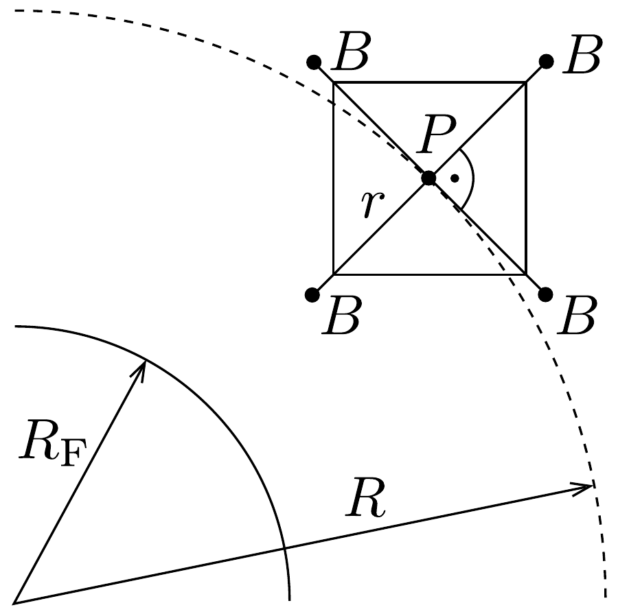

## Feladat 1

Forgó mühold.
Egy múhold közelítőleg kör alakú pályán kering a Föld egyenlítői síkjában. A múhold egy elhanyagolható tömegú központi testből ( $P$ pont), és négy kicsi, $m$ tömegú külső testből áll ( $B$ pontok). Ez utóbbiakat $r$ hosszúságú, vékony, nyújthatatlan kábelek kötik a $P$ ponthoz. Mind az öt test ( $P$ és $B$ pontokban) az Egyenlító síkjában helyezkedik el, és forogva kering ebben a síkban. A négy sugárirányú kábelt egymással is vékony drótok kötik össze, amelyek a szomszédos kábeleket állandóan 90°-os szögben tartják (lásd a 146. ábrát).

Az összekötő drótok csak azért vannak, hogy megakadályozzák az egyes $B$-beli testek lengését. (Enélkül a mozgás vizsgálata hihetetlenül bonyolulttá válna.) Így valamennyi $B$-beli test ugyanazzal az $\omega$ szögsebességgel kering a $P$ pont körül (az állócsillagokhoz viszonyítva); a rendszer merev testként forog.

Vizsgáljuk meg az alábbi kérdéseket általánosságban, minden lehetőséget diszkutálva! Az $a$ ) és $b$ ) alkérdésre numerikus választ is adjunk! (A szükséges számadatok a feladat végén találhatók.)
a) Határozzuk meg a sugárirányú kábelek által a $B$-beli testekre kifejtett erőt azokban a helyzetekben, amikor a $\boldsymbol{R}$ és $\boldsymbol{r}$ vektorok egyirányúak, ellentétes irányúak, illetve merólegesek! Ezek a helyzetek felelnek meg a legnagyobb és a legkisebb kábelerőnek.
b) Mind a négy $B$-beli testben azonos, napenergiával múködő gép található, amelyek a sugárirányú kábelekhez csatlakoznak. Mindegyik gép rövid idő alatt kissé behúzza a kábelt $B$-be, amikor az erő az előző kérdésnek megfelelően maximális, és kiengedi a kábelt ugyanannyival, ha az eró minimális. A gép a kábelt

a teljes hossz 1 \%-ával húzza be, illetve engedi ki. Hosszú idő alatt a kábel átlagos hossza nem változik. Mekkora egy-egy gép egy körülfordulás alatti átlagos teljesítménye? Az átlagos teljesítmény definíciója a következő:
\[
\frac{W_{1}-W_{2}}{T},
\]
ahol $W_{1}$ a gép által a kábel behúzásakor végzett munka, $W_{2}$ a drót által a kiengedéskor végzett munka és $T$ körülfordulás ideje.
c) Elemezzük, hogy milyen változást okoz lassan a múhold mozgásában a gép múködése! Vizsgáljuk meg az alábbi táblázatban felsorolt mennyiségek megváltozásának lehetőségét!

\begin{tabular}[t]{|l|l|l|l|l|}
\hline & növekszik, ha & csökken, ha & nem változik, ha & sohasem változik \\
\hline a mühold keringési sebessége & & & & \\
\hline a múhold pályájának $R$ sugara & & & & \\
\hline a múhold forgásának $\omega$ szögsebessége & & & & \\
\hline a mühold gravitációs potenciális energiája & & & & \\
\hline
\end{tabular}

Kerülhet-e a mühold a gépek által végzett munka hatására egy magasabb keringési pályára?

Kerülhet-e a mühold tetszőlegesen magas, a Föld gravitációs terét lényegében elhagyó pályára? Miért?

A numerikus számításokhoz adatok:
\[
\begin{array}{ll}
\text { Föld tömege: } & M_{\mathrm{F}}=5,97 \cdot 10^{24} \mathrm{~kg}, \\
\text { a gravitációs állandó: } & G=6,673 \cdot 10^{-11} \mathrm{~m}^{3} \mathrm{~kg}^{-1} \mathrm{~s}^{-2}, \\
\text { a Föld egyenlítői sugara: } & R_{F}=6378 \mathrm{~km} . \\
\text { Jelöljük az } M_{\mathrm{F}} G \text { szorzatot } C \text {-vel: } & C=3,983 \cdot 10^{14} \mathrm{~m}^{3} \mathrm{~s}^{-2} .
\end{array}
\]
- 1. A középső test körpályájának $R$ sugara: $R_{F}+500 \mathrm{~km}$.
- 2. A sugárirányú kábelek átlagos hossza $r=100 \mathrm{~km}$, tehát a műholdrendszer átmérője 200 km.
- 3. Az egyes tömegek: $m=1000 \mathrm{~kg}$.
- 4. A kezdetben a négy $B$-beli test (az állócsillagokhoz képest) a $P$ pont körül óránként 10 fordulatot tesz meg.
- 5. A drótok, a kábelek és a központi $P$ test tömege elhanyagolható.

Tanácsok:
- - Vegyük figyelembe, hogy $\omega$ kétféle előjelú is lehet!
- - Nem várunk egzakt megoldást, 5\% pontosságú eredmények tökéletesen elfogadhatóak.
- - A Hold és a Nap gravitációs hatását ne vegyük figyelembe!
