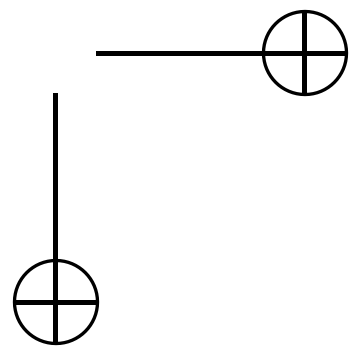
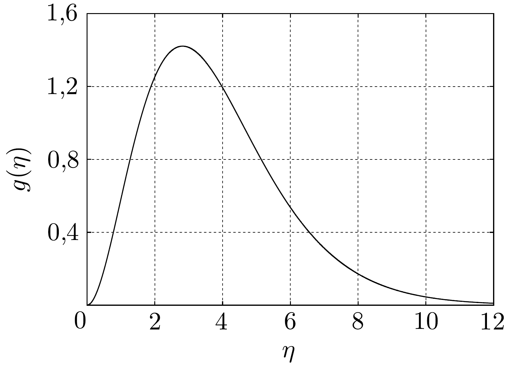

## Feladat 3

Egy ürszonda a napfényben.
Ebben a feladatban egy úrszonda hőmérsékletét fogjuk kiszámítani. Az úrszonda teste egy 1 m átmérőjú gömbnek tekinthető, amelynek hőmérséklete mindenütt ugyanakkora. A szonda teljes felületét egyféle anyaggal burkolták. Az úrszonda a Föld közelében tartózkodik, de nincs a Föld árnyékában.

A Nap sugara $R_{\mathrm{Nap}}=6,96 \cdot 10^{8} \mathrm{~m}$, Nap felszíni hőmérséklete (feketetest sugárzási hómérséklete) $T_{\text {Nap }}=6000 \mathrm{~K}$. A Nap-Föld távolság $R=1,5 \cdot 10^{11} \mathrm{~m}$. A napsugárzás hatására az ưrszonda olyan hőmérsékletre melegszik fel, hogy a napfényből elnyelt teljesítmény megegyezzék a szonda mint feketetest által kisugárzott teljesítménnyel. A feketetest egységnyi felülete által kisugárzott teljesítményt a $P=\sigma T^{4}$ Stefan-Boltzmann-törvény adja meg, ahol $\sigma=5,67 \cdot 10^{-8} \mathrm{Wm}^{-2} \mathrm{~K}^{-4}$ egy univerzális állandó. Első közelítésben feltételezhetjük, hogy mind a Nap, mind az úrszonda teljes mértékben elnyeli az ốt érő elektromágneses sugárzást.
a) Vezessünk le összefüggést, amely megadja az ürszonda $T$ hőmérsékletét! Számítsuk ki számszerúen $T$ értékét!
b) Egy $T$ hómérsékletú feketetest sugárzásának $u(T, f)$ spektrumát a Planck-

féle sugárzási törvény határozza meg:
\[
u(T, f) \mathrm{d} f=\frac{8 \pi k^{4} T^{4}}{c^{3} h^{3}} \cdot \frac{\eta^{3}}{e^{\eta}-1} \mathrm{~d} \eta
\]
ahol $u \mathrm{~d} f$ az $[f, f+\mathrm{d} f]$ frekvenciaintervallumba esó elektromágneses sugárzás energiájának térfogati sűrúsége, továbbá $\eta=h f / k T$. Az állandók értékei: a Planckállandó $h=6,6 \cdot 10^{-34} \mathrm{~J} / \mathrm{s}$, a Boltzmann-állandó $k=1,4 \cdot 10^{-23} \mathrm{~J} / \mathrm{K}$, a fénysebesség pedig $c=3,0 \cdot 10^{8} \mathrm{~m} / \mathrm{s}$.

Ha a feketetest sugárzási spektrumát az összes $f$ frekvenciára és a kisugárzás valamennyi irányára integráljuk, az egységnyi felület által kisugárzott teljes teljesítmény $P=\sigma T^{4}$ képletét kapjuk, összhangban a fent említett Stefan-Boltzmanntörvénnyel $\left(\sigma=2 \pi^{5} k^{4} /\left(15 c^{2} h^{3}\right)\right)$. A 150, ábra a normált spektrumot, vagyis a
\[
g(\eta)=\frac{c^{3} h^{3}}{8 \pi k^{4}} \cdot \frac{u(T, f)}{T^{4}}
\]
értékét mutatja $\eta$ függvényében.

Az úrszondákat általában hüteni kell, annyira, amennyire csak lehet. A szondák hútésére a mérnökök olyan fényvisszaverő borítást alkalmaznak, amely egy bizonyos küszöbértéknél nagyobb frekvenciákra visszaveri a fényt, de az ennél alacsonyabb frekvenciájú hősugárzást nem akadályozza meg. Tegyük fel, hogy ennek az (éles) küszöbfrekvenciának megfelelő $h f / k$ érték 1200 K.

Becsüljük meg, hogy ilyen körülmények között mekkora lesz az ürszonda hőmérséklete!

Megjegyzés. Nem kívánunk egzakt megoldást. Ne végezzünk bonyolult integrálásokat, ahol szükséges, alkalmazzunk közelítéseket! Felhasználhatjuk, hogy
\[
\int_{0}^{\infty} \frac{\eta^{3} d \eta}{e^{\eta}-1}=\frac{\pi^{4}}{15}
\]
és az $\eta^{3} /\left(e^{\eta}-1\right)$ kifejezés $\eta \approx 2,82$-nél maximális. Kis $\eta$ esetén az exponenciális függvény $e^{\eta} \approx 1+\eta$ módon közelíthető.
c) A valódi úrszondáknál, amelyek kiterjesztett napelemei áramot termelnek, a szonda testének belsejében egy extra hőforrást jelent az elektronikus áramkörökben termelődő hő. Feltéve, hogy ennek a belső hőtermelésnek 1 kW a teljesítménye, mekkora volna a fenti $b$ ) részben vizsgált szonda hőmérséklete?
d) Egy festékgyár a következőképp hirdeti speciális festékét:
„Ez a festék az összes bejövő (látható és infravörös) sugárzásnak 90\%-át visszaveri, míg minden frekvencián (látható és infravörös tartományban) feketetestként sugároz, és ezzel sok hốt von el az úrszondától. Ily módon a festékünkkel annyira lehútheti az úrszondáját, amennyire csak lehetséges."

Létezhet-e ilyen festék? Miért, vagy miért nem?
$e$ ) Milyen tulajdonságú borításra van szükség ahhoz, hogy az előbbi szondához hasonló, gömb alakú test hőmérsékletét az $a$ ) alkérdésben számított érték fölé emeljük?
