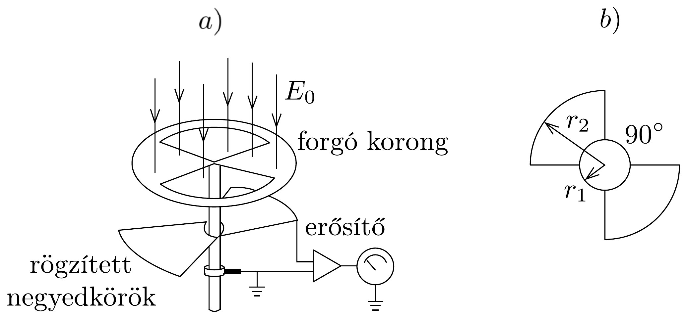
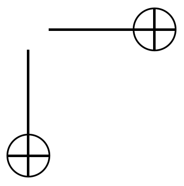
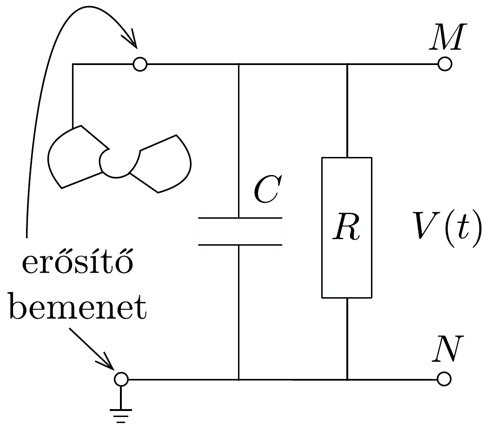

## Feladat 1

Légköri elektromosság

Elektrosztatikus szempontból a Föld felszínét jó vezetőnek tekinthetjük. A Föld egy bizonyos $Q_{0}$ töltéssel rendelkezik, illetve egy $\sigma_{0}$ átlagos felületi töltéssúrúsége van.
a) Jó idő esetén a lefelé mutató $E_{0}$ elektromos térerősség a Föld felszínén hozzávetőlegesen 150 V/m értékú. Határozzuk meg a Föld felszíni töltéssúrúségének nagyságát, illetve a Föld teljes töltését!
b) A lefelé mutató elektromos tér nagysága a magassággal csökken, és 100 m magasságban körülbelül 100 V/m értékú. Számítsuk ki a légkör átlagos eredő töltését köbméterenként a Föld felszíne és a 100 m-es magasság között!
c) Az előző részfeladatban kiszámított eredő töltéssúrúség valójában közel azonos számú, egyszeresen töltött pozitív és negatív iontól származik, amelyeknek egységnyi térfogatra esó száma $n_{+}$és $n_{-}$. A Föld felszínéhez közel, jó idő esetén: $n_{+} \approx n_{-} \approx 6 \cdot 10^{8} \mathrm{~m}^{-3}$. Ezek az ionok a függőleges elektromos tér hatására mozgásban vannak. Sebességük arányos a térerősséggel:
\[
v \approx 1,5 \cdot 10^{-4} \frac{\mathrm{~m}^{2}}{\mathrm{Vs}} \cdot E .
\]
Mennyi idő alatt semlegesítené a légköri ionok mozgása a Föld felületi töltésének a felét, ha más folyamatok (például villámok) nem pótolnák a töltést?
d) A légköri elektromos tér, és így $\sigma_{0}$ mérésére az egyik lehetőséget a 155, a) ábrán látható berendezés jelenti. Két negyedkört, amelyek a földtől szigeteltek, de

egymással össze vannak kötve, közvetlenül egy egyenletesen forgó, földelt korong

alatt rögzítünk. A forgó korongban két negyedkör alakú lyukat vágtunk. (Az ábrán a lemezek távolságát a jobb áttekinthetőség kedvéért felnagyítottuk.) Minden körülfordulás alkalmával a szigetelt negyedköröket kétszer éri teljesen az elektromos tér, illetve (negyed periódussal később) kétszer teljesen árnyékolva lesznek a tértől.

Legyen $T$ a körülfordulás periódusideje és legyenek a szigetelt negyedkörök belsó́ és külső sugarai $r_{1}$ és $r_{2}$ értékúek, amint ezt a 155. b) ábra mutatja. Legyen $t=0$ az a pillanat, amikor a szigetelt negyedkörök teljesen árnyékoltak.

Írjunk fel olyan kifejezéseket, amelyek $t=0$ és $t=T / 2$ között az idő függvényében megadják a szigetelt lemez felsó felületén felhalmozódó $q(t)$ töltést! Ábrázoljuk grafikusan is a töltés időbeli változását! (A légköri ionok áramát most hanyagoljuk el.)
- $e$ ) Az előző alkérdésben leírt berendezés egy erósítőhöz kapcsolódik, amelynek bemenő áramköre egy párhuzamosan kapcsolt $C$ kapacitású kondenzátornak és egy $R$ ellenállásnak feleltethető meg (156. ábra). (Feltételezhetjük, hogy a negyedkörökből álló berendezés saját kapacitása elhanyagolható $C$-hez képest.)

Vázoljuk grafikusan az $M$ és $N$ pontok közötti $V$ feszültséget az idő függvényében a korong egy teljes körülfordulása alatt, közvetlenül azután, hogy a korong $T$ periódusidejú forgásba jött, ha:
- (i) $T=T_{1} \ll R C$;
- (ii) $T=T_{2} \gg R C$.

(Tételezzük fel, hogy $C$ és $R$ rögzített értékek, csak $T$ változik az (i) és (ii) határeseteknek megfelelően.) Adjunk meg közelító formulát a $V_{1} / V_{2}$ arányszámra, ahol $V_{1}$ és $V_{2}$ a $V(t)$ feszültség legnagyobb értékei az $(i)$, illetve $(i i)$ határesetekben!
f) Tegyük fel, hogy $E_{0}=150 \mathrm{~V} / \mathrm{m}, r_{1}=1 \mathrm{~cm}, r_{2}=7 \mathrm{~cm}, C=0,01 \mu \mathrm{~F}$, $R=20 \mathrm{M} \Omega$ és a korong másodpercenként 50 fordulatot tesz meg. Közelítőleg határozzuk meg, hogy mekkora a $V$ feszültség legnagyobb értéke egy fordulat alatt ebben az esetben!
