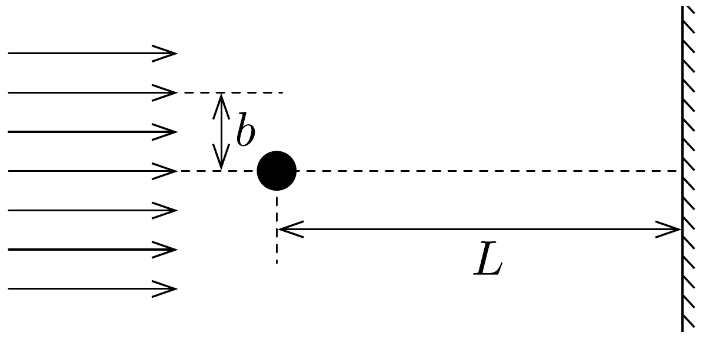

## Feladat 3

Elektronnyaláb
$V_{0}$ gyorsítófeszültséggel nagy energiájú elektronok párhuzamos, homogén nyalábját állítjuk elő. Az elektronok útjába egy vékony, hosszú, pozitívan feltöltött rézdrótot helyezünk. A rézdrót az elektronnyaláb eredeti irányára merólegesen helyezkedik el (160. ábra a papír síkjára merólegesen). Az ábrán $b$-vel jelöltük azt

a távolságot, amennyire egy-egy elektron a rézdrót mellett elhaladna, ha a drótnak nem lenne töltése. Az elektronok ezek után egy ernyőnek csapódnak, amely a
drót mögött $L \gg b$ távolságra helyezkedik el. A nyaláb eredeti kiterjedése a drót tengelyétől $\pm b_{\text {max }}$ mértékú. A drót hossza, valamint a nyaláb szélessége a papír síkjára merőlegesen végtelen nagynak tekinthető.

Néhány numerikus adat:
a drót sugara: $R_{0}=10^{-6} \mathrm{~m}$,
$b$ legnagyobb értéke: $b_{\text {max }}=10^{-4} \mathrm{~m}$,
a drót hosszegységre jutó töltése: $\sigma=4,4 \cdot 10^{-11} \mathrm{C} / \mathrm{m}$,
gyorsítófeszültség: $V_{0}=2 \cdot 10^{4} \mathrm{~V}$,
az ernyő távolsága a dróttól: $L=0,3 \mathrm{~m}$.

Megjegyzés. A b)-d) alkérdések esetén alkalmazzunk olyan elfogadható közelítéseket, melyek segítségével képlet formájában és numerikusan is eljuthatunk a megoldásig.
a) Számítsuk ki a drót által létrehozott $\boldsymbol{E}$ elektromos térerősséget! Ábrázoljuk vázlatosan $\boldsymbol{E}$ nagyságát a drót tengelyétől mért távolság függvényében!
b) Számítsuk ki, hogy mekkora szöggel térül el egy elektron a klasszikus fizika törvényei szerint! Adjuk meg ezt az eltérülési szöget a $b$ paraméter olyan értékeire, amelyeknél az elektron nem ütközik neki a drótnak! Jelöljük $\vartheta$-val azt a (kicsiny) szöget, amelyet az elektron sebessége az ernyőnek csapódó elektron sebességével zár be! Mekkora ennek a $\vartheta$ szögnek az értéke?
c) Számoljuk ki és vázoljuk is fel, hogy a klasszikus fizika milyen becsapódási képet (azaz elektronintenzitás-eloszlást) jósol az ernyőre érkező elektronokra!
d) A kvantummechanika a klasszikus elmélettől lényegesen különböző elektronintenzitás-eloszlást jósol. Vázoljuk fel a hullámmechanika által jósolt eloszlásképet és számszerúen is jellemezzük ezt az elektroneloszlást!
