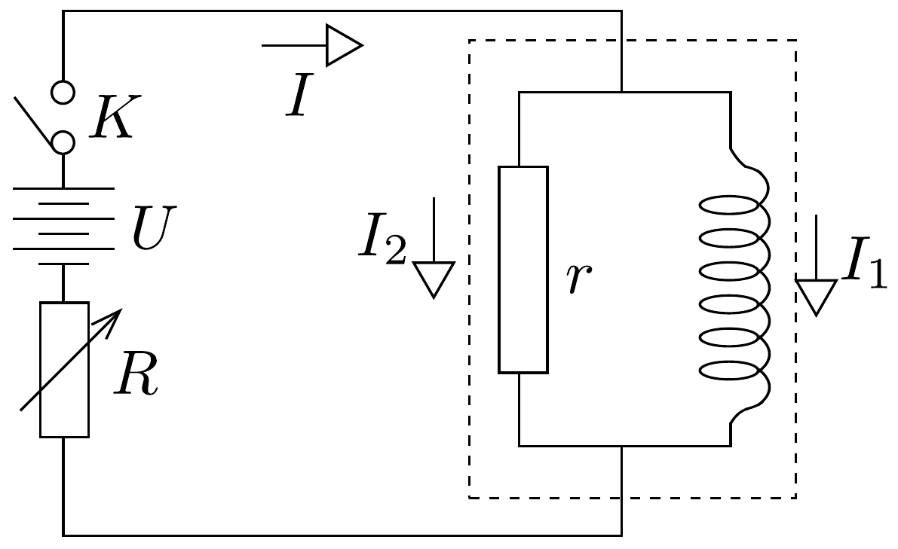
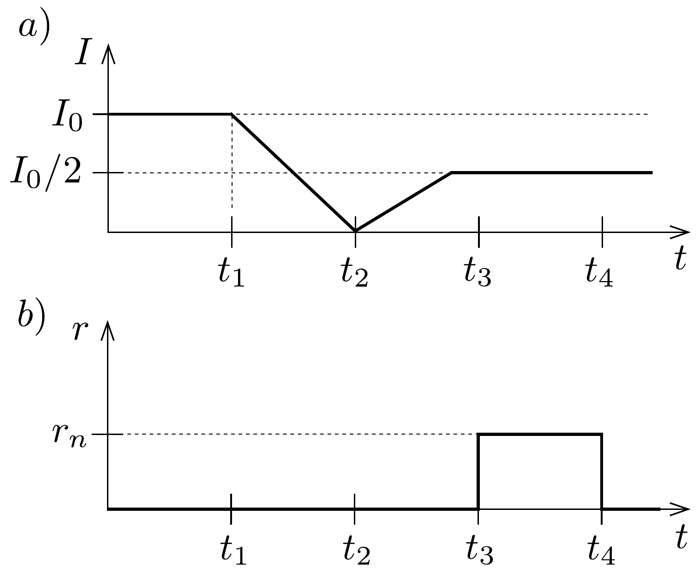
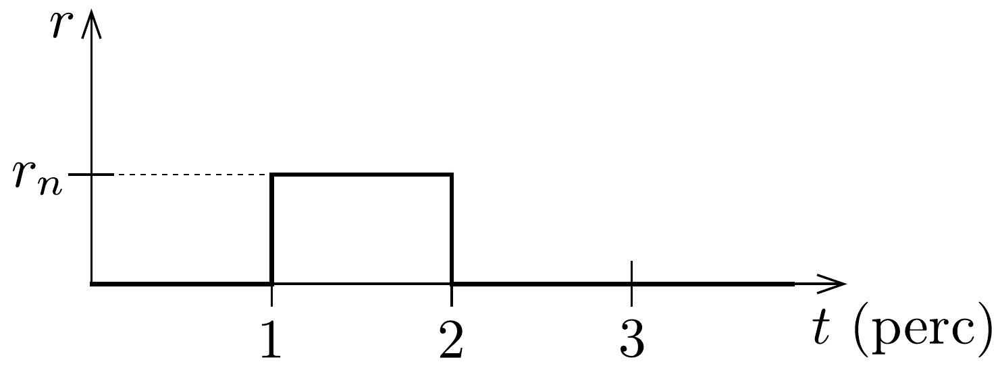

## Feladat 2

Szupravezetõ mágnes
A szupravezető mágnességet széles körben használják a laboratóriumokban. A szupravezető mágnesek legelterjedtebb alakja egy tekercs (szolenoid), amely szupravezető drótból készült. A szupravezető mágnesek csodálatos előnye, hogy nagy mágneses teret hoznak létre, miközben nincsen Joule-hő okozta energiaveszteség, mivel a szupravezetó drót elektromos ellenállása nullává válik, amikor a mágnest 4,2 K hómérsékletú folyékony héliumba mártjuk. A mágneshez rendszerint hozzátartozik egy speciális szupravezető kapcsoló, amint ezt a 172, ábra mutatja. A

kapcsoló $r$ ellenállása szabályozható: vagy $r=0$ szupravezetó állapotban, vagy $r=r_{\mathrm{n}}$ normál állapotban van. Amikor a kapcsoló szupravezető állapotban van, a mágnesen állandó erősségú áram folyik, amelynek nagysága akármekkora lehet. A szupravezető állapotba hozott kapcsolóval elérhetjük, hogy még hosszú idővel a külső áramforrás kikapcsolása után is állandó mágneses mező maradjon a tekercsben.

A szupravezető kapcsoló részletei nem láthatók a 172. ábrán. Ez általában egy rövid szupravezető huzal, amelyet fütószál vesz körül, és megfelelően hőszigetelve van a folyékony héliumtól. Fútés hatására a szupravezető huzal hốmérséklete
növekszik, így normál állapotú ellenállássá változik. Az $r_{\mathrm{n}}$ tipikus értéke néhány ohm, esetünkben 5 ohm. A szupravezető mágnes önindukciós együtthatója a méretétől függ, a 172 ábrán látható mágnes esetében tekintsük 10 H-nek. A teljes $I$ áramot az $R$ ellenállás segítségével változtatjuk. A nyilak az $I$, $I_{1}$ és $I_{2}$ pozitív irányait jelölik.
a) Ha a teljes $I$ áramot és az $r$ ellenállású szupravezető kapcsoló ellenállását a 173. a) és 173. b) ábrán látható módon változtatjuk, és feltehetjük, hogy a mágnesen és a kapcsolón átfolyó $I_{1}$ és $I_{2}$ áramok kezdetben egyenlők voltak, határozzuk meg és ábrázoljuk, hogyan változnak ezek időben $t_{1}$-től $t_{4}$-ig!

b) Tegyük fel, hogy a $K$ tápfeszültségkapcsolót a $t=0$ pillanatban bekapcsoljuk, amikor $r=0, I_{1}=0$ és $R=7,5 \Omega$, továbbá a teljes $I$ áram 0,5 A. A $K$ kapcsoló zárva tartása mellett a szupravezető kapcsoló $r$ ellenállása a 174. ábra szerint változik. Ábrázoljuk az $I, I_{1}$ és $I_{2}$ áramok időbeli változását!

c) Normál állapotban a szupravezető kapcsolón csak kis áramok folyhatnak át, nevezetesen csak 0,5 A-nél kisebb, mert máskülönben a nagy áramok kiégetik a kapcsolót. Tegyük fel, hogy a szupravezető mágnes állandósult (bekapcsolt) állapotban van $t=0$-tól $t=3$ percig, azaz $I=0$ és $I_{1}=i_{1}$ (pl. 20 A), továbbá
szintén $t=0$-tól $t=3$ percig $I_{2}=-i_{1}$. Ha a kísérletet a mágnesen átfolyó áram zérusra csökkentésével be kell fejezni, hogyan lehetne ezt a feladatot megoldani? Ezt néhány lépésben lehet megtenni. (Az eljárás többféle módon is elképzelhető.) Adjunk meg egy lehetséges megoldást olymódon, hogy ábrázoljuk az $I, r, I_{1}$ és $I_{2}$ mennyiségek időbeli változását (a $t$ tengely beosztása legyen 3 perc, és 12 percig ábrázoljuk)!
d) Tegyük fel, hogy a mágnes állandó, $I_{1}=20$ A-es áramerősséggel múködik $t=0$-tól $t=3$ percig. Hogyan lehet az említett feltétel betartásával megváltoztatni a szupravezetó tekercs áramát 30 A-re? Választ az $I, r, I_{1}$ és $I_{2}$ mennyiségek időbeli változásának ábrázolásával adjuk meg ( $\mathrm{a} t$ tengely beosztása legyen 3 perc, és 15 percig ábrázoljuk)!
