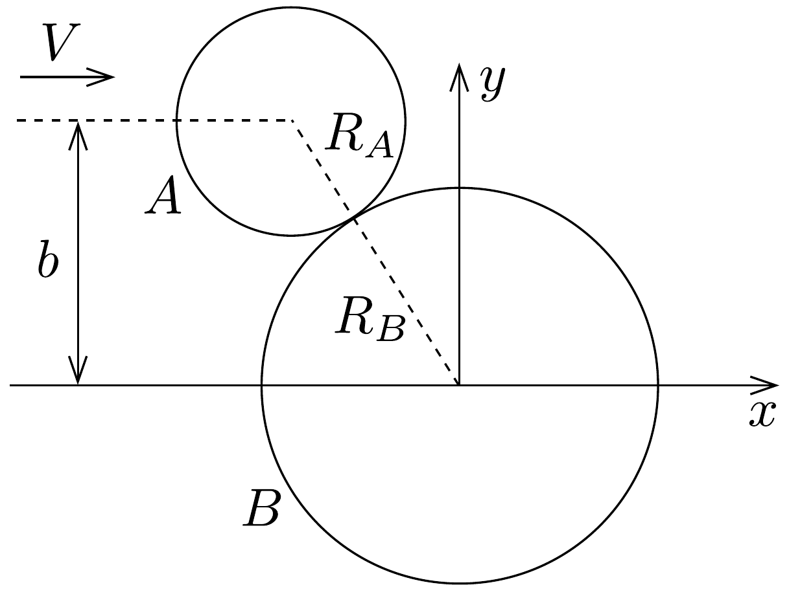

## Feladat 3

Korongok ütközése felületi súrlódással
Egy $A$ jelú, $m$ tömegǘ, $R_{A}$ sugarú, tömör, homogén korong $V$ sebességü transzlációs (azaz forgás nélküli) súrlódásmentes mozgást végez a sima vízszintes $x-y$ síkban, $x$ irányban, $b$ távolságban az $x$ tengelytől. Összeütközik egy $B$ jelü, kezdetben nyugvó, ugyancsak $m$ tömegú, azonos vastagságú, de $R_{B}$ sugarú, tömör, homogén koronggal, amely kezdetben a koordináta-rendszer origójában áll 175. ábra). Feltehetjük, hogy az érintkezó felületek ütközés alatti súrlódása következtében az érintkezési pontban a korongok sebességének érintő irányú összetevője az ütközés után egyenlő lesz. Azt is feltehetjük, hogy a korongok középpontját összekötő egyenes mentén a korongok relatív sebességének nagysága az ütközés előtt és az ütközés után megegyezik.

a) Határozzuk meg az ilyen ütközés esetén a két korong ütközés utáni sebességeinek $x$ és $y$ komponenseit, azaz $V_{A x}^{\prime} ; V_{A y}^{\prime} ; V_{B x}^{\prime} ; V_{B y}^{\prime}$ értékét $m, R_{A}, R_{B}, V$ és $b$ ismeretében!
b) Határozzuk meg az $A$ korong ütközés utáni $E_{A}^{\prime}$ és a $B$ korong ütközés utáni $E_{B}^{\prime}$ mozgási energiáját $m, R_{A}, R_{B} V$ és $b$ ismeretében!
