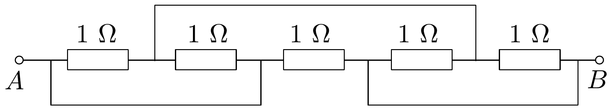
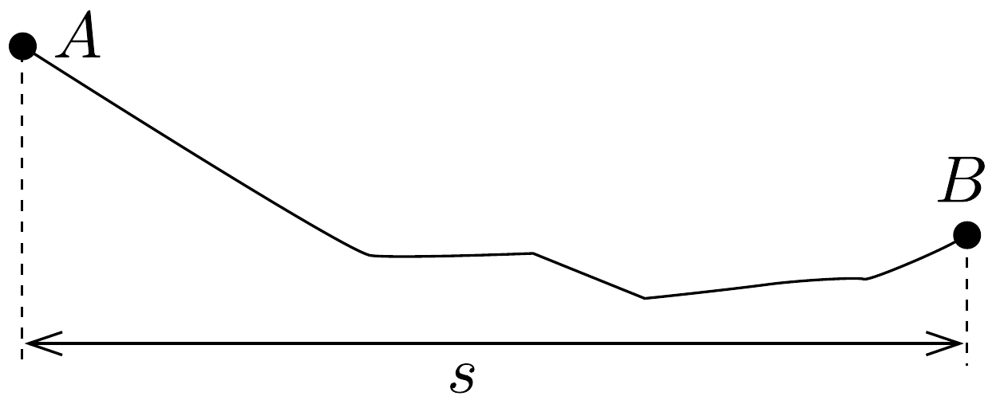
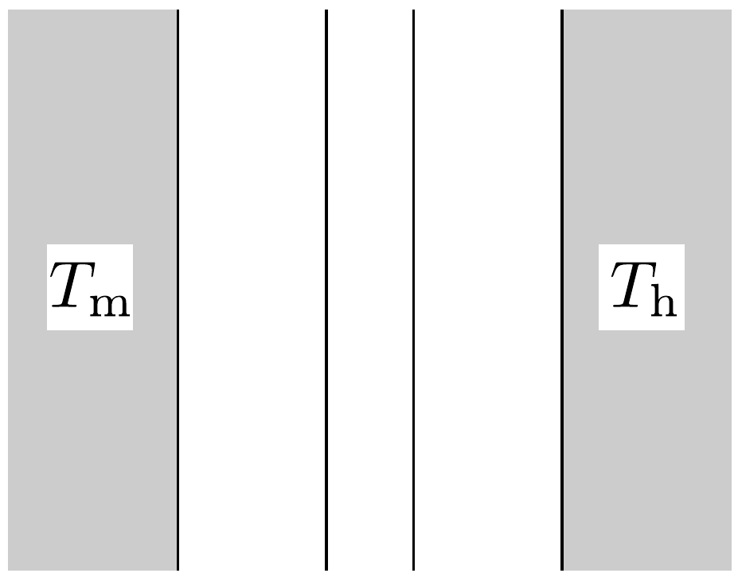
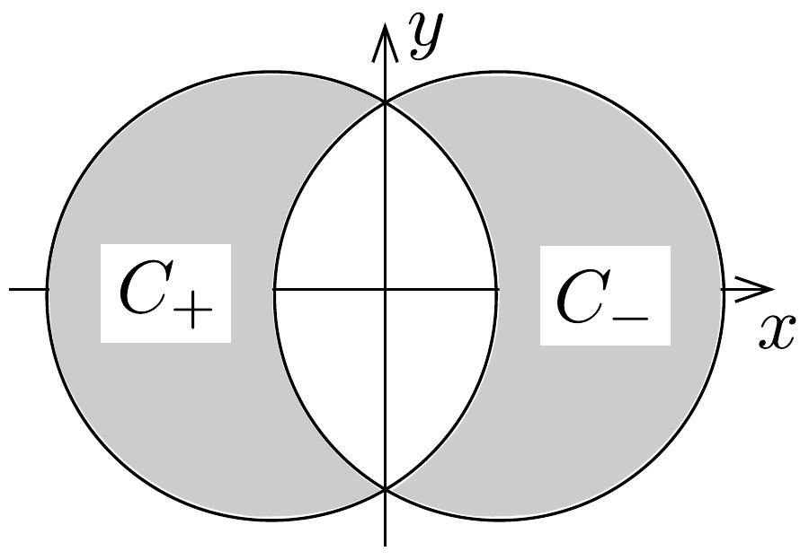

## Feladat 1

Ez a példa öt független, kis feladatból áll.
a) Öt $1 \Omega$-os ellenállást a 196. ábrán látható módon kapcsolunk össze. Az összekötő vezetékek ellenállása elhanyagolható. Határozzuk meg az $A$ és $B$ pontok közötti $R$ eredő ellenállást!

196. ábra.
b) Egy síelő az $A$ pontból nyugalmi helyzetből indulva kanyarodás és fékezés nélkül siklik le a hegyről (197. ábra). A súrlódási együttható $\mu$. A $B$ pontba érve végül megáll, ekkor vízszintes elmozdulása $s$. Mekkora az $A$ és $B$ pontok közötti $h$ magasságkülönbség? (A síelő sebessége olyan kicsi, hogy a lejtő görbületéből származó nyomóerő-változás elhanyagolható. Hanyagoljuk el a légellenállást és a $\mu$ súrlódási együttható sebességfüggését.)

197. ábra.
c) Egy - a környezetétől hőszigetelt - fémdarabot légköri nyomás mellett elektromos áram segítségével melegítünk. A fémdarab időben állandó $P$ teljesítménnyel vesz fel energiát, ami a fém hőmérsékletének emelkedését eredményezi. Az abszolút hőmérséklet
\[
T(t)=T_{0}\left[1+a\left(t-t_{0}\right)\right]^{1 / 4}
\]
módon függ az időtől ( $a, t_{0}$ és $T_{0}$ állandók). Határozzuk meg a fém $C_{p}(T)$ hőkapacitását (ami a kísérlet hőmérséklet-tartományában hőmérsékletfüggő).
d) Egy $T_{\mathrm{m}}$ állandó hómérsékletú meleg, fekete, sík felület párhuzamos egy hideg, fekete, sík felülettel, amelynek $T_{\mathrm{h}}$ hőmérséklete szintén állandó. A síkok

között vákuum van. A sugárzásból származó hőáram csökkentése érdekében hốvédő pajzsot helyezünk el a meleg és a hideg felületek között, amely két vékony, egymástól hőszigetelt, a sík felületekkel párhuzamos fekete lemezből áll (198. ábra). Egy idő után állandósult állapot jön létre. Mekkora $\xi$ tényezóvel csökkent az

állandósult hő́aram a hővédő pajzs jelenlétének következtében? A felületek véges méretéből származó hatásokat hanyagoljuk el.
$e$ ) Két nagyon hosszú, nem-mágneses anyagból készült, egyenes, egymástól elszigetelt $C_{+}$és $C_{-}$vezetóben $I$ áram folyik rendre a pozitív és a negatív $z$ tengely irányában. A vezetők keresztmetszeteit (a 199. ábrán satírozva láthatók) az $x-y$ síkban fekvő, $D$ átmérőjú körök határolják, amelyek középpontjainak távolsága $D / 2$. A létrejövő keresztmetszetek területe így külön-külön $\left(\frac{1}{12} \pi+\frac{1}{8} \sqrt{3}\right) D^{2}$. Az egyes vezetők keresztmetszetében az áramok egyenletes eloszlásúak. Határozzuk meg a $B(x, y)$ mágneses teret a vezetők közötti térben!

