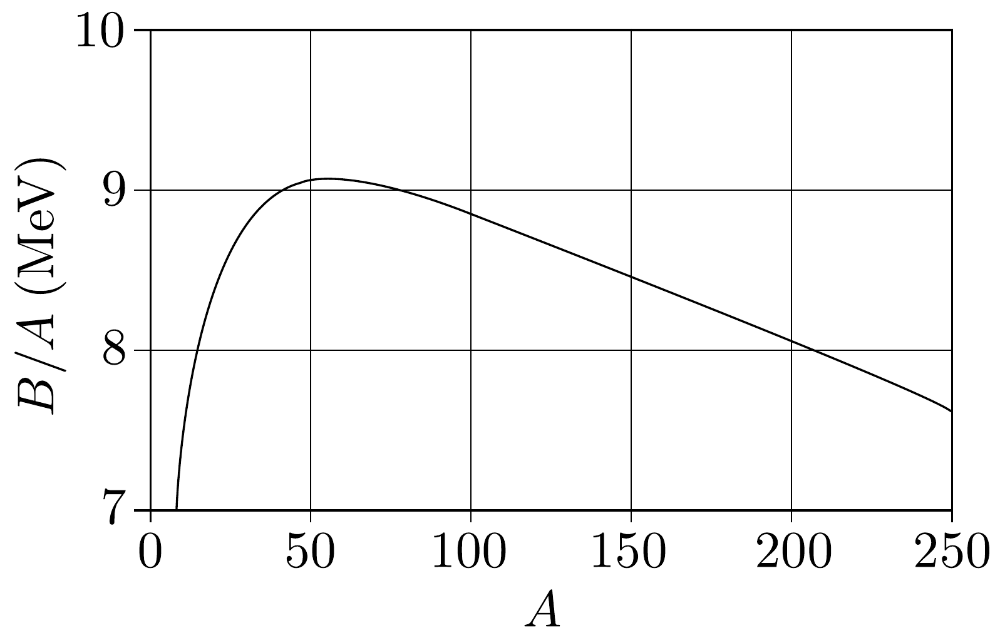

## Feladat 2

Atommagtömegek és stabilitás

Egy $Z$ rendszámú (protonszámú) és $N$ neutronszámú ( $A=N+Z$ ) atommag $M$ tömegét úgy kapjuk meg, hogy a magot alkotó szabad összetevók (protonok és neutronok) tömegének összegéből kivonjuk a $c^{2}$-tel osztott $B$ kötési energiát ( $B / c^{2}$-et):
\[
M c^{2}=Z m_{\mathrm{p}} c^{2}+N m_{\mathrm{n}} c^{2}-B .
\]
A 207. ábra egy adott $A$ értékhez tartozó maximális $B / A$ értéket (egy nukleonra jutó kötési energiát) adja meg $A$ függvényében. Minél nagyobb $B / A$ értéke, általában annál stabilabb a mag.
a) Egy bizonyos $A_{\alpha}$ tömegszám felett a nukleonok kötési energiája elég kicsi ahhoz, hogy a mag kibocsáthasson egy $\alpha$-részecskét $(A=4)$. Lineáris közelítést alkalmazva az $A=100$-nál nagyobb tömegszámú atomokra, becsüljük meg a 207 ábra alapján $A_{\alpha}$ értékét!

Ebben a közelítésben tételezzük fel a következőket:
- - Az $\alpha$-bomlás kiinduló és keletkező magja is rajta van a megadott görbén.
- - Az $\alpha$-részecske teljes kötési energiája: $B_{4}=25,0 \mathrm{MeV}$. (Ezt nem lehet a grafikonból kiolvasni.)
- b) Egy $Z$ protont és $N$ neutront tartalmazó atommag kötési energiáját a következő félempirikus képlet adja meg:
\[
B=a_{\mathrm{v}} A-a_{\mathrm{s}} A^{2 / 3}-a_{\mathrm{C}} Z^{2} A^{-1 / 3}-a_{\mathrm{a}} \frac{(N-Z)^{2}}{A}+\delta,
\]
$\operatorname{ahol} \delta$ értéke:
\[
\delta= \begin{cases}+a_{\mathrm{P}} A^{-3 / 4}, & \text { ha } Z \text { és } N \text { páros ( } A \text { páros); } \\ 0, & \text { ha } A \text { páratlan; } \\ -a_{\mathrm{P}} A^{-3 / 4}, \text { ha } Z \text { és } N \text { páratlan ( } A \text { páros). }\end{cases}
\]
Az együtthatók értékei: $a_{\mathrm{v}}=15,8 \mathrm{MeV} ; a_{\mathrm{s}}=16,8 \mathrm{MeV} ; a_{\mathrm{C}}=0,72 \mathrm{MeV} ; a_{\mathrm{a}}=$ $23,5 \mathrm{MeV} ; a_{\mathrm{P}}=33,5 \mathrm{MeV}$.
- (i) Vezessük le azt az összefüggést, amely adott $A$ tömegszám esetében megadja a legnagyobb kötési energiához tartozó $Z_{\text {max }}$ protonszámot (rendszámot)! Csak ebben az alkérdésben a $\delta$-tagot figyelmen kívül hagyhatjuk.
- (ii) Az $A=200$ tömegszámú magok közül melyik $Z$-hez tartozik a legnagyobb $B / A$ ? Ebben az esetben vegyük figyelembe a $\delta$ tagot is.
- (iii) Tekintsük az alábbi táblázatban szereplő három, $A=128$ tömegszámú atommagot. Határozzuk meg, hogy közülük melyek az energetikailag stabilak, és melyek rendelkeznek elegendő energiával ahhoz, hogy az alább felsorolt bomlások valamelyikével elbomolhatnak! Határozzuk meg az ( $i$ ) pontban definiált $Z_{\text {max }}$-ot, és töltsük ki a táblázatot!

\begin{tabular}[t]{|l|l|l|l|l|}
\hline Mag & $\beta^{-}$-bomlás & $\beta^{+}$-bomlás & elektronbefogás & $\beta^{-} \beta^{-}$-bomlás \\
\hline ${ }_{53}^{128} \mathrm{I}$ & & & & \\
\hline ${ }_{54}^{128} \mathrm{Xe}$ & & & & \\
\hline ${ }_{55}^{128} \mathrm{Cs}$ & & & & \\
\hline
\end{tabular}

A táblázat kitöltéséhez:
- - az energetikailag megengedett folyamatokat jelöljük ✓ -val,
- - az energetikailag tiltott folyamatokat jelöljük × -tel,
- - csak a táblázatban szereplő három mag közötti átmenetekkel foglalkozzunk.

Bomlási folyamatok:
- (1) $\beta^{-}$-bomlás: a mag egy elektront bocsát ki,
- (2) $\beta^{+}$-bomlás: a mag egy pozitront bocsát ki,
- (3) $\beta^{-} \beta^{-}$-bomlás: a mag egyidejüleg két elektront bocsát ki,
- (4) elektronbefogás: a mag az elektronhéjból fog be egy elektront.

Az elektron (és a pozitron) nyugalmi energiája $m_{\mathrm{e}} c^{2}=0,51 \mathrm{MeV}$, a protoné $m_{\mathrm{p}} c^{2}=938,27 \mathrm{MeV}$, a neutroné pedig $m_{\mathrm{n}} c^{2}=939,57 \mathrm{MeV}$.
