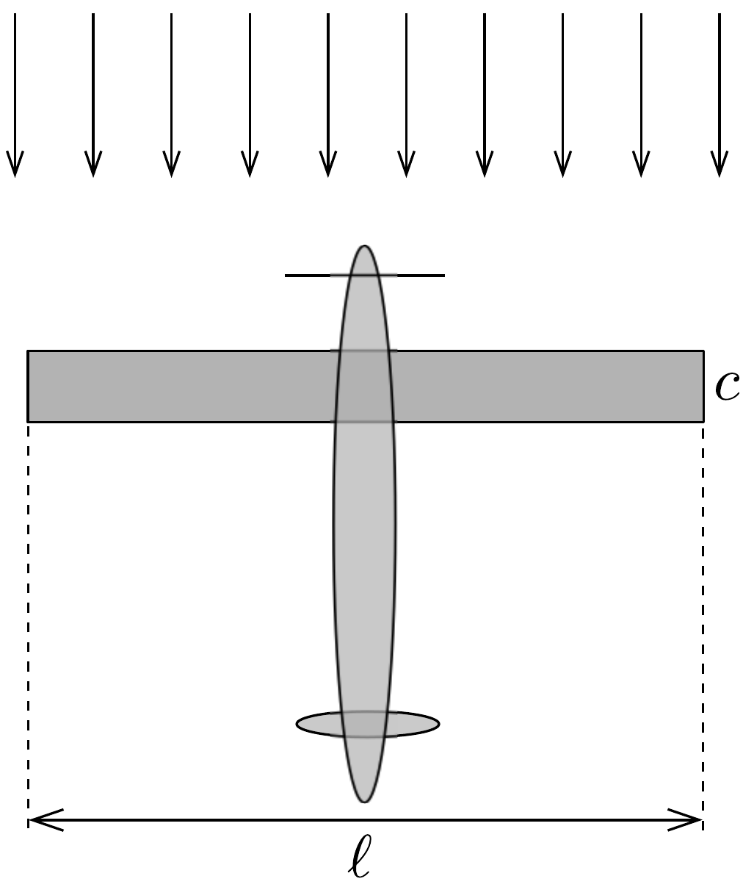
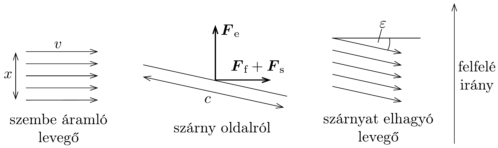

## Feladat 3

Napenergiával hajtott repülőgép
Olyan repülőgépet tervezünk, amely kizárólag napenergia felhasználásával repül. Az a legcélszerúbb elrendezés, ha a szárnyak felső felületét teljesen beborítják a napelemek. A napelemek által termelt elektromos energia hajtja a légcsavarokat.

A repülúgép felülnézeti képét (a hozzá rögzített koordináta-rendszerben) a 208. ábra, a szárny oldalnézeti képét (szintén a repülőgéphez rögzített rendszerben) pedig a 209. ábra mutatja. Legyen a szárny téglalap alakú, fesztávolsága $\ell$, szélessége $c$, területe $S=c \ell$, aránytényezóje $A=\ell / c$. A szárny múködését
a következő modellel írhatjuk le: egy $x$ magasságú és $\ell$ szélességú levegőréteg a szárnyon egy kis $\varepsilon$ szöggel lefelé eltérül, miközben a sebességének nagysága alig változik. A szárnyon lévő szabályozólemezekkel be lehet állítani a repüléshez optimális $\varepsilon$ szöget. Ez az egyszerú modell akkor felel meg legjobban a valóságnak, ha $x=\pi \cdot \ell / 4$; a továbbiakban ezt az értéket használjuk. A repülőgép teljes tömege $M$, a sebessége pedig a környező levegőhöz képest $v$. A számításokban csak a szárny körüli légáramlást vegyük figyelembe. A légcsavar által okozott légáramlásváltozást hanyagoljuk el.

a) Tegyük föl, hogy a szárnyat elhagyó levegőnek úgy változik meg az impulzusa, hogy a sebességének nagysága nem változik. Vezessük le azokat az összefüggéseket, melyek megadják az $F_{\mathrm{e}}$ függőleges emelőerőt és a vízszintes $F_{\mathrm{f}}$ fékezőerőt a szárny méreteinek, valamint $v, \varepsilon$ és a levegő $\varrho$ súrúségének függvényében! Feltételezhetjük, hogy a levegő áramlásának iránya mindig párhuzamos az oldalnézeti rajz síkjával.
b) A szárnyfelület mentén mozgó levegő súrlódása egy további $F_{\mathrm{s}}$ vízszintes fékezőerőt eredményez. A levegő egy kicsit lelassul, nagysága $\Delta v$ értékkel csökken $(\Delta v \ll v / 100)$. A relatív sebességváltozást a
\[
\frac{\Delta v}{v}=\frac{f}{A}
\]
összefüggés adja meg, ahol $f$ egy $\varepsilon$-tól független állandó.
Jelöljük $v_{0}$-lal azt a sebességet, mellyel minimális teljesítménnyel lehet állandó magasságban állandó sebességgel repülni. Adjuk meg $v_{0}-\mathrm{t} M, f, A, S, \varrho$ és a $g$ nehézségi gyorsulás függvényében! Hanyagoljuk el az $\varepsilon^{2}$-nél és $\Delta v$-nél kisebb tagokat.

Hasznos lehet a következő (kis szögekre érvényes) közelítés: $1-\cos \varepsilon \approx \frac{1}{2} \sin ^{2} \varepsilon$.
c) Ábrázoljuk vázlatosan a repüléshez szükséges $P$ teljesítményt a $v$ sebesség függvényében! Rajzoljuk be az ábrába azt is, hogy a kétféle fékezőerőből származó teljesítményjárulék külön-külön hogyan függ $v$-től! Fejezzük ki a $P_{\text {min }}$ minimális teljesítményt $M, f, A, S, \varrho$ és $g$ segítségével!
d) Tegyük föl, hogy a napelemek annyi energiát termelnek, hogy a légcsavar mechanikai teljesítménye egységnyi szárnyfelületre vonatkoztatva $I=10 \mathrm{~W} / \mathrm{m}^{2}$. Számítsuk ki, hogy ilyen teljesítmény mellett mekkora a maximális $M g / S$ szárnyterhelés $\left(\mathrm{N} / \mathrm{m}^{2}-\right.$ ben $)$, és mekkora az ehhez tartozó $v_{0}$ sebesség!

Adatok: $\varrho=1,25 \mathrm{~kg} / \mathrm{m}^{3}, f=0,004, A=10$.
