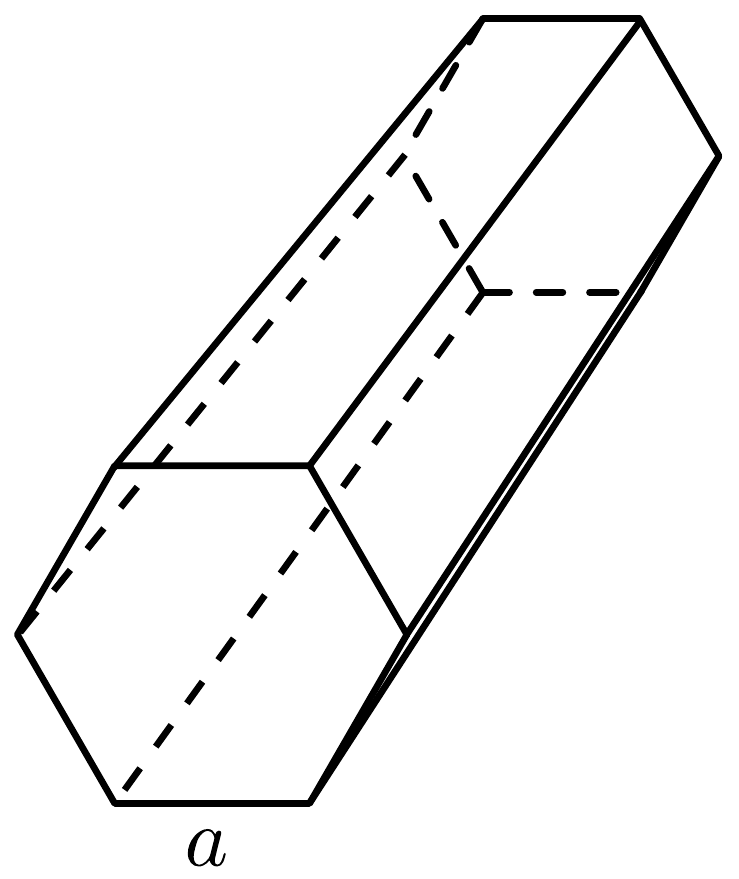
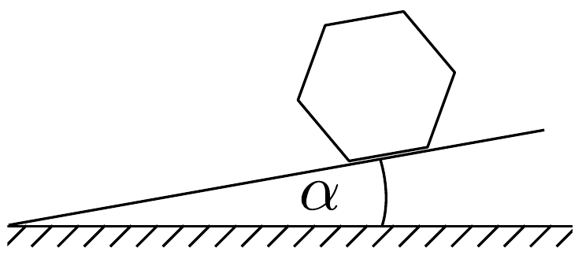

## Feladat 1

Szabályos hatszög alapú hasáb gördülése

Tekintsünk egy hosszú, merev, szabályos hatszög alapú egyenes hasábot, amilyen pl. egy ceruza (211. ábra). A homogén súrúségú hasáb tömege $M$. A szabályos

hatszög mindegyik oldaléle $a$. A hatszögü hasáb középtengelyére vonatkoztatott $\Theta$ tehetetlenségi nyomatéka:
\[
\Theta=\frac{5}{12} M a^{2} .
\]
A hasáb egy hosszanti élére vonatkoztatott $\Theta^{\prime}$ tehetetlenségi nyomatéka:
\[
\Theta^{\prime}=\frac{17}{12} M a^{2} .
\]
a) A hasáb kezdetben nyugalomban van, tengelye vízszintesen fekszik egy sík lejtőn, aminek a vízszintessel képezett $\alpha$ hajlásszöge kicsi (212. ábra). Tételezzük

fel, hogy a henger oldallapjai enyhén konkávak, így a hasáb csak oldalélei mentén érinti a lejtőt. (Ennek a csekély behajlásnak a tehetetlenségi nyomatékra gyakorolt hatását elhanyagolhatjuk.) A hasábot mozdítsuk ki nyugalmi állapotából, így az
egyenetlen mozgással legurul a lejtőn. Feltételezzük, hogy a súrlódás bármilyen csúszást megakadályoz, valamint hogy a hasáb mindvégig érintkezik a lejtóvel. Mielőtt egy adott él éppen megérinti a lejtőt, a szögsebesség legyen $\omega_{\mathrm{i}}$, közvetlenül az él és a lejtő érintkezése után pedig $\omega_{\mathrm{f}}$. Mutassuk meg, hogy
\[
\omega_{\mathrm{f}}=s \cdot \omega_{\mathrm{i}},
\]
ahol $s$ egy szám. Mekkora $s$ értéke?
b) A hasáb mozgási energiája közvetlenül az érintés előtt $K_{\mathrm{i}}$ és közvetlenül utána $K_{\mathrm{f}}$. Mutassuk meg, hogy
\[
K_{\mathrm{f}}=r \cdot K_{\mathrm{i}},
\]
ahol $r$ egy szám. Mekkora $r$ értéke?
c) Ahhoz, hogy egy következő él is érintse a lejtőt, $K_{\mathrm{i}}$-nek nagyobbnak kell lennie egy minimális $K_{\mathrm{i}, \text { min }}$ értéknél. Ez utóbbi így írható:
\[
K_{\mathrm{i}, \min }=\delta \cdot M g a,
\]
ahol $g=9,81 \mathrm{~m} / \mathrm{s}^{2}$ a nehézségi gyorsulás. Határozzuk meg $\delta$-t a lejtő $\alpha$ hajlásszögének és az $r$ együtthatónak a függvényeként!
d) Ha a $c$ ) alkérdés feltétele teljesül, akkor a $K_{\mathrm{i}}$ mozgási energia egy meghatározott $K_{\mathrm{i}, 0}$ értékhez tart, miközben a hasáb gördül a lejtőn. Annak ismeretében, hogy ez a határérték létezik, mutassuk meg, hogy $K_{\mathrm{i}, 0}$ így írható:
\[
K_{\mathrm{i}, 0}=\kappa \cdot M g a!
\]

Fejezzük ki $\kappa$ értékét $\alpha$ és $r$ függvényeként!
e) Számítsuk ki $0,1^{\circ}$ pontossággal, hogy mi a lejtő hajlásszögének az az $\alpha_{0}$ minimuma, amelynél az egyenetlen gördülés - ha egyszer elindult - végtelen hosszan folytatódni fog!
