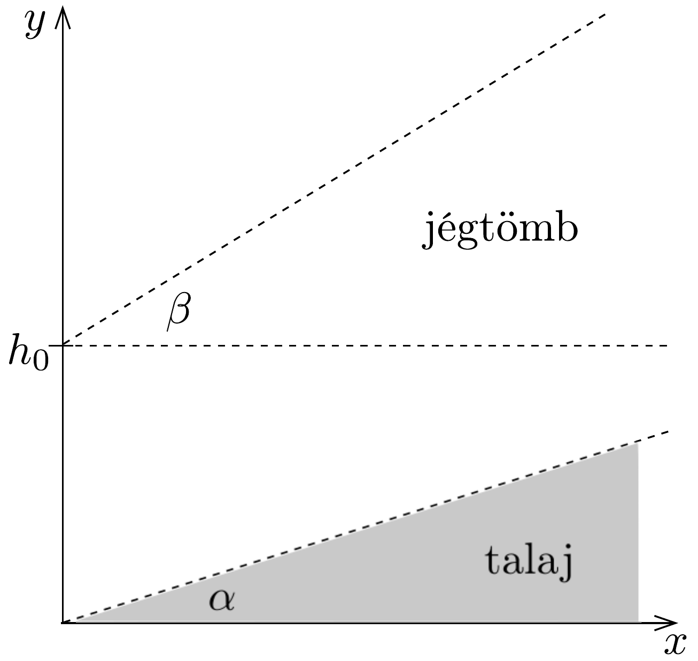
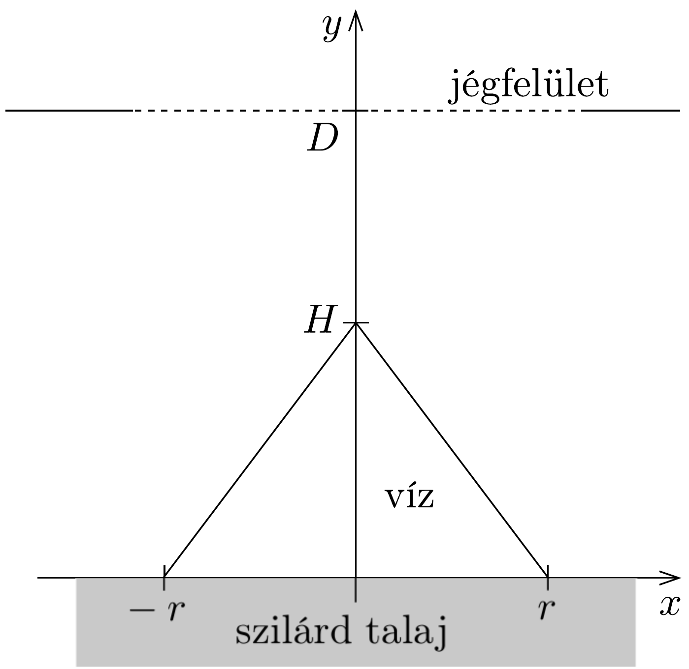
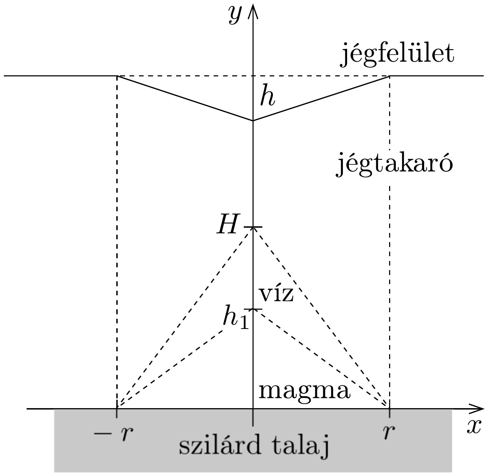

## Feladat 2

Víz a jégmező alatt
A jégmező szilárd talajon helyezkedik el, függőleges vastagsága néhány km, vízszintes kiterjedése többször 10 vagy 100 km. A feladatban a jég olvadását fogjuk tanulmányozni, és azt, hogy miként viselkedik a víz 0 °C hőmérsékletű jégtömb alatt. Feltételezzük, hogy ilyen feltételek mellett a nyomásváltozások a jégben (akárcsak viszkózus folyadékban) lényegében függőleges elmozdulásokat okoznak.

A feladat megoldásánál a következő adatokat használhatjuk: a víz súrúsége: $\varrho_{\mathrm{v}}=1,000 \cdot 10^{3} \mathrm{~kg} / \mathrm{m}^{3}$, a jég súrúsége: $\varrho_{\mathrm{j}}=0,917 \cdot 10^{3} \mathrm{~kg} / \mathrm{m}^{3}$, a jég fajhője: $c_{\mathrm{j}}=2,1 \cdot 10^{3} \mathrm{~J} /\left(\mathrm{kg}^{\circ} \mathrm{C}\right)$, a jég olvadáshóje: $L_{\mathrm{j}}=3,4 \cdot 10^{5} \mathrm{~J} / \mathrm{kg}$, a kőzet és a magma súrúsége: $\varrho_{\mathrm{k}}=2,9 \cdot 10^{3} \mathrm{~kg} / \mathrm{m}^{3}$,

a kőzet és a magma fajhője: $c_{\mathrm{k}}=700 \mathrm{~J} /\left(\mathrm{kg}{ }^{\circ} \mathrm{C}\right)$,
a kózet és a magma olvadáshője: $L_{\mathrm{k}}=4,2 \cdot 10^{5} \mathrm{~J} / \mathrm{kg}$,
a Föld felületén kilépő átlagos hőáramsúrúség: $J_{Q}=0,06 \mathrm{~W} / \mathrm{m}^{2}$,
a jég olvadáspontja: $T_{0}=0{ }^{\circ} \mathrm{C}$, állandó.
a) Tekintsünk egy vastag jégmezőt, amely alatt hó áramlik fel a Föld mélyéből. A fenti adatokat használva számítsuk ki, hogy évente milyen $d$ vastagságú jégréteg olvad el!
b) Tekintsük egy jégtömb felső, sík felszínét. A jégtábla alatt a sziklatalaj haj-lásszöge $\alpha$. A jégtábla sík felszínének hajlásszöge $\beta$ (213. ábra). A jég függőlegesen mért vastagsága az $x=0$ helyen $h_{0}$. Eszerint a jégtáblát alul és felül határoló síkok egyenlete:
\[
y_{1}=x \cdot \operatorname{tg} \alpha, \quad y_{2}=h_{0}+x \cdot \operatorname{tg} \beta .
\]

Fejezzük ki a $p$ nyomást a jégtábla alján az $x$ vízszintes koordináta függvényeként! Adjuk meg matematikailag $\alpha$ és $\beta$ függvényében annak feltételét, hogy a jégtábla és a sziklatalaj között a víz ne folyjék egyik irányba sem! Mutassuk meg, hogy ez a feltétel $\operatorname{tg} \beta=s \cdot \operatorname{tg} \alpha$ alakban írható! Határozzuk meg az $s$ együtthatót!

A sziklatalaj menetét a $y_{1}=0,8 x$ egyenlet írja le a jégtábla alatt. A jég függőlegesen mért $h_{0}$ vastagsága az $x=0$ helyen 2 km. Tételezzük fel, hogy a víz a jégtábla alatt egyensúlyban van. (Egy 0 °C hómérsékletú jégtábla úgy nyugszik egy sziklatalajon, hogy a jég alatt a víz egyensúlyban van.) Adjuk meg az $y_{2}$ egyenes egyenletét!
c) Vízszintes talajon elhelyezkedő, nagy kiterjedésú jégtábla kezdetben $D=$ 2,0 km vastag. Ekkor a jég viszonylag gyors megolvadása révén egy $H=1,0 \mathrm{~km}$ vastag, $r=1,0 \mathrm{~km}$ sugarú, kúp alakú víztömeg alakul ki (214. ábra). Tételezzük fel, hogy a visszamaradt jégtömeg ehhez az új állapothoz úgy alkalmazkodik, hogy benne csak függőleges elmozdulások mennek végbe. Adjuk meg a jégtábla felső
felületének alakját (a 214, ábrán szaggatottan jelölt) a vízkúp képződése és a hidrosztatikus egyensúly beállta után!

- d) Egy nemzetközi kutatócsoport expedíciói évente megvizsgálják az Antarktisz 0 °C hómérsékletú jégtakaróját. Ennek felszíne normálisan egy vízszintes felületü, kiterjedt jégréteg. De most egy mély, kráterszerú mélyedésre bukkannak, ami olyan, mint egy felfordított kúp, amelynek legnagyobb $h$ bemélyedése 100 m és $r$ sugara 500 m (215. ábra).

Tapasztalataikat megbeszélve a kutatók arra a következtetésre jutnak, hogy a jég alatt kisebb vulkánkitörés történhetett. Egy kevés olvadt magma benyomult
a jégréteg aljába, ott megdermedt és lehült, eközben bizonyos mennyiségú jeget megolvasztott. A kutatók megpróbálják megbecsülni a behatolt magma térfogatát, hogy megértsék, mitől lett a megolvadt víz. Gondolatmenetük a következő:

Tételezzük fel, hogy a jégben csak függőleges mozgás ment végbe. Azt is tételezzük fel, hogy a behatoló magma 1200 °C hőmérsékleten teljesen folyékony állapotú volt. Az egyszerúség kedvéért még azt is feltehetjük, hogy a benyomulás kúp alakban történt, körszerüen a megfigyelt kúpos jégbemélyedés alatt. A magma behatolása viszonylag rövid idő alatt ment végbe a hőkicserélődés időigényéhez képest. A hőátadás kezdetben elsősorban függőleges irányú volt, így a jégből kiolvadt térfogat mindig kúp alakú volt, a kúp tengelye pedig a magmabenyomulás centrumán átmenő függőleges volt.

Ezen feltételek mellett a jég megolvadása két lépésben ment végbe. Először a víz nincs nyomásegyensúlyban a magma fölött, hanem elfolyik onnan. Az elfolyó víz 0 °C hőmérsékletúnek tételezhető fel. Később beáll a hidrosztatikai egyensúly, a víz a keletkezési helyén, a magmabenyomulás felett marad, nem folyik el. Számítsuk ki a következő mennyiségeket a hőmérsékleti egyensúly beálltakor:
1. A jégtakaró alatt kialakult vízkúp tetőpontjának $H$ magassága a jégtábla alapjának eredeti szintjéhez képest.
2. A magmabehatolás $h_{1}$ magassága.
3. A keletkezett víz teljes $m$ tömege és az elfolyt víz $m^{\prime}$ tömege, ${ }^{15}$
