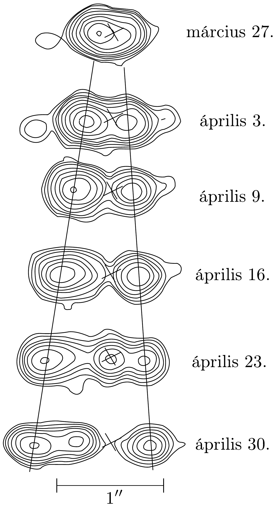

## Feladat 3

Fénynél sebesebben?
Ebben a feladatban egy 1994-ben elvégzett mérést elemzünk és értelmezünk. A mérés egy, a Tejútrendszerben lévő, összetett forrás rádióhullámú sugárzására vonatkozik. A szélessávú vevőantenna centiméteres hullámhosszú rádióhullámokra volt hangolva. A 216. ábra azt mutatja, hogy különböző időpontokban milyen képet láttak. A „szintvonalak” az azonos intenzitásokat jelzik, mint ahogyan a földrajzi térkép szintvonalai az azonos magasságú pontokat kötik össze. A képen látható, szaggatott vonalakkal érzékeltetett két maximumot úgy értelmezik, hogy két objektum távolodik egy közös centrumtól. Ezt a centrumot kereszt jelzi az ábrákon. (A centrumról feltételezik, hogy nyugszik a térben; ez is erós rádióforrás, de fóleg más hullámhosszon sugároz.) A méréseket több mint egy hónapon át mindig azonos napszakban, azonos órában végezték el. Az ábra léptékét egy skálaszakasz jelzi, ami 1 ívmásodpercnek felel meg (1 ívmásodperc $=1 \operatorname{arc} \sec =1$ $\mathrm{as}=\frac{1}{3600}$ szögfok). A centrumban lévő, kereszttel jelölt égitest becsült távolsága $R=12,5 \mathrm{kpc}$. Egy kiloparsec ( kpc ) $3,09 \cdot 10^{19}$ m-nek felel meg. A fény sebessége: $c=3,00 \cdot 10^{8} \mathrm{~m} / \mathrm{s}$. A feladat megoldásában nem kell hibaszámítást végezni.
a) A bal és a jobb oldali rádióforrás szögtávolságát a centrumtól rendre $\theta_{1}(t)$ és $\theta_{2}(t)$ jelöli, ahol $t$ a megfigyelés ideje. A Földről látszó szögsebességek $\omega_{1}$ és $\omega_{2}$. A két rádióforrásnak megfelelő transzverzális (keresztirányú) sebességek: $v_{1, \perp}^{\prime}$ és $v_{2, \perp}^{\prime}$. A 216, ábra alapján határozzuk meg $\omega_{1}$ és $\omega_{2}$ értékét ezred-ívmásodperc/nap

\footnotetext{
${ }^{15}$ Ezen mennyiségek meghatározását követően a versenyen feladat volt még a magmabehatolás és a visszamaradt víztömeg alakjának méretarányos ábrázolása milliméterpapíron a 215 ábrához hasonlóan.

egységekben! Határozzuk meg $v_{1, \perp}^{\prime}$ és $v_{2, \perp}^{\prime}$ számértékeit is! (Némelyik eredmény meglepő lehet.)
b) Az előző alkérdésben felvetődött probléma feloldása érdekében képzeljünk el egy fényforrást, ami $\boldsymbol{v}$ sebességgel mozog egy tőle távoli $O$ megfigyelő irányához képest $\varphi$ szögben $(0 \leq \varphi \leq \pi)$. A sebesség nagyságát jelölje $v=\beta c$, ahol $c$ a fénysebesség. A fényforrás távolságát a megfigyelő $R$-nek méri, a fényforrás szögsebességét $\omega$-nak észleli. A látásirányra merőleges látszólagos sebesség $v_{\perp}^{\prime}$. Határozzuk meg $\omega$ és $v_{\perp}^{\prime}$ értékeit $\beta, R$ és $\varphi$ függvényében!
$c)$ Feltételezzük, hogy az $a$ ) alkérdésben szereplő két objektum egymáshoz képest ellenkező irányban mozog, szétrepülési sebességük egyenlő, $v=\beta c$. Ekkor a $b$ ) alkérdés eredményei alapján $\beta$ és $\varphi$ kiszámítható az $\omega_{1}$ és $\omega_{2}$ szögsebességek, valamint az $R$ távolság ismeretében. Itt $\varphi$ a $b$ ) alkérdésben értelmezett szög a bal oldali objektumra vonatkozóan, ami az $a$ ) alkérdésben az 1 indexnek felel meg. Vezessünk le összefüggéseket arra, hogyan kell ismert mennyiségekből kiszámítani $\beta$ és $\varphi$ értékét! Határozzuk meg $\beta$ és $\varphi$ értékét az $a$ ) alkérdésben meghatározott számértékek alapján!
d) A b) alkérdésben megismert egyetlen test esetben keressük meg annak a feltételét, hogy a látszólagos $v_{\perp}^{\prime}$ transzverzális sebesség nagyobb legyen, mint a $c$ fénysebesség! Írjuk ezt a feltételt $\beta>f(\varphi)$ alakba, az $f$ függvényre keressünk analitikus alakot! Rajzoljuk le a $(\beta, \varphi)$ koordinátasík fizikailag értelmes tartományát! Satírozzuk be azt a tartományt, ahol $v_{\perp}^{\prime}>c$ teljesül!
$e$ ) A b) alkérdésben tárgyalt egyetlen test esetben keressünk egy kifejezést a $v_{\perp}^{\prime}$ látszólagos transzverzális sebesség maximális $\left(v_{\perp}^{\prime}\right)_{\text {max }}$ értékére adott $\beta$ esetén! Észrevehetjük, hogy ez a maximális látszólagos transzverzális sebesség minden határon túl nőhet, ha $\beta \rightarrow 1$.
f) Az $R$ értékére vonatkozóan a bevezetőben megadott becsült érték nem megbízható. Ezért a kutatók azon kezdtek gondolkozni, hogy létezik-e jobb és közvetlenebb módszer $R$ meghatározására. Az egyik ötlet a következő:

Tételezzük fel, hogy a két objektum színképében azonosítjuk és megmérjük egy színképvonal Doppler-eltolódott $\lambda_{1}$ és $\lambda_{2}$ hullámhosszait, ami nyugvó objektum sugárzása esetén $\lambda_{0}$ lenne. Induljunk ki a relativisztikus Doppler-eltolódás formulájából:
\[
\lambda=\frac{\lambda_{0}(1-\beta \cos \varphi)}{\sqrt{1-\beta^{2}}} .
\]

Mint korábban, most is tételezzük fel, hogy a két tárgy sebessége ugyanolyan nagyságú. Mutassuk meg, hogy az ismeretlen $\beta=v / c$ kifejezhető $\lambda_{0}, \lambda_{1}$ és $\lambda_{2}$ függvényeként a következő szerint:
\[
\beta=\sqrt{1-\frac{\alpha \lambda_{0}^{2}}{\left(\lambda_{1}+\lambda_{2}\right)^{2}}} .
\]
Adjuk meg az $\alpha$ együttható számértékét! Észrevehetjük, hogy ily módon a hullámhosszak mért értékéből gyakorlati becslést kaphatunk az $R$ távolságra.
