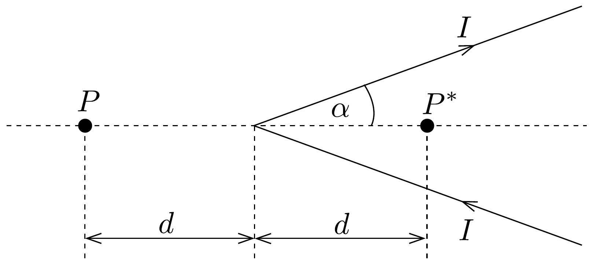

## Feladat 2

V-alakú áramvezető mágneses tere
A mágneses jelenségek Ampère-féle első sikeres leírása idején egy érdekes vita alakult ki az áramjárta vezetők mágneses terének tárgyalásakor, mivel Biot és Savart korai megfontolásai nem egyeztek Ampère eredményével abban az időben.

Különösen érdekes esetnek tekinthető, amikor egy hosszú, $I$ árammal átjárt vezetőt két egyenes szakaszra osztunk, melyeket V-alakban meghajlítunk úgy, hogy az általuk bezárt szög fele $\alpha$ legyen (lásd a 226. ábrát). Ampère számításai szerint a mágneses indukció vektorának $B$ nagysága egy olyan $P$ pontban, amely a V tengelye mentén, annak külső oldalán a törésponttól $d$ távolságra helyezkedik el, kizárólag úgy függ a szögtől, hogy arányos a $\operatorname{tg}(\alpha / 2)$ kifejezéssel. Ampère munkája később beépült Maxwell elektromágneses elméletébe, és általánosan elfogadottá vált.

Felhasználva az elektromágnességre vonatkozó mai ismereteinket:
- a) Határozzuk meg a $\boldsymbol{B}$ mágneses indukcióvektor irányát a $P$ pontban!
- b) Tudva, hogy a tér eróssége arányos $\operatorname{tg}(\alpha / 2)$-vel, határozzuk meg a $k$ arányossági tényezőt a $B(P)=k \cdot \operatorname{tg}(\alpha / 2)$ összefüggésben!
- $c$ ) Határozzuk meg a $\boldsymbol{B}$ teret abban a $P^{*}$ pontban, amely $P$ tükörképe a csúcspontra vonatkoztatva, azaz a tengely mentén, a csúcstól ugyancsak $d$ távolságra, de a V belsejében helyezkedik el (lásd a 226, ábrát).
- d) A mágneses tér mérése érdekében a $P$ pontban egy kis mágnestüt helyezünk el, melynek tehetetlenségi nyomatéka $\Theta$, mágneses momentuma pedig $\mu$.

(A lerögzített tengelyú mágnestú egy olyan síkban végez rezgéseket, amely tartalmazza a $\boldsymbol{B}$ irányát.) Számítsuk ki, hogy a mágnestú kis rezgéseinek periódusideje hogyan függ $B$-től!

Ugyanennek a problémának a megoldására Biot és Savart más formulát javasolt. Azt tételezték fel, hogy a $P$ pontban a mágneses indukció (mai jelöléseket használva):
\[
B(P)=\frac{I \mu_{0} \alpha}{\pi^{2} d},
\]
ahol $\mu_{0}$ a vákuum mágneses permeabilitása. Ténylegesen elvégzett kísérlettel próbálták eldönteni, hogy a két elmélet közül vajon melyik (Ampère-é vagy Biot és Savart-é) a helyes. Egy mágnestú rezgésidejét mérték a V félnyílásszögének függvényében. Bizonyos $\alpha$ értékeknél azonban a különbség túl kicsi, ezért nem lehet könnyen kimutatni a két elmélet jóslata közötti eltérést.
$e$ ) A két elmélet között kísérletileg akkor tudunk különbséget tenni, ha a $P$ pontban lévó mágnestú rezgéseinek $T$ periódusidejére vonatkozó jóslatok legalább 10 \%-kal eltérnek, vagyis $T_{1}>1,1 \cdot T_{2}$. ( $T_{1}$ Ampère jóslata, $T_{2}$ pedig Biot és Savarté). Határozzuk meg, hogyan kell megválasztanunk a V-alakú áramjárta vezető $\alpha$ félnyílásszögét ahhoz, hogy a két elmélet között dönthessünk!

Útmutatás: A megoldás során lehetséges (de az alkalmazott módszertől függően nem szükségszerú), hogy a következó trigonometrikus azonosság hasznosnak bizonyul:
\[
\operatorname{tg} \frac{\alpha}{2}=\frac{\sin \alpha}{1+\cos \alpha}
\]
