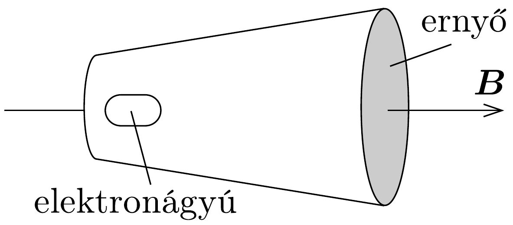
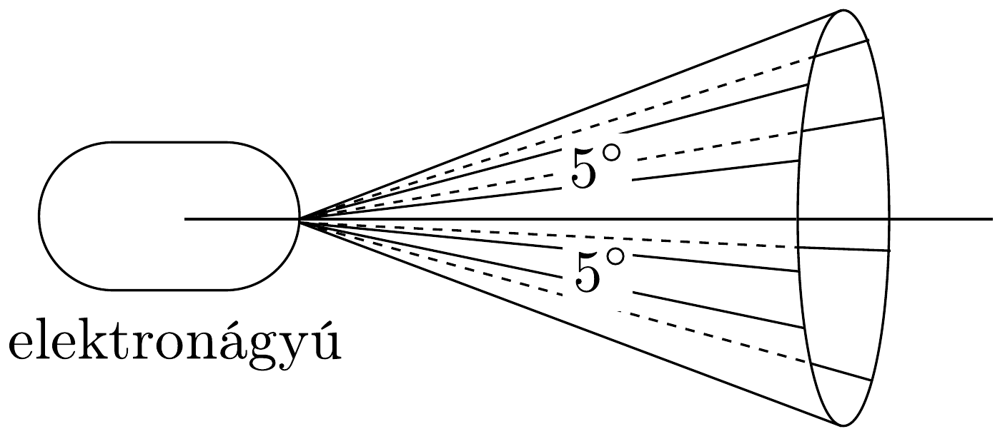
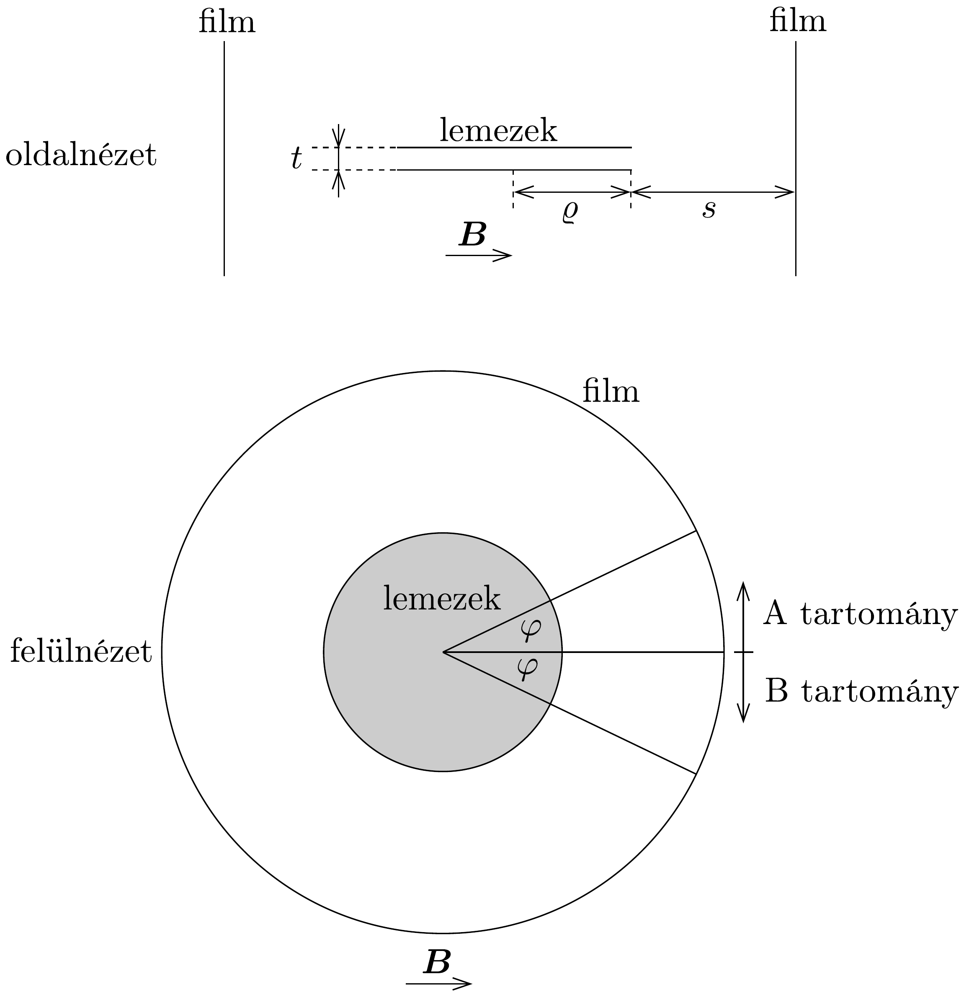
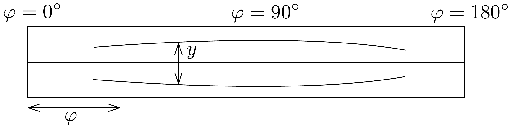

## Feladat 2

Az elektron fajlagos töltésének meghatározása
a) Egy katódsugárcsövet homogén, $\boldsymbol{B}$ indukciójú mágneses mezőbe helyezünk. A katódsugárcső egy elektronágyúból és egy ernyőből áll. A katódsugárcső elektronsugarának tengelye párhuzamos a $\boldsymbol{B}$ mágneses indukcióvektorral, ahogy azt a 230. ábra szemlélteti.

Az elektronsugár az anódot elhagyva a tengely mentén halad, de attól legfeljebb 5°-os szögben szóródik (231. ábra). Általában egy elmosódott foltot lehet látni az ernyőn, de a $B$ mágneses indukció bizonyos értékeinél egy élesen fókuszált pont jelenik meg.

Egy elektron mozgását tanulmányozva, amint $\beta$ szögben mozog a tengelyhez képest (ahol $0 \leq \beta \leq 5^{\circ}$ ), továbbá megvizsgálva az elektron mozgásának a tengellyel párhuzamos és arra meróleges komponensét, vezessünk le egy összefüggést

az elektron fajlagos töltésére, azaz az $e / m$ hányados meghatározására az alábbi mennyiségek függvényében:
- - a legkisebb $B$ mágneses indukcióvektor értéke, amely a fókuszáláshoz szükséges,
- - az elektronágyú $V$ gyorsító feszültsége (vegyük figyelembe, hogy $V<2 \mathrm{kV}$ ),
- - az anód és az ernyő közti $D$ távolság.

b) Tekintsünk egy másik módszert az $e / m$ arány meghatározására. Az elrendezést a 232. ábra mutatja oldalnézetben, illetve felülnézetben, a $\boldsymbol{B}$ mágneses indukcióvektor irányának feltüntetésével. Ebben a homogén $\boldsymbol{B}$ mágneses indukcióvektorú mágneses mezőben két kör alakú, $\varrho$ sugarú sárgarézlemez található, amelyek egymástól nagyon kis $t$ távolságra helyezkednek el. A lemezek közötti elektromos feszültség $V$. A lemezek egymással párhuzamosak és koaxiálisak, a tengelyük a mágneses indukcióvektorra merőleges. A kör alakú lemezeket egy $\varrho+s$ sugarú henger veszi körül, melynek belső felületét fényérzékeny film borítja. (Más szavakkal: a film $s$ távolságra van a lemezek szélétől.) Az egész elrendezés vákuumban van, $t$ sokkal kisebb, mint $s$, illetve $\varrho$.

A lemezek középpontjai közé egy pontszerú $\beta$-részecske forrást helyezünk, amely minden irányba egyenletesen, egy bizonyos sebességtartományban bocsát ki részecskéket. Ugyanazt a filmet használjuk a következő három esetben:
\[
\begin{aligned}
& \text { először } B=0 \text { és } V=0, \\
& \text { másodszor } B=B_{0} \text { és } V=V_{0}, \\
& \text { harmadszor } B=-B_{0} \text { és } V=-V_{0},
\end{aligned}
\]

ahol $B_{0}$ és $V_{0}$ pozitív állandók. Vegyük figyelembe, hogy a felső lemez pozitív töltésú, amikor $V>0$ (negatív töltésű, amikor $V<0$ ). A mágneses indukcióvektor irányát a 232. ábra $B>0$ esetben mutatja (ellentétes irányú, amikor $B<0$ ).

Ebben a részben feltételezhetjük, hogy a lemezek közötti távolság elhanyagolhatóan kicsi. A filmen, ahogy azt a 232. ábra szemlélteti, két tartományt (A és

B) különböztetünk meg. A film besugárzása és előhívása után a 233. ábrán vázolt minta látható. Döntsük el, hogy az ábra melyik tartományt, A-t vagy B-t ábrá-
zolja! Az indoklásban adjuk meg, hogy milyen irányú erők hatnak az elektronra!
c) A 233. ábrán látható minták közötti $y$ távolság mikroszkópos mérésének adatait és a nekik megfelelő $\varphi$ értékeket az alábbi táblázat tartalmazza, ahol $\varphi$ a mágneses indukcióvektor iránya, valamint a lemezek középpontját és a film adott pontját összekötő egyenesek által bezárt szög (lásd a 232. ábrát).

\begin{tabular}[t]{|l|l|l|l|l|l|l|}
\hline $\varphi$ (fok) & 90 & 60 & 50 & 40 & 30 & 23 \\
\hline $y(\mathrm{~mm})$ & 17,4 & 12,7 & 9,7 & 6,4 & 3,3 & nyom vége \\
\hline
\end{tabular}

A rendszer paramétereinek numerikus értékei a következők: $B_{0}=6,91 \mathrm{mT}$, $V_{0}=580 \mathrm{~V}, t=0,80 \mathrm{~mm}, s=41,0 \mathrm{~mm}$. További adatok: a fény vákuumbeli sebessége: $3,00 \cdot 10^{8} \mathrm{~m} / \mathrm{s}$, az elektron nyugalmi tömege $9,11 \cdot 10^{-31} \mathrm{~kg}$.

Határozzuk meg a $\beta$-részecskék legnagyobb megfigyelt mozgási energiáját eV egységben!
d) Felhasználva a $c$ ) rész eredményét, egy megfelelő grafikon segítségével határozzuk meg numerikusan az elektron töltésének és a nyugalmi tömegének hányadosát! (Jelezzük algebrai formában az ábrázolt mennyiségeket a grafikon mindkét tengelyén!)

Vegyük figyelembe, hogy a kapott eredmény - a megfigyelést befolyásoló szisztematikus hiba következtében - nem feltétlenül egyezik a közismert értékkel.
