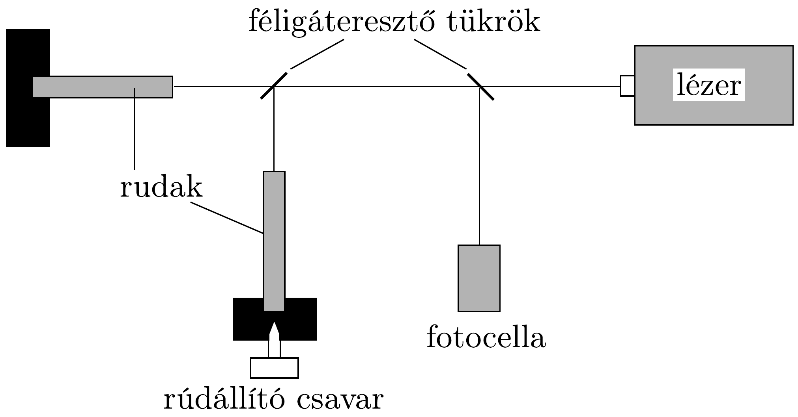

## Feladat 3

Gravitációs hullámok és a gravitáció hatása a fényre

A rész
Ez a rész csillagászati események által kiváltott gravitációs hullámok detektálásának nehézségeivel foglalkozik. Gondoljuk meg, hogy egy távoli szupernóvarobbanás a Föld felszínén mindössze $10^{-19} \mathrm{~N} / \mathrm{kg}$ nagyságrendú ingadozásokat okozhat a gravitációs térerősségben!

Egy gravitációshullám-detektor modellje (234. ábra) két darab, 1 m hosszú, egymásra merőleges fémrúdból áll. Mindkét rúd egyik vége optikailag simára van csiszolva, a másik vége pedig mereven rögzített. Az egyik rúd állítható, és a helyzete úgy van beállítva, hogy a fotocella által mért jel minimális legyen.

A rudaknak piezoelektromos eszköz segítségével egy rövid, éles longitudinális impulzust adunk. Ennek eredményeképp a rudak szabad végei $\Delta x_{t}$ kitéréssel rezegni kezdenek, ahol
\[
\Delta x_{t}=a \mathrm{e}^{-\mu t} \cos (\omega t+\phi),
\]
és $a, \mu, \omega$ és $\phi$ állandók.
a) A mozgás amplitúdója 50 s alatt 20 \%-kal csökken. Határozzuk meg $\mu$ értékét!
b) A longitudinális hullámok sebessége: $v=\sqrt{E / \varrho}$. Határozzuk meg $\omega$ legkisebb értékét, ha a rudak alumíniumból készültek! Az alumínium sűrúsége $\varrho=$ $2700 \mathrm{~kg} / \mathrm{m}^{3}$, Young-modulusa $E=7,1 \cdot 10^{10}$ Pa.
c) A rudakat nem lehet teljesen egyforma hosszúra készíteni, ezért a fotocella által mért jel 0,005 Hz frekvenciával lebeg. Mekkora a rudak hosszának különbsége?

234. ábra.
d) A $g$ gravitációs térerősség $\Delta g$ megváltozásának hatására az $\ell$ hosszúságú rúd hossza $\Delta \ell$ értékkel változik meg. A gravitációs térerősség változásának iránya az egyik rúddal párhuzamos. Vezessünk le $\Delta \ell$ értékére egy algebrai kifejezést a rúd $\ell$ hosszának és anyagi állandóinak függvényében!
e) A lézer fénye monokromatikus, hullámhossza 656 nm. Az interferenciacsíkok legkisebb eltolódása, amit detektálni lehet, a lézer hullámhosszának $10^{-4}$-szerese. Legalább mekkora legyen $\ell$, ha azt akarjuk, hogy egy ilyen rendszer képes legyen detektálni $g$ értékének $10^{-19} \mathrm{~N} / \mathrm{kg}$ nagyságrendứ változásait?

B rész
Ez a rész azzal foglalkozik, hogyan befolyásolja a gravitációs mező a fény terjedését az úrben.
a) Az $M$ tömegú és $R$ sugarú Nap felszínéről kilépő fotonok vöröseltolódást szenvednek. Newton gravitációs elméletének segítségével igazoljuk, hogy a foton frekvenciája a Naptól végtelen messze $\left(1-\frac{G M}{R c^{2}}\right)$-szeresére csökken (vöröseltolódás)! A foton nyugalmi tömegének az energiájával ekvivalens tömeget tekintsünk!
b) A foton frekvenciájának csökkenése a periódusidejének növekedésének felel meg, ez pedig - a fotont standard órának használva - az idő dilatációjával egyenértékú. (Meg lehet mutatni, hogy az idődilatáció mindig együtt jár a hosszúság egységének ugyanilyen mértékú kontrakciójával.)

A továbbiakban megpróbáljuk tanulmányozni ennek a jelenségnek a hatását a Nap közelében elhaladó fénysugárra. Először definiáljuk az $n_{r}$ effektív törésmutatót a Nap középpontjától $r$ távolságra. Legyen
\[
n_{r}=\frac{c}{c^{\prime}},
\]
ahol $c$ a fénysebesség egy olyan koordináta-rendszerben, ahol a Nap gravitációs hatása már elhanyagolható $(r \rightarrow \infty)$, és $c^{\prime}$ a fénysebesség egy, a Nap középpontjától $r$ távolságra lévő koordináta-rendszerben.

Mutassuk meg, hogy ha $G M /\left(r c^{2}\right)$ kicsi, akkor $n_{r}$ a következő formulával közelíthető:
\[
n_{r}=1+\frac{\alpha G M}{r c^{2}},
\]
ahol $\alpha$ egy meghatározandó állandó.
$c)$ Ennek az $n_{r}$-t megadó kifejezésének a segítségével számoljuk ki (radiánban) egy olyan fénysugárnak az eltérülését, amely épp érinti a Nap szélét!

Adatok:
a gravitációs állandó $G=6,67 \cdot 10^{-11} \mathrm{Nm}^{2} / \mathrm{kg}^{2}$,
a Nap tömege $M=1,99 \cdot 10^{30} \mathrm{~kg}$,
a Nap sugara $R=6,95 \cdot 10^{8} \mathrm{~m}$,
a fénysebesség $c=3,00 \cdot 10^{8} \mathrm{~m} / \mathrm{s}$.
Szükség lehet a következő integrálra:
\[
\int_{-\infty}^{\infty} \frac{\mathrm{d} x}{\left(x^{2}+a^{2}\right)^{3 / 2}}=\frac{2}{a^{2}}
\]
