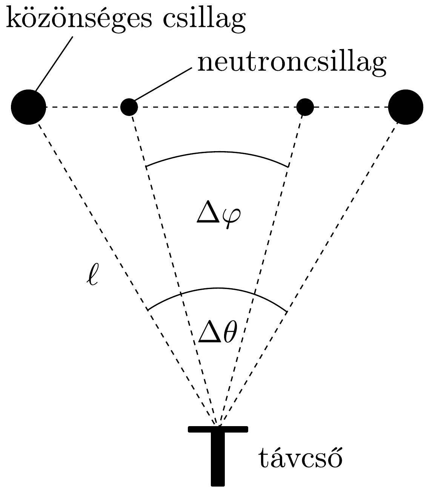
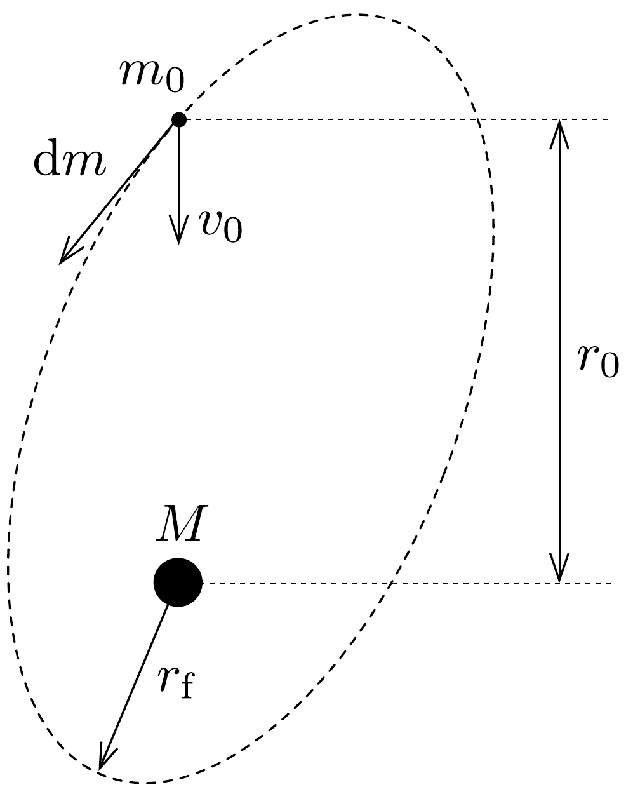

## Feladat 2

Kettöscsillag
a) Jól ismert, hogy a legtöbb csillag kettőscsillag-rendszernek része. A kettőscsillagok egyik típusa egy $m_{0}$ tömegú és $R$ sugarú közönséges csillagból, valamint egy kis méretú, $M \gg m_{0}$ tömegú neutroncsillagból áll, és ezek egymás körül keringenek. A Föld mozgását a továbbiakban mindenhol figyelmen kívül hagyhatjuk. Egy ilyen kettőscsillagról távcsöves megfigyelésekkel a következő információkat nyerhetjük:
- A csillag legnagyobb szögelmozdulása $\Delta \theta$, míg a neutroncsillag legnagyobb szögelmozdulása $\Delta \varphi$ (242. ábra).
- A legnagyobb szögelmozduláshoz szükséges idő $\tau$.
- A közönséges csillagra jellemző sugárzás vizsgálata azt mutatja, hogy a csillag felszíni hőmérséklete $T$, és róla a Föld felszínére felületegységenként és időegységenként $P$ sugárzási energia érkezik.
- Ebben a sugárzásban a kalcium színképvonalának hullámhossza $\Delta \lambda$ értékkel különbözik a földi körülmények között szokásos $\lambda_{0}$ hullámhossztól. Az eltérést a közönséges csillag gravitációs terének hatása okozza. (A számítás során a fotont $h /(c \lambda)$ effektív tömegú részecskének tekinthetjük.)

Vezessünk le egy olyan kifejezést, amely a távcsöves megfigyelési adatok és univerzális állandók felhasználásával megadja a Föld és a kettőscsillag $\ell$ távolságát!

- b) Tegyük fel, hogy $M \gg m_{0}$, és így a közönséges csillag lényegében a ne-

utroncsillag körül kering egy $r_{0}$ sugarú körpályán. Feltesszük továbbá, hogy a közönséges csillag gázt bocsát ki magából, és ezt a gázt saját magához képest $v_{0}$ relatív sebességgel a neutroncsillag felé lövelli (243. ábra).

Tudva azt, hogy a feladatban a neutroncsillag gravitációs erốtere a meghatározó, és elhanyagolva a közönséges csillag pályájának megváltozását, határozzuk meg azt az $r_{\mathrm{f}}$ távolságot, amennyire a gáz megközelíti a neutroncsillagot!
