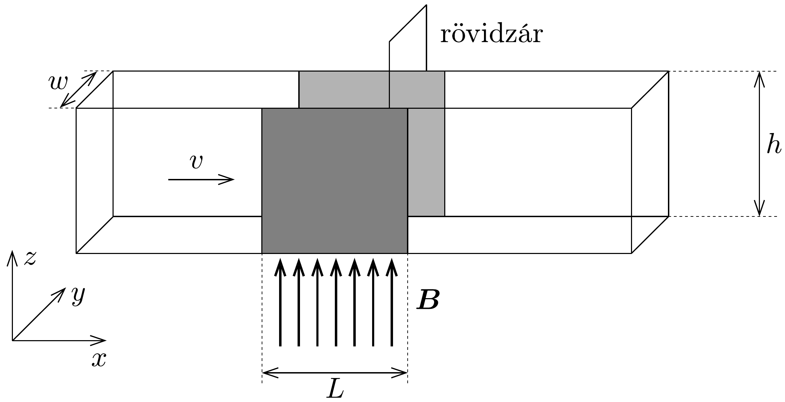

## Feladat 3

Magnetohidrodinamikai (MHD) generátor
Egy téglalap keresztmetszetú, vízszintes múanyag csó szélessége $w$, magassága $h$. Az önmagába záródó csőben $\varrho$ fajlagos ellenállású higany található. A higanyt egy $p$ túlnyomást biztosító szivattyú állandó $v_{0}$ sebességgel hajtja körbe. A cső két szemközti függőleges falának $L$ hosszúságú szakaszát rézlemezek borítják (244. ábra).

Egy folyadék valóságos mozgása nagyon bonyolult, összetett jelenség. A helyzet egyszerúsítése érdekében tegyük fel a következőket:
- Jóllehet a folyadék viszkózus, a sebességet tekintsük a csó teljes keresztmetszetében ugyanakkorának.
- A folyadék sebessége mindig arányos a folyadékra ható eredő külső erővel.
- A folyadék összenyomhatatlan.

A rézlapokat a folyadékon kívül rövidre zárjuk, majd a folyadék rézlapokkal határolt szakaszán függőlegesen felfelé mutató, homogén $\boldsymbol{B}$ mágneses teret kapcsolunk be. Az elrendezést a 244, ábra mutatja. A megoldás során használandó $x$, $y$ és $z$ irányú egységvektorokat jelöljük rendre az $\hat{x}, \hat{y}$ és $\hat{z}$ szimbólumokkal.
a) Határozzuk meg a mágneses tér által a folyadékra kifejtett erőt $(L, B, h$, $w, \varrho$ és a megváltozott $v$ sebesség függvényében)!
b) Vezessünk le egy olyan formulát, amely megadja a folyadék megváltozott $v$ sebességét ( $v_{0}, p, L, B$ és $\varrho$ függvényében) a mágneses tér bekapcsolása után!
c) Vezessük le azt az összefüggést, amely megadja, hogy mekkora többletteljesítményre van szüksége a szivattyúnak ahhoz, hogy az áramlás sebességét az eredeti $v_{0}$ értékre állítsa vissza!
d) A mágneses teret most kikapcsoljuk, és a higanyt $v_{0}$ sebességgel folyó vízzel helyettesítjük. Egy adott frekvenciájú elektromágneses hullámot küldünk végig az $L$ hosszúságú szakaszon, az áramlással azonos irányban. A víz törésmutatója $n, v_{0} \ll c$. Vezessük le azt a kifejezést, amely megadja, hogy mekkora a folyadék mozgásának járuléka a hullám $L$ hosszúságú szakaszra esó fáziskülönbségéhez!
