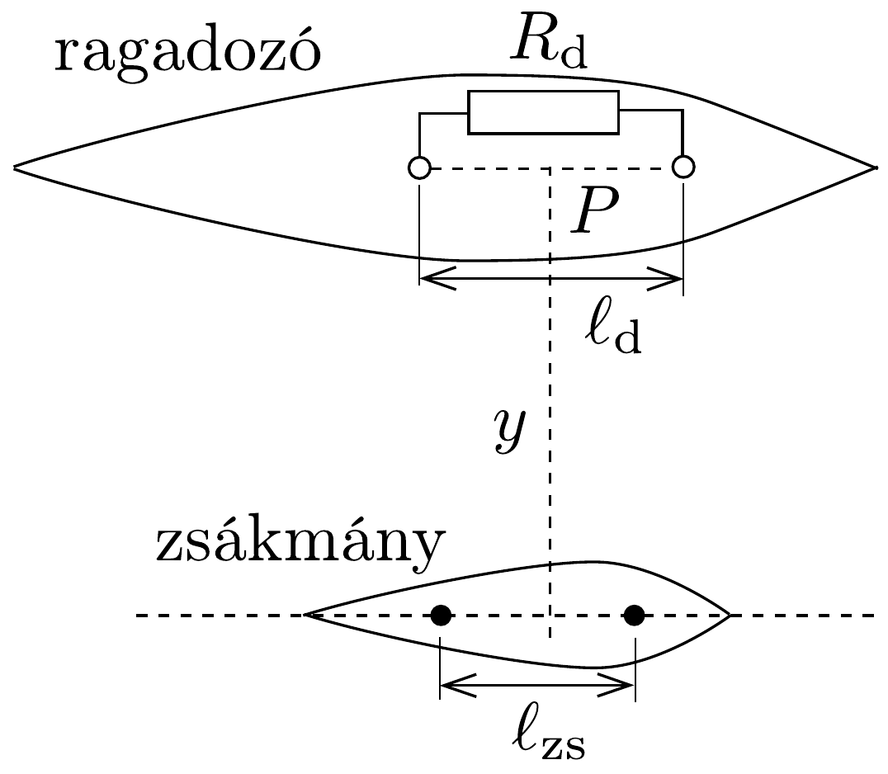
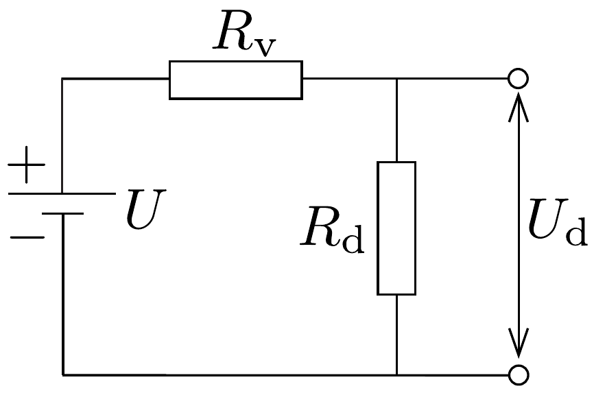

## Feladat 2

Elektromos jelek érzékelése
Néhány tengeri állat képes bizonyos távolságból más élőlényeket érzékelni oly módon, hogy ezek az élőlények (például légzésük közben, vagy más izomösszehúzódással járó folyamat során) elektromos áramokat hoznak létre. Vannak olyan ragadozók, melyek ezt az elektromos jelet használják fel arra, hogy meghatározzák zsákmányuk helyzetét, még akkor is, ha az homokkal van betemetve.

A zsákmányállat által keltett áram és a ragadozó észlelési folyamatának fizikai mechanizmusát a 249. ábrán látható módon modellezhetjük. A zsákmány által keltett áram két gömb között folyik, melyek a zsákmány testében találhatóak, és
egyik pozitív, másik negatív potenciálú. A két gömb középpontja közti távolság $\ell_{\mathrm{zs}}$, mindkét gömb sugara $r_{\mathrm{zs}}$, ami sokkal kisebb, mint $\ell_{\mathrm{zs}}$. A tengervíz fajlagos ellenállása $\varrho$. Tételezzük fel, hogy a zsákmányállat testének fajlagos ellenállása ugyanakkora, mint a környező tengervízé.

Annak érdekében, hogy leírjuk, hogyan érzékeli a zsákmányból származó elektromos teljesítményt a ragadozó, az előzőekhez hasonlóan az érzékelőt (detektort) is két gömbnek tekintjük, melyek a ragadozó testében helyezkednek el, érintkeznek a környező tengervízzel, és párhuzamosan fekszenek a zsákmány testében lévő gömbpárral. Ezek a gömbök $\ell_{\mathrm{d}}$ távolságra helyezkednek el egymástól, mindkettőjük sugara $r_{\mathrm{d}}$, ami sokkal kisebb, mint $\ell_{\mathrm{d}}$. Esetünkben az észlelő középpontja $y$ távolságra helyezkedik el a zsákmánytól, és éppen a forrás felett található. Mind $\ell_{\mathrm{zs}}$, mind $\ell_{\mathrm{d}}$ sokkal kisebb, mint $y$. Az elektromos térerősség a ragadozó helyén, a két gömböt összekötő vonal mentén állandónak tekinthető. Ennek megfelelően feltehetjük, hogy az észlelő, amely a zsákmányhoz, a környező tengervízhez és a ragadozóhoz csatlakozik, a 250. ábrán bemutatott módon zárt áramköri rendszert alkot.

a) Tekintsünk egy végtelen, homogén közegben lévő, pontszerú áramforrást, amiből $I$ áram folyik ki. Határozzuk meg a $\boldsymbol{j}$ áramsúrúség vektort (egységnyi felületen átmenő áramot) a forrástól $r$ távolságban!
b) Az $\boldsymbol{E}=\varrho \cdot \boldsymbol{j}$ differenciális Ohm-törvényre alapozva határozzuk meg az $\boldsymbol{E}_{\mathrm{r}}$ elektromos térerósség vektort a ragadozó állat érzékelő gömbjei közötti $P$ pontban (lásd a 249, ábrát) egy olyan esetben, amikor a zsákmány testében lévó gömbök között $I_{\mathrm{zs}}$ áram folyik!
c) Ugyanezen $I_{\mathrm{zs}}$ áramra határozzuk meg a zsákmányban lévó forrásgömbök közötti $U_{\mathrm{zs}}$ feszültséget!

Határozzuk meg a két forrásgömb közötti $R_{\mathrm{zs}}$ ellenállást és a forrás $P_{\mathrm{zs}}$ teljesítményét!
d) Határozzuk meg a 250, ábrán lévő $R_{\mathrm{v}}$ és $U_{\mathrm{d}}$ értékeket, és számítsuk ki a forrásból a detektorba átvitt $P_{\mathrm{d}}$ teljesítmény értékét!
$e$ ) Határozzuk meg $R_{\mathrm{d}}$ optimális értékét, amely az észlelt teljesítmény maximumához vezet, és határozzuk meg a maximális teljesítmény nagyságát is!
