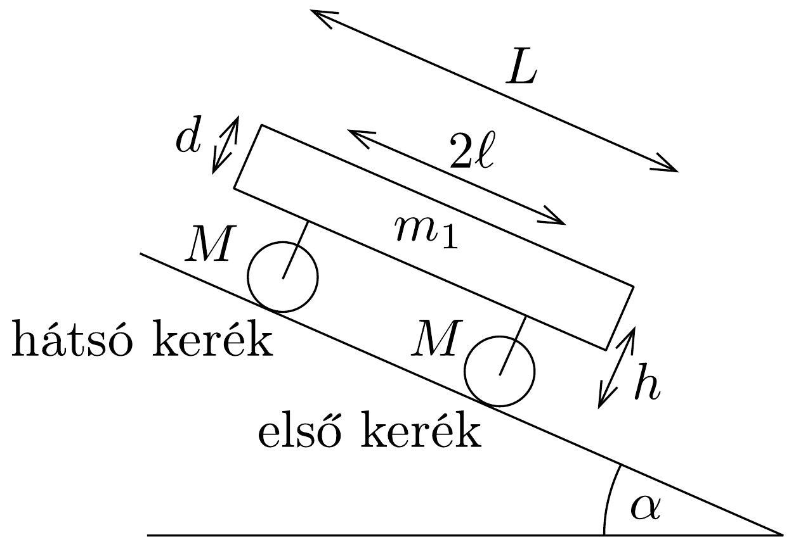
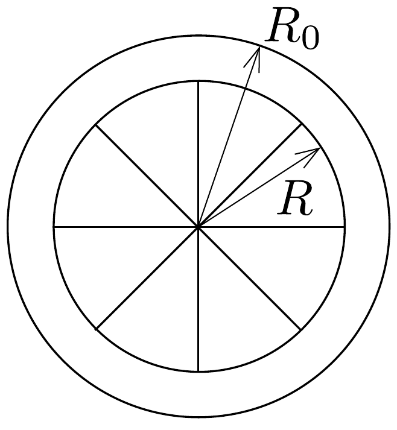

## Feladat 3

Lejtõs úton mozgó, nehéz jármű

A 251. ábra egy nehéz jármú (például egy pótkocsi) egyszerúsített modelljét mutatja. A jármú $\alpha$ hajlásszögú, lejtős úton halad, első és hátsó kerekei hengerszimmetrikusak. Mindkét kerék $M$ tömegű, vastag, hengeres csőnek tekinthető, melyek külső sugara $R_{0}$, míg belső sugaruk $R=0,8 R_{0}$, továbbá egy-egy keréken 8 darab küllő van. A 8 küllő teljes tömege $0,2 M$. A kerekek a 252. ábrán látható módon modellezhetők. A járműtestet tartó alvázszerkezet tömege elhanyagolható. A jármú az úton lefelé halad, mozgását a nehézségi és a súrlódási erők határozzák meg. Az első és a hátsó kerék a jármúhöz képest szimmetrikusan helyezkedik el.

A henger és az út közötti tapadási, illetve csúszási súrlódási együtthatókat jelöljük rendre $\mu_{0}$-lal és $\mu$-vel. A téglatest alakú jármútest tömege $m_{1}=5 M$, hossza $L$, vastagsága pedig $d$. Az első és a hátsó kerekek tengelyei közötti távolság $2 \ell$, míg a kerekek középpontjának a jármútest középsíkjától mért távolsága $h$. Tételezzük fel, hogy a kerekek súrlódásmentesen csapágyazottak.
- a) Számítsuk ki az egyes kerekek tehetetlenségi nyomatékát!
- b) Rajzoljuk le a jármútestre, továbbá az első és a hátsó kerekekre ható összes erót! Minden egyes részre írjuk fel a mozgásegyenleteket!
- c) A jármú nyugalomból indul, és a nehézségi eró hatására szabadon mozog. Állapítsuk meg a rendszer összes lehetséges mozgástípusát, és határozzuk meg az egyes gyorsulásokat a megadott fizikai mennyiségek segítségével!

d) Tegyük fel, hogy a jármú nyugalomból indulva tiszta gördüléssel éppen $d$ utat tett meg, amikor az útnak egy olyan szakaszára érkezik, ahol a súrlódási együtthatók hirtelen kicsiny $\mu_{0}^{\prime}$ és $\mu^{\prime}$ értékekre csökkennek, és így mindkét kerék csúszni kezd.

Számítsuk ki az egyes kerekek haladási sebességét és szögsebességét, amikor a jármú a nyugalmi helyzethez képest összesen $s$ méter utat tett meg! Ekkor feltehetjük, hogy $d$ és $s$ sokkal nagyobbak, mint a jármú méretei.
