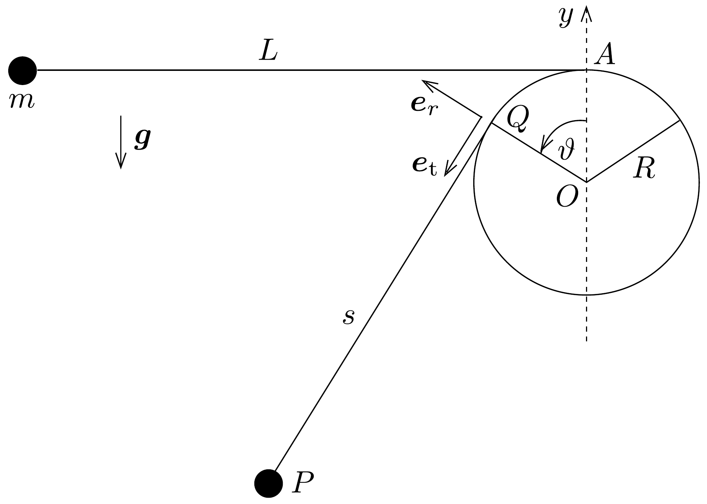
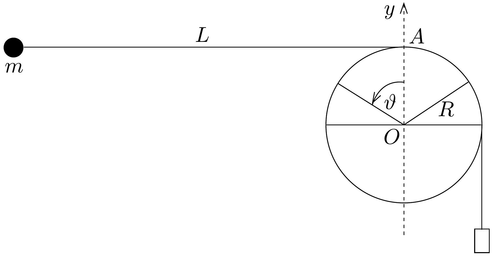

## Feladat 1

Inga, melynek felsố végét is egy súly húzhatja

Egy $R$ sugarú merev rudat a talaj felett bizonyos magasságban vízszintes helyzetben rögzítettünk. Egy elhanyagolható tömegü, $L$ hosszúságú $(L>2 \pi R)$ fonál egyik végét a 257. ábrán látható módon a rúd legfelsó, $A$ pontjában rögzítettük, a másik végére $m$ tömegü, pontszerúnek tekinthetó testet erősítve ingát készítettünk. A fonalat feszesen tartva az inga nehezékét az $A$ ponttal azonos magasságba emeljük, majd onnan kezdősebesség nélkül elengedjük. A fonalat kezdetben feszültségmentesnek tekinthetjük, és feltehetjük, hogy az ingatest a rúd tengelyére merőleges síkban mozog. A nehézségi gyorsulás $g$.

Legyen $O$ a koordináta-rendszerünk origója. Amikor az ingatest a $P$ pontban van, a fonál a hengerfelület $Q$ pontbeli érintójével egyirányú. A $Q P$ szakasz hosszát $s$-sel jelöljük. A $Q$ pontbeli érintőirányú egységvektort jelölje $\boldsymbol{e}_{\mathrm{t}}$, a sugárirányú egységvektort pedig $\boldsymbol{e}_{r}$. Az $O Q$ sugár szögelfordulása $\vartheta$, melyet az $O A$ függőleges $x$ tengelytől az óramutató járásával ellentétes irányban tekintjük pozitívnak.

Amikor $\vartheta=0$, az $s$ távolság nagysága $L$, és az ingatest $U$ gravitációs potenciális energiája legyen nulla. A részecske mozgása során az időben változó $\vartheta$ és $s$ mennyiségek változási sebességét jelölje $\dot{\vartheta}$ és $\dot{s}$. Hacsak nem jelezzük másként, valamennyi sebességet a rögzített $O$ pontra vonatkoztatjuk.

A rész
Ebben a részben az ingatest mozgása során a fonál végig feszes marad. A fentebb bevezetett mennyiségek (vagyis $s, \vartheta, \dot{s}, \dot{\vartheta}, R, L, g, \boldsymbol{e}_{\mathrm{t}}$ és $\boldsymbol{e}_{r}$ ) segítségével fejezzük ki:
- a) a $\dot{\vartheta}$ és $\dot{s}$ közötti kapcsolatot;
- $b$ ) a mozgó $Q$ pont $O$ ponthoz viszonyított sebességvektorát;
- c) a $P$ pontban lévó ingatest $Q$ ponthoz viszonyított $\boldsymbol{v}_{Q}$ sebességvektorát;
- d) a $P$ pontban lévő ingatest $\boldsymbol{v}$ sebességvektorát az $O$ ponthoz viszonyítva;
- e) a $P$ pontban lévő ingatest $O$ pontra vonatkoztatott gyorsulásának tangenciális ( $\boldsymbol{e}_{\mathrm{t}}$ irányú) komponensét;
- f) a $P$ pontban lévő ingatest $U$ gravitációs potenciális energiáját;
- $g$ ) az ingatest sebességének $v_{\mathrm{m}}$ nagyságát a pályájának legalacsonyabb pontjában!

B rész
Ebben a részben az $L$ és $R$ mennyiségek aránya legyen
\[
\frac{L}{R}=\frac{9 \pi}{8}+\frac{2}{3} \operatorname{ctg} \frac{\pi}{16} \approx 6,886 .
\]
- $h)$ Adjuk meg az ingatest sebességének nagyságát ( $g$ és $R$ függvényében) abban a helyzetben, amikor a $Q P$ fonalhossz a legrövidebb, de a fonal még nem lazult meg!
- i) Mekkora a rúd túlsó oldalára átlendült ingatest sebessége ( $g$ és $R$ függvényében) a pályájának ottani legmagasabb, $H$ pontjában?

C rész

Ebben a részben az $m$ tömegú nehezékkel rendelkező inga fonalának felső végét nem rögzítjük az $A$ ponthoz, hanem a fonalat a rúd tetején átvetve, a végét egy nehezebb, $M$ tömegú súlyhoz kapcsoljuk a 258. ábrán látható módon. A súly
ugyancsak pontszerűnek tekinthető. Kezdetben az ingatestet az $A$ ponttal azonos magasságban tartjuk, a másik oldalon a súly az $O$ pontnál mélyebben helyezkedik el, a fonál feszes, és a vízszintes részének hossza $L$. Ezután az ingatestet kezdősebesség nélkül elengedjük, és a súly is süllyedni kezd. Feltehetjük, hogy az ingatest mindvégig egy függőleges síkban mozog, és át tud lendülni a lefelé mozgó súly mellett, anélkül, hogy egymás mozgását megzavarnák. A rúd felülete és a fonál közötti csúszási súrlódás elhanyagolható, a tapadó súrlódásról viszont feltesszük, hogy az elegendően nagy, és emiatt az egyszer megálló súly nem tud ismét megmozdulni, nyugalomban kell maradjon.
j) Tegyük fel, hogy a súly $D$ nagyságú függőleges elmozdulás után valóban megáll, és hogy $(L-D) \gg R$. Ahhoz, hogy az ingatest a rúd körül teljesen körbefordulhasson, vagyis $\vartheta=2 \pi$ lehessen, méghozzá úgy, hogy a fonál mindkét ága egyenes maradjon, az szükséges, hogy az $\alpha=D / L$ hosszúságarány ne legyen kisebb egy bizonyos kritikus $\alpha_{\mathrm{k}}$ értéknél.

Elhanyagolva az $R / L$ nagyságrendú, vagy ennek magasabb hatványait tartalmazó, kicsiny tagokat, adjunk becslést $\alpha_{\mathrm{k}}$ nagyságára az $M / m$ tömegaránnyal kifejezve!
